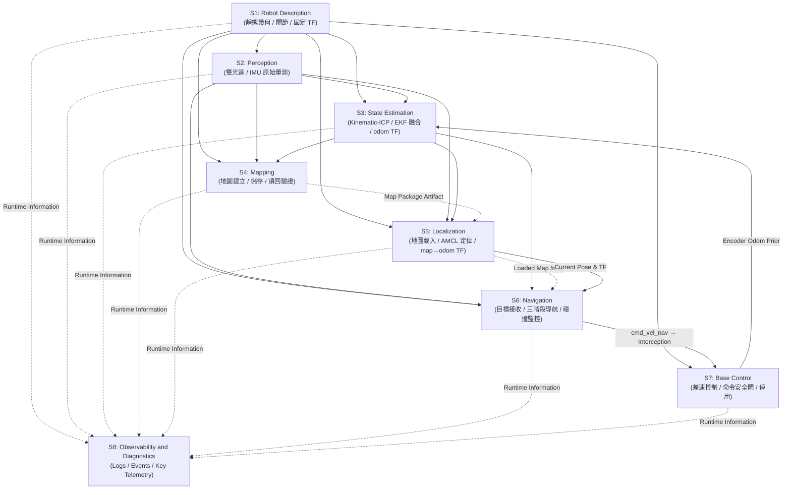
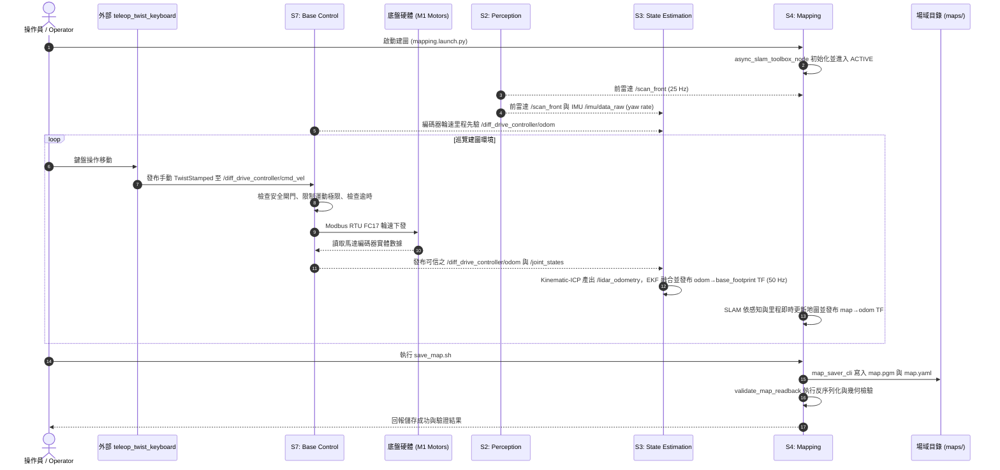
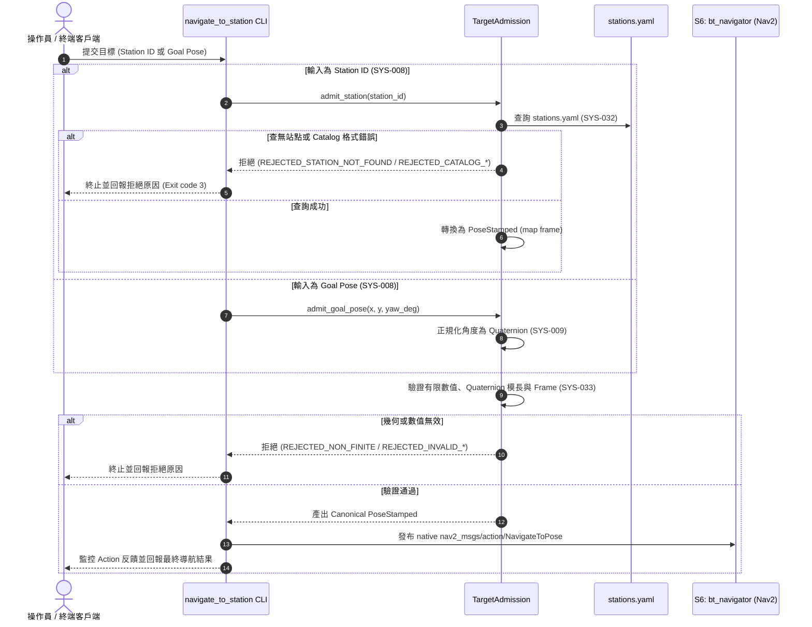
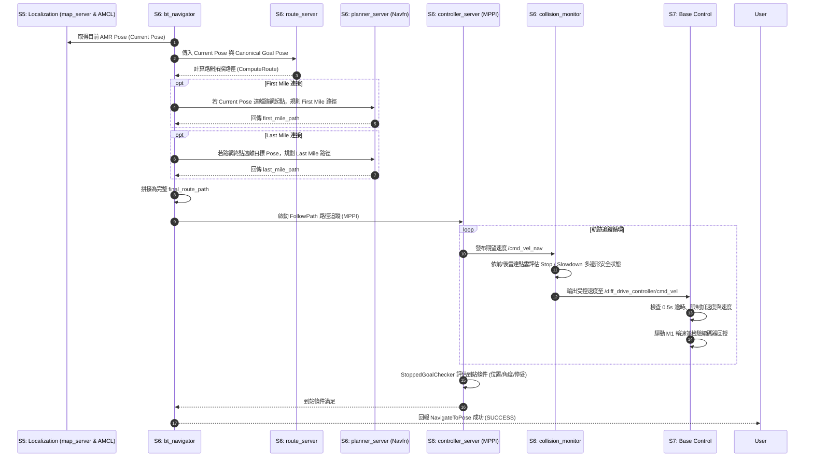
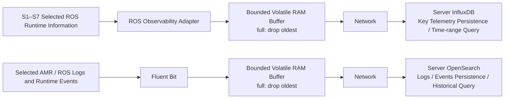

# System Architecture

本文件定義 `mobile_base` v0.1 之系統層級架構，包含系統邊界、操作模式、子系統劃分與責任配置、跨系統資料流與控制鏈、動態 TF 權限契約，以及全系統核心架構規範。

---

## 1. Purpose and Authority

### 1.1 上游產品需求基準 (Normative Product Inputs)
本架構文件嚴格以下列規範性文件為 **唯一 Normative Product Inputs**：
- [`docs/01_USE_CASES.md`](./01_USE_CASES.md)
- [`docs/02_CAPABILITIES.md`](./02_CAPABILITIES.md)
- [`docs/03_REQUIREMENTS.md`](./03_REQUIREMENTS.md)

本架構為 `mobile_base` 目前 as-built 系統架構的**單一權威來源 (Single Canonical Authority)**。

### 1.2 下游實作關係 (Downstream Implementation Authority)
本文件統籌定義全系統與子系統層級之架構責任與介面邊界，各子系統內部實作與配置以現行原始碼（`src/*`）、Launch 檔與參數 YAML 為準。

### 1.3 架構職權範圍 (Architecture Authority Boundaries)

| 系統架構（docs/04_SYSTEMS.md）決定 | 不應由架構決定（保留至 Source / Config / Verification） |
|---|---|
| 系統分解為 S1–S7 主要 Subsystem 與責任配置 | Class / Struct / Function 內部程式碼實作細節 |
| 系統規範性需求（SYS Requirements）之子系統責任配置 | 具體原始碼檔案內部行級邏輯與資料結構 |
| 跨子系統之資料流、控制流與生命週期依賴關係 | Launch 檔與 YAML 配置之細部數值與調校表格 |
| 座標框架 TF Tree 的唯一動態與靜態發布權限契約 | 驅動程式內部暫存器編號與 Modbus 封包細部編解碼 |
| 速度命令鏈（Command Chain）與多層停止安全架構 | 操作命令指南、開發日誌與除錯記錄 |
| Route-assisted 導航編排與 Station 導航架構 | 測試案例執行記錄、細部除錯記錄與暫態調校數據 |
| 場域資源（Map / Route Graph / Station Catalog）所有權與解析界線 | 導航演算法細部超參數調校與推測性根本原因分析 |

---

## 2. System Context

`mobile_base` 為基於 ROS 2 Jazzy 開發的自主移動機器人（AMR）底盤系統。系統邊界涵蓋 8 大核心子系統及其運行的軟體責任。

### 2.1 外部實體 (External Entities)
- **使用者 / 操作員 (Operator / User)**：提交建圖與儲存命令、操作鍵盤手動移動巡覽（透過外部 `teleop_twist_keyboard`）、提交導航目標（Station ID 或 Goal Pose）或發出取消請求。
- **實體感測器 (Physical Sensors)**：
  - 前左（Front-Left）與後右（Rear-Right）雙 SICK picoScan150 2D 激光雷達。
  - TDK IIM-42652 6 軸慣性測量單元（IMU）。
- **底盤動力硬體 (M1 Drive Hardware & Motors)**：
  - M1 雙驅動器差速動力總成，透過 RS-485 Modbus RTU 接收輪速控制命令並回傳實體編碼器量測狀態。
- **場域資源資料夾 (Site Artifacts)**：
  - 存放於 `maps/<site_name>/` 之二維佔據網格地圖（`map.pgm`, `map.yaml`）、路網圖（`route_graph.geojson`）與站點目錄（`stations.yaml`）。
- **Observability Server**：位於 AMR 外部，接收並保存 Logs / Events 與 Key Telemetry，提供歷史時間範圍與來源查詢；不參與 Navigation、Localization、Control 或 Safety 執行路徑。

### 2.2 系統脈絡圖 (System Context Diagram)

```text
       使用者 / 上層客戶端 (Operator / User)
          │                    │                     │
          │ 提交導航目標 / 取消 │ 啟動建圖 / 儲存      │ 操作鍵盤遙控 (Teleop)
          ▼                    ▼                     ▼
    ┌─────────────────────────────────────────────────────────────┐
    │                        mobile_base                          │
    │                                                             │
    │  ┌────────────────┐      ┌────────────────┐                 │
    │  │ S1 Robot Desc  │      │ S2 Perception  │◄─┼── 實體感測器 (LiDAR / IMU)
    │  └───────┬────────┘      └───────┬────────┘  │              │
    │          │                       │           │              │
    │          ▼                       ▼           │              │
    │  ┌────────────────┐      ┌────────────────┐  │              │
    │  │ S4 Mapping     │      │ S3 State Estim │  │              │
    │  └───────┬────────┘      └───────┬────────┘  │              │
    │          │                       │           │              │
    │          ▼ (Map Package)         ▼           │              │
    │  ┌────────────────┐      ┌────────────────┐  │              │
    │  │ S5 Localize    │─────►│ S6 Navigation  │  │              │
    │  └────────────────┘      └───────┬────────┘  │              │
    │                                  │           │              │
    │                                  ▼           │              │
    │                          ┌────────────────┐  │              │
    │                          │ S7 Base Control│◄─┴──────────────┘ (手動 TwistStamped)
    │                          └───────┬────────┘
    │                                  │
    │                                  ▼
    │                                  底盤動力硬體 (M1 Motors)
    │                                                             │
    │  S1–S7 Runtime Information / Logs / Events ──► S8 Observability
    └─────────────────────────────────────────────────────────────┘
                        ▲
                        │ 載入 Map Package / Route Graph / Station Catalog
           ┌────────────┴───────────┐
           │ 場域資源 (Site Artifacts)│
           └────────────────────────┘

    S8 Observability ── Logs / Events / Key Telemetry ──► Observability Server
```

---

## 3. Operational Modes

`mobile_base` v0.1 定義兩種**嚴格互斥 (Mutually Exclusive)** 的系統操作模式：

```text
                         ┌─────────────────┐
                         │   mobile_base   │
                         │   Shared Base   │
                         │ (S1,S2,S3,S7)   │
                         └────────┬────────┘
                                  │
                 ┌────────────────┴────────────────┐
                 ▼                                 ▼
      ┌─────────────────────┐           ┌─────────────────────┐
      │    Mapping Mode     │           │   Navigation Mode   │
      │       (UC-001)      │           │       (UC-002)      │
      ├─────────────────────┤           ├─────────────────────┤
      │ • S4 Mapping (建圖)  │           │ • S5 Localization   │
      │ • Teleop 速度命令輸入│           │   (map_server+AMCL) │
      │ • SLAM 擁有 map→odom │           │ • S6 Navigation     │
      │ • S5, S6 未啟用      │           │ • AMCL 擁有 map→odom│
      │                     │           │ • S4 未啟用         │
      └─────────────────────┘           └─────────────────────┘
```

S8 為兩種模式共用、與核心功能隔離的觀察旁路；其啟動、停止或故障不改變 Mapping Mode 或 Navigation Mode 的成立條件。

### 3.1 Mapping Mode (UC-001)
- **目的**：巡覽未知環境，即時建立二維佔據網格地圖，並持久化儲存為 Map Package。
- **活躍子系統**：`S1 Robot Description`, `S2 Perception`, `S3 State Estimation`, `S4 Mapping`, `S7 Base Control`。
- **運動控制輸入**：操作員透過外部 `teleop_twist_keyboard` 發布手動速度命令（`geometry_msgs/msg/TwistStamped`）直接至 S7（`/diff_drive_controller/cmd_vel`，SYS-034）。未操作或命令停止時底盤停等，建圖程序維持運行。
- **動態 TF 權限**：由 S4 `slam_toolbox` 動態發布 `map -> odom` TF；由 S3 `robot_localization` EKF 動態發布 `odom -> base_footprint` TF。
- **互斥邊界**：`S5 Localization` 與 `S6 Navigation` **嚴格禁止啟動**。全系統僅存在單一手動運動命令源，不引入 `twist_mux` 或額外模式仲裁節點。

### 3.2 Navigation Mode (UC-002)
- **目的**：載入已建置地圖與路網資源，依據使用者提交之 Station 或 Goal Pose 目標執行三階段自主導航。
- **活躍子系統**：`S1 Robot Description`, `S2 Perception`, `S3 State Estimation`, `S5 Localization`（包含 `map_server` 地圖載入與 `amcl` 定位）, `S6 Navigation`, `S7 Base Control`。`S4 Mapping` 處於非活躍狀態（Inactive）。
- **運動控制輸入**：由 S6 Nav2 `controller_server` 運算自主軌跡，經 `collision_monitor` 安全閘門後輸出至 S7（`/diff_drive_controller/cmd_vel`）。
- **動態 TF 權限**：由 S5 `nav2_amcl` 唯一發布 `map -> odom` TF；由 S3 `robot_localization` EKF 唯一發布 `odom -> base_footprint` TF。
- **互斥邊界**：S4 `slam_toolbox` 建圖節點與外部 `teleop_twist_keyboard` **嚴格禁止啟動**。

---

## 4. Subsystem Architecture

系統劃分為 8 個高內聚、低耦合的子系統（S1–S8）：



---

### 4.1 S1: Robot Description
- **主要職責**：全系統幾何模型、車體外形（Footprint）、關節拓撲與感測器安裝靜態座標轉換（`/tf_static`）的唯一權威提供者。
- **承接需求**：`SYS-023`。
- **核心執行元件**：
  - `robot_state_publisher`（`mobile_base_description`）。
  - URDF/Xacro 幾何模型描述。
- **重要輸入**：
  - `/joint_states` (`sensor_msgs/msg/JointState`, 來自 S7)。
- **重要輸出**：
  - `/robot_description` (`std_msgs/msg/String`, Topic 與 Parameter)。
  - `/tf_static` (`tf2_msgs/msg/TFMessage`, 包含 `base_footprint -> base_link`、`base_link -> base_lidar_link_FL/BR`、`base_link -> base_imu_link`)。
  - `/tf` (`tf2_msgs/msg/TFMessage`, 輪端關節動態變換 `base_link -> driving_wheel_link_L/R`)。
- **TF 所有權**：所有靜態轉換與輪端關節狀態轉換。
- **架構約束**：嚴禁發布動態 `odom -> base_footprint` 或 `map -> odom`。
- **權威實作與配置參考**：
  - Launch: `src/mobile_base_description/launch/robot_description.launch.py`
  - Config: `src/mobile_base_description/config/robot_state_publisher.yaml`

---

### 4.2 S2: Perception
- **主要職責**：自實體硬體感測器（雙 2D 光達與 6 軸 IMU）擷取原始觀測量，轉換為標準 ROS 2 感測資料發布供下游子系統消耗。
- **承接需求**：`SYS-003`, `SYS-004`。
- **核心執行元件**：
  - `front_lidar_node` (`sick_scan_xd` 之 `sick_generic_caller`，讀取前左 SICK picoScan150)。
  - `rear_lidar_node` (`sick_scan_xd` 之 `sick_generic_caller`，讀取後右 SICK picoScan150)。
  - `imu_driver_node` (`tdk_ros2_imu` 之 `tdk_imu_node`，讀取 TDK IIM-42652)。
- **重要輸入**：實體感測器硬體通訊訊號（UDP / Serial）。
- **重要輸出**：
  - `/scan_front` (`sensor_msgs/msg/LaserScan`, Frame: `base_lidar_link_FL`, 25 Hz)。
  - `/scan_rear` (`sensor_msgs/msg/LaserScan`, Frame: `base_lidar_link_BR`, 25 Hz)。
  - `/imu/data_raw` (`sensor_msgs/msg/Imu`, Frame: `base_imu_link`, 50–100 Hz)。
- **TF 所有權**：無（由 S1 統一發布感測器靜態 Frame）。
- **架構約束**：
  - 採用**獨立雙雷達架構 (Independent Dual LiDAR)**。生產執行路徑中**完全不使用**虛擬融合節點 `dual_laser_merger`，亦無全局合併主題 `/scan`。
  - 各下游消費者（建圖、定位、里程、代價地圖、碰撞監控）直接訂閱所需之獨立雷達主題。
- **權威實作與配置參考**：
  - Launch: `src/mobile_base_perception/launch/sick_dual_lidar.launch.py`, `src/mobile_base_perception/launch/tdk_imu.launch.py`
  - Config: `src/mobile_base_perception/config/tdk_imu.yaml`

---

### 4.3 S3: State Estimation
- **主要職責**：以平面雷達掃描與輪速里程為先驗驅動 Kinematic-ICP，並由 EKF 融合雷達里程與 IMU 角速度，提供不依賴地圖的連續平面里程估測，作為全系統唯一權威發布 `odom -> base_footprint` 動態 TF。
- **承接需求**：`SYS-005`。
- **核心執行元件**：
  - `kinematic_icp_online_node` (`kinematic_icp`)。
  - `ekf_filter_node` (`robot_localization` / `mobile_base_state_estimation`)。
- **重要輸入**：
  - `/scan_front` (`sensor_msgs/msg/LaserScan`, 來自 S2)。
  - `/diff_drive_controller/odom` (`nav_msgs/msg/Odometry`, 來自 S7，作為 Kinematic-ICP 運動先驗)。
  - `/imu/data_raw` (`sensor_msgs/msg/Imu`, 來自 S2，EKF 僅融合 `yaw_rate`)。
- **重要輸出**：
  - `/lidar_odometry` (`nav_msgs/msg/Odometry`, 由 Kinematic-ICP 產出平面位姿 $x, y, \text{yaw}$)。
  - `/odometry/filtered` (`nav_msgs/msg/Odometry`, 由 EKF 融合輸出)。
  - 動態 TF: `odom -> base_footprint`（由 EKF 於 50 Hz 唯一發布）。
- **TF 所有權**：`odom -> base_footprint` 動態 TF 之**全系統唯一擁有者**。
- **架構約束**：
  - Kinematic-ICP 配置 `publish_odom_tf: false`，嚴禁發布 TF。
  - S7 `diff_drive_controller` 配置 `enable_odom_tf: false`，嚴禁發布 TF。
  - 生產架構中不存在任何 RF2O 元件或中間 `odom_lidar` 座標框架。
- **權威實作與配置參考**：
  - Config: `src/kinematic_icp/ros/config/kinematic_icp_ros.yaml`, `src/mobile_base_state_estimation/config/ekf.yaml`
  - Launch: `src/kinematic_icp/ros/launch/kinematic_icp.launch.py`, `src/mobile_base_state_estimation/launch/ekf.launch.py`

---

### 4.4 S4: Mapping
- **主要職責**：管理二維佔據網格地圖（Occupancy Grid）之建立與持久化生命週期：在 Mapping Mode 下接收感知與里程資訊，即時建立與更新地圖、持久化儲存為 Map Package（`map.pgm` 與 `map.yaml`），並執行儲存後讀回驗證（Read-back verification）。
- **承接需求**：`SYS-001`, `SYS-002`, `SYS-006`, `SYS-024`。
- **核心執行元件**：
  - `async_slam_toolbox_node` (`slam_toolbox`, Lifecycle Node)。
  - `map_saver_cli` (`nav2_map_server`)。
  - `validate_map_readback` (`mobile_base_mapping`)。
- **重要輸入**：
  - `/scan_front` (`sensor_msgs/msg/LaserScan`, 來自 S2)。
  - 動態 TF `odom -> base_footprint` (來自 S3)。
- **重要輸出**：
  - `/map` (`nav_msgs/msg/OccupancyGrid`, $0.05\,\text{m}$ 解析度)。
  - 動態 TF `map -> odom`（建圖模式下由 SLAM 暫時擁有並依 `transform_publish_period: 0.05` 發布）。
  - Map Package 實體檔案（`map.pgm`, `map.yaml`）。
- **TF 所有權**：Mapping Mode 下暫時擁有 `map -> odom` 動態 TF。
- **架構約束**：
  - 僅在 Mapping Mode 啟用；在 Navigation Mode 下保持非活躍（Inactive）。
  - 僅消耗前左雷達 `/scan_front`。
  - 地圖儲存流程必須在寫入後調用 `validate_map_readback` 進行反序列化與幾何元數據檢驗，確認合格後方判定儲存成功。
- **權威實作與配置參考**：
  - Config: `src/mobile_base_mapping/config/slam_toolbox.yaml`
  - Launch: `src/mobile_base_mapping/launch/mapping.launch.py`
  - Script: `src/mobile_base_bringup/scripts/save_map.sh`

---

### 4.5 S5: Localization
- **主要職責**：在 Navigation Mode 下，透過 `map_server` 載入所選定之 Map Package 提供佔據網格，並利用 AMCL 粒子濾波結合前雷達掃描與系統里程資訊，估測 AMR 在地圖中的全局位姿，作為唯一權威發布 `map -> odom` 動態座標轉換與標準定位 Pose；接收使用者提供之 Approximate Initial Pose 完成定位初始化。
- **承接需求**：`SYS-007`, `SYS-010`。
- **核心執行元件**：
  - `map_server` (`nav2_map_server`, Lifecycle Node)。
  - `amcl` (`nav2_amcl`, Lifecycle Node)。
  - `lifecycle_manager_localization` (`nav2_lifecycle_manager`，統籌管理 `map_server` 與 `amcl`)。
- **重要輸入**：
  - Map Package 檔案（經由 `site_resolution` 或 CLI 傳入 `map.yaml` 由 `map_server` 載入）。
  - `/scan_front` (`sensor_msgs/msg/LaserScan`, 來自 S2)。
  - 動態 TF `odom -> base_footprint` (來自 S3)。
  - `/initialpose` (`geometry_msgs/msg/PoseWithCovarianceStamped`, 來自 RViz2 或上層客戶端)。
- **重要輸出**：
  - `/map` (`nav_msgs/msg/OccupancyGrid`, 由 `map_server` 於導航期發布供定位與代價地圖使用)。
  - `/amcl_pose` (`geometry_msgs/msg/PoseWithCovarianceStamped`)。
  - 動態 TF `map -> odom`（導航模式下由 AMCL 唯一發布，`tf_broadcast: true`）。
- **TF 所有權**：Navigation Mode 下 `map -> odom` 動態 TF 之**唯一權威擁有者**。
- **架構約束**：僅在 Navigation Mode 啟用；僅消耗前雷達 `/scan_front`。
- **權威實作與配置參考**：
  - Config: `src/mobile_base_localization/config/amcl_params.yaml`
  - Launch: `src/mobile_base_localization/launch/localization.launch.py`

---

### 4.6 S6: Navigation
- **主要職責**：導航全生命週期任務編排（Navigation Task Orchestration）：
  1. **Target Admission**：接收外部目標，執行目標判別（SYS-008）、Goal Pose 正規化（SYS-009）、Station Catalog 查表解析（SYS-032）與 Canonical 幾何合法性驗證（SYS-033）。
  2. **Route Strategy**：讀取 `route_graph.geojson`，由 `route_server` 運算路網拓撲路徑。
  3. **Stage Execution**：編排與監控 First Mile → On Route → Last Mile 三階段路徑拼接與追蹤。
  4. **Supervision & Collision Protection**：透過 Nav2 Costmaps 維護障礙物代價，由 `collision_monitor` 攔截自主速度命令進行安全減速與煞停。
  5. **Completion & Result**：以 `StoppedGoalChecker` 評估到站停妥條件，對外統一回傳導航結果（Success / Failure / Canceled）。
- **承接需求**：`SYS-008`, `SYS-009`, `SYS-011`, `SYS-013`, `SYS-014`, `SYS-015`, `SYS-016`, `SYS-017`, `SYS-018`, `SYS-019`, `SYS-020`, `SYS-021`, `SYS-025`, `SYS-032`, `SYS-033`。
- **核心執行元件**：
  - `bt_navigator` (`nav2_bt_navigator`, 載入 `route_assisted_nav.xml`)。
  - `route_server` (`nav2_route`, 載入 `route_graph.geojson`)。
  - `planner_server` (`nav2_planner`, 使用 `nav2_navfn_planner::NavfnPlanner`)。
  - `controller_server` (`nav2_controller`, 使用 `nav2_mppi_controller::MPPIController` 與 `StoppedGoalChecker`)。
  - `collision_monitor` (`nav2_collision_monitor`)。
  - `lifecycle_manager_navigation` (`nav2_lifecycle_manager`)。
  - `navigate_to_station` CLI 應用程式（整合 `TargetAdmission` 模組）。
- **重要輸入**：
  - 外部目標（Station ID 或 Goal Pose）。
  - `/map` (來自 S5 `map_server`)。
  - `/scan_front` 與 `/scan_rear` (來自 S2，供 Local/Global Costmaps 與 Collision Monitor 使用)。
  - TF `map -> odom` (來自 S5) 與 `odom -> base_footprint` (來自 S3)。
  - 場域資源 `route_graph.geojson` 與 `stations.yaml`。
- **重要輸出**：
  - `/cmd_vel_nav` (`geometry_msgs/msg/TwistStamped`, 經 `collision_monitor` 攔截轉發至 S7 `/diff_drive_controller/cmd_vel`)。
  - 原生 Nav2 Action 介面反饋與結果 (`nav2_msgs/action/NavigateToPose`)。
- **TF 所有權**：無。
- **架構約束**：
  - 採用原生 `nav2_msgs/action/NavigateToPose` 進行導航目標調度，**系統不存在任何自製 `mobile_base_msgs/action/NavigateToStation` 介面**。
  - v0.1 關閉全域自由空間 Fallback（SYS-021）；當無可用路網解時直接終止任務並回報失敗。
- **權威實作與配置參考**：
  - Launch: `src/mobile_base_navigation/launch/navigation.launch.py`
  - Config: `src/mobile_base_navigation/config/nav2_params.yaml`
  - Behavior Tree: `src/mobile_base_navigation/behavior_trees/route_assisted_nav.xml`
  - Target Admission: `src/mobile_base_navigation/include/mobile_base_navigation/target_admission.hpp`
  - Station App: `src/mobile_base_navigation/src/navigate_to_station_app.cpp`

---

### 4.7 S7: Base Control
- **主要職責**：將自主或手動速度命令轉為差速輪運動控制，作為**底盤物理執行與安全防護的最終擁有者**：
  1. 執行差速輪閉迴路速度控制（SYS-022）。
  2. 接收並執行建圖期間來自外部手動速度命令（SYS-034）。
  3. 實施運動命令逾時保護（Command Timeout Stop, SYS-027）。
  4. 實施直線／旋轉速度與加速度極限限制（Operational Limits, SYS-028）。
  5. 檢核馬達驅動器編碼器回授狀態之有效性，提供可信的 Measured Wheel State（禁止偽造, SYS-029）。
  6. 實施底盤硬體安全 Enable 自檢與停機 Safe Stop / Disable 序列（SYS-026, SYS-030）。
- **承接需求**：`SYS-022`, `SYS-026`, `SYS-027`, `SYS-028`, `SYS-029`, `SYS-030`, `SYS-034`。
- **核心執行元件**：
  - `ros2_control_node` (`controller_manager`)。
  - `diff_drive_controller` (`diff_drive_controller/DiffDriveController`)。
  - `joint_state_broadcaster` (`joint_state_broadcaster/JointStateBroadcaster`)。
  - `M1Hardware` (`mobile_base_control/M1Hardware` SystemInterface Plugin)。
  - `M1Driver` (Modbus RTU 通訊庫)。
- **重要輸入**：
  - `/diff_drive_controller/cmd_vel` (`geometry_msgs/msg/TwistStamped`, 來自 S6 `collision_monitor` 或 Mapping 模式之 `teleop_twist_keyboard`)。
- **重要輸出**：
  - 物理輪端運動驅動（Modbus RTU FC17 輪速下發至 M1 驅動器）。
  - `/joint_states` (`sensor_msgs/msg/JointState`)。
  - `/diff_drive_controller/odom` (`nav_msgs/msg/Odometry`, 僅作為 S3 狀態估測先驗，不發布 TF)。
- **TF 所有權**：無。配置 `enable_odom_tf: false`，嚴禁向 `/tf` 發布 `odom -> base_footprint`。
- **架構約束**：
  - 控制迴圈運作於 30 Hz。
  - 嚴格實施時間戳 Stamped 速度命令逾時（$0.5\,\text{s}$）。
  - 實體編碼器回授無效時拒絕提供並發出警告，嚴禁以命令值冒充。
- **權威實作與配置參考**：
  - Launch: `src/mobile_base_control/launch/base_control.launch.py`
  - Config: `src/mobile_base_control/config/base_control_params.yaml`
  - Driver & Hardware: `src/mobile_base_control/src/m1_hardware.cpp`, `src/mobile_base_control/src/m1_driver.cpp`

#### 4.7.1 底盤控制分層架構與責任邊界 (Base-Control Architecture & Responsibility Boundary)

底盤運動控制堆疊劃分為兩層應用層設計：

```text
diff_drive_controller
        │
        │ 輪端目標角速度 [rad/s]
        ▼
   ros2_control
        │
        │ Joint Command / State Interfaces
        ▼
   M1Hardware (Hardware Plugin)
        │
        │ MotorCommand / MotorState (馬達目標 RPM / 狀態資料)
        ▼
    M1Driver (Protocol Library)
        │
        │ 私有 RTU 封包 (Raw Modbus Frames)
        ▼
    libmodbus (C Library)
        │
        ▼
      RS-485 序列匯流排 (/dev/ttyUSB0, 230400 8N1)
        │
   ┌────┴────┐
   ▼         ▼
M1 ID1    M1 ID2
(右輪)    (左輪)
```

**責任邊界配置 (Responsibility Boundary)**：

| 元件 | 專屬擁有職責 (Owned Responsibilities) | 嚴格禁止涉足 (Non-Goals / Excluded) |
|---|---|---|
| **`M1Hardware`** | • ROS 2 / ros2_control 生命週期管理<br/>• 左右輪語意與馬達 ID 映射 (ID1 $\rightarrow$ Right, ID2 $\rightarrow$ Left)<br/>• 輪速 [rad/s] 與馬達 [RPM] 雙向轉換<br/>• 機械減速比 ($20:1$) 與馬達方向極性 ($\text{Left}=+1, \text{Right}=-1$)<br/>• 命令有限性檢查、極限截斷 (`max_motor_rpm = 3000.0`)<br/>• 連續位置追蹤與 int32 溢位解算 (`PositionTracker`)<br/>• 裝置健康政策 (Alarm 檢驗與 `ERROR` 判定)<br/>• 安全啟動與停機序列編排<br/>• A2 同步控制模型之狀態快取 (`latest_motor_state_`) | • Modbus 協定封包與暫存器編解碼<br/>• Multi-drive 2.0 廣播定址與 Bitmap 運算<br/>• `libmodbus` context 管理與串列通訊<br/>• 機器人差速運動學 (由 `diff_drive_controller` 擁有) |
| **`M1Driver`** | • M1 通訊協定語意與 Multi-drive 2.0 廣播定址 (Group ID `0x65`)<br/>• Multi-drive 2.0 FC03 / FC17 封包建構<br/>• JG (RPM 控制)、SVON (使能)、SVOFF (去能) 命令編碼<br/>• 有符號整數解碼 (Signed int16 RPM, Signed int32 Position)<br/>• 協定回應結構語意驗證 (FC、長度、驅動器區塊完整性)<br/>• 私有 `libmodbus` context 管理與 RTU 通訊 (`connect`, `disconnect`, `transact`)<br/>• 標準 Modbus 單一暫存器維護存取 (`read_register`, `write_register`) | • ROS 2 介面、Node 或 ros2_control 生命週期<br/>• 機器人左右輪幾何、輪徑、輪距或減速比<br/>• 輪端弧度與角速度轉換<br/>• 連續位置溢位展開 (Rollover Tracking)<br/>• 裝置健康業務政策 (如警報轉為 ROS Error) |

- **封裝原則**：`M1Hardware` 專注於 ROS 與機器人領域語意，不依賴任何 Modbus 暫存器或 `libmodbus` 型別；`M1Driver` 私有擁有 `libmodbus`，不向外暴露傳輸層細節。MVP 架構中無獨立之 `SerialTransport` 抽象層，維持單一後端之最簡架構（Avoid Premature Structure）。

#### 4.7.2 硬體基準與馬達參數 (Hardware Baseline & Motor Configuration)

系統採用實機驗證通過之硬體與馬達參數基準：

- **序列通訊參數**：RS-485 介面，固定埠位 `/dev/ttyUSB0`，鮑率 `230400` bps，格式 `8N1`（8 資料位元、無同位檢查、1 停止位元）。
- **通訊逾時門檻**：`response_timeout_ms: 50` ms（URDF / Launch 強制指定之必要參數，系統不依賴隱式預設值）。
- **驅動器與輪端映射**：
  - 驅動器 ID 1：右輪馬達（Right Motor），原生安裝旋轉極性 $\text{sign}_{\text{right}} = -1$（負轉為機器人前進方向）。
  - 驅動器 ID 2：左輪馬達（Left Motor），原生安裝旋轉極性 $\text{sign}_{\text{left}} = +1$（正轉為機器人前進方向）。
- **機械幾何與減速比**：
  - 輪半徑 $R = 0.080\,\text{m}$，輪間距 $L = 0.5545\,\text{m}$（由 `diff_drive_controller` 擁有）。
  - 機械減速比 $G = 20.0$（$20:1$ 行星減速機，由 `M1Hardware` 擁有）。
- **編碼器與位置解析度**：
  - 馬達編碼器原生解析度 $2500\,\text{CPR}$，設定為 Format 1（`02-14 = 1`）四倍頻解碼，馬達端每圈對應 $10{,}000\,\text{steps/motor rev}$。
  - 經 $20:1$ 減速後，輪端旋轉一圈對應 $200{,}000\,\text{steps/wheel rev}$（即 $200{,}000\,\text{steps} = 2\pi\,\text{rad}$）。
- **運作極限與逾時**：
  - 馬達轉速工作限制 `max_motor_rpm = 3000.0` RPM。
  - 速度命令逾時門檻 `cmd_vel_timeout = 0.5` s。
- **控制頻率基準**：`controller_manager` 控制迴圈基準為 **30 Hz**（週期 $33.3\,\text{ms}$）。

#### 4.7.3 Multi-drive 2.0 通訊架構 (Multi-drive 2.0 Communication Design)

M1 驅動器支援 Multi-drive 2.0 協定，透過廣播群組定址（Group ID `0x65` 與驅動器位元遮罩），以單一總線事務同時存取雙馬達：

1. **唯讀狀態路徑 (`read_state()`)**：
   - 使用 Multi-drive 2.0 FC03（Read Holding Registers）。
   - 在單一總線讀取事務中同時獲取雙驅動器之運作狀態、警報碼、即時轉速與編碼器位置等關鍵狀態資料。
2. **運行期控制路徑 (`exchange()`, `enable()`, `stop()`, `disable()`)**：
   - 使用 Multi-drive 2.0 FC17（Read/Write Multiple Registers）。
   - 在**單一總線事務中同步下發雙輪控制命令並回讀雙輪狀態**：
     - `exchange()`：下發 JG（Jog 速度控制）目標轉速 RPM。
     - `enable()`：下發 SVON（Servo-On 使能）命令。
     - `stop()`：下發 JG 零速命令。
     - `disable()`：下發 SVOFF（Servo-Off 去能）命令。
   - **設計理由**：將控制命令下發與狀態回授合併於單一 FC17 事務，消除傳統 Modbus 分立讀寫的多餘總線往返，大幅減少總線延遲並支持同步控制迴圈。
3. **標準 Modbus 維護路徑**：
   - 支援標準單一暫存器讀寫（FC03 / FC06），專責於離線配置、參數檢查與診斷維護（如 02-14 位置格式、09-19 驅動器 ID、09-20 鮑率、09-26 Multi-drive 映射），嚴禁介入運行期即時控制迴圈。

#### 4.7.4 A2 同步控制迴圈與轉換模型 (A2 Synchronous Control Model & Conversions)

系統採用實機驗證通過之 **A2 同步控制模型 (Synchronous Model A2)**：

```text
M1Hardware::read()
    │
    ├── 消耗前一週期 write() 快取之最新馬達狀態 latest_motor_state_ (無總線通訊)
    ├── 檢查馬達狀態健康度 (alarm == 0)
    ├── 執行 PositionTracker 增量累加與輪端位置 [rad] 轉換
    └── 轉換 actual_rpm 為輪端角速度 [rad/s]
    │
controller_manager / diff_drive_controller update() 運算
    │
M1Hardware::write()
    │
    ├── 檢驗輪端角速度命令合法性 (有限值) 與極限截斷 (max_motor_rpm)
    ├── 轉換左/右輪角速度 [rad/s] 為馬達轉速 [RPM]
    ├── 執行單一 M1Driver::exchange() FC17 總線事務
    ├── 快取回傳之 ExchangeResult 作為最新狀態 latest_motor_state_
    └── 檢驗回傳狀態之警報碼
```

- **A2 模型設計理由**：每個 30 Hz 控制週期（$33.3\,\text{ms}$）僅在 `write()` 發生一次物理總線通訊，`read()` 直接使用快取，避免重複通訊開銷，確保控制迴圈完全收斂在時限內。
- **速度命令轉換公式 (Wheel Command to Motor RPM)**：
  $$\text{motor\_rpm} = \text{clamp}\left( \text{round}\left( \omega_{\text{wheel}} \times \frac{60}{2\pi} \times G \times \text{sign}_{\text{motor}} \right), -\text{max\_rpm}, \text{max\_rpm} \right)$$
  其中 $G = 20.0$；$\text{sign}_{\text{left}} = +1$，$\text{sign}_{\text{right}} = -1$；$\text{max\_rpm} = 3000.0$。
- **速度回授轉換公式 (Motor RPM to Wheel Velocity)**：
  $$\omega_{\text{wheel}} = \text{actual\_rpm} \times \text{sign}_{\text{motor}} \times \frac{1}{G} \times \frac{2\pi}{60}$$
- **轉換職責劃分**：機器人線速／角速與輪速間的差速運動學轉換由 `diff_drive_controller` 擁有；輪端角速度與馬達轉速／符號間的轉換由 `M1Hardware` 擁有；馬達轉速之協定暫存器編碼由 `M1Driver` 擁有。

#### 4.7.5 連續位置追蹤與溢位解算 (Position Tracking & Rollover Unwrapping)

- **M1 位置回授特性**：M1 回傳之位置為 signed 32-bit 整數（`position_steps`），計數範圍在 $[-2^{31}, 2^{31}-1]$ 之間，持續運轉會發生數值溢位（Rollover）。
- **`PositionTracker` 解算機制**：
  - 每個馬達獨立配置一個 `PositionTracker`。
  - 採用二補數差值（2's complement difference）計算相鄰採樣之原始增量：
    $$\Delta_{\text{steps}} = (\text{int32\_t})\left( (\text{uint32\_t})\text{raw}_{\text{current}} - (\text{uint32\_t})\text{raw}_{\text{previous}} \right)$$
  - 將增量累加至 64 位元累加器 $\text{accumulated\_steps} \in \text{int64\_t}$，消除溢位突變。
- **輪端連續位置計算公式**：
  $$\theta_{\text{wheel}}\,\text{[rad]} = \frac{\text{accumulated\_steps}}{\text{motor\_steps\_per\_rev} \times G} \times 2\pi \times \text{sign}_{\text{motor}} = \frac{\text{accumulated\_steps}}{200{,}000} \times 2\pi \times \text{sign}_{\text{motor}}$$
- **原點重置政策 (Origin Reset Policy)**：
  - 每次 `M1Hardware::on_activate()` 執行時，強制將左右輪 `PositionTracker` 歸零重置，將當前馬達實體位置定義為 ROS 輪端位置原點（$0.0\,\text{rad}$）。
  - 系統在節點重啟或生命週期重新啟動後**不保留先前的絕對里程記帳**。

#### 4.7.6 裝置健康政策與錯誤隔離 (Device Health Policy & Error Responsibility)

- **通訊結果與裝置狀態的架構區隔**：
  - 一次 Modbus 總線通訊在傳輸層與協定層可能完全成功（`Result::ok == true`），但馬達驅動器在狀態區塊中可能回報非零警報碼（如 `alarm = 21`）。
  - `M1Driver` 專責判定傳輸與封包語意是否成功，不擅自解釋硬體健康狀態。
  - `M1Hardware` 專責實施裝置健康政策：當檢測到任何驅動器 `alarm != 0` 時，判定硬體故障並使 ros2_control 進入 `ERROR` / `FAILURE` 狀態。
- **無自動清除警報政策**：系統嚴禁在運行中靜默自動清除驅動器警報，必須將異常明確呈報上層與操作員。

---

### 4.8 S8: Observability and Diagnostics

- **主要職責**：提供 AMR runtime information 觀察，將選定的 Logs / Events 與少量 Key Telemetry 傳送至 Server 保存及歷史查詢，並以 timestamp、source identity 與共同時間範圍支援人工關聯與診斷。
- **承接需求**：`SYS-035`, `SYS-036`, `SYS-037`, `SYS-038`, `SYS-042`。
- **核心執行元件**：
  - **AMR onboard**：ROS Observability Adapter、Fluent Bit、bounded volatile RAM buffering。
  - **Server**：OpenSearch、InfluxDB。
- **重要輸入**：選定的 ROS runtime information、AMR / ROS Logs 與 selected runtime Events。
- **重要輸出**：可依時間與來源查詢的 Logs / Events，以及可依時間範圍查詢的 Key Telemetry。
- **控制權限**：S8 不擁有亦不介入 Navigation、Localization、Control 或 Safety 的控制、參數、生命週期轉換或 recovery。

#### 4.8.1 MVP 資料流與產品責任

**Logs / Events path**：

```text
Selected AMR / ROS Logs and Runtime Events
                    │
                    ▼
                Fluent Bit
                    │
                    ▼
        Bounded Volatile RAM Buffer
                    │
                    ▼
                  Network
                    │
                    ▼
       OpenSearch on Observability Server
```

**Key Telemetry path**：

```text
Selected ROS Runtime Information
                    │
                    ▼
        ROS Observability Adapter
                    │
                    ▼
 Simple Structured Time-series Data
                    │
                    ▼
        Bounded Volatile RAM Buffer
                    │
                    ▼
                  Network
                    │
                    ▼
         InfluxDB on Observability Server
```

#### 4.8.2 ROS Observability Adapter

- 只讀取選定的 ROS runtime information，產生少量 Key Telemetry，並轉換為適合 Server time-series storage 的簡單結構化資料。
- 每筆概念資料僅要求：`timestamp`、`robot/source identity`、`metric`、`value`。
- exact topic profile、sampling frequency，以及 InfluxDB measurement、tags、fields schema 由 Implementation Design 決定，本層不固定。
- Adapter 不得控制 Navigation、Localization、Control 或 Safety，不得修改 parameter、觸發 lifecycle transition、執行 recovery、推導 composite health，亦不得錄製 raw ROS data。

#### 4.8.3 Fluent Bit

- Fluent Bit 為 MVP Log / Event forwarder，負責收集 selected AMR / ROS Logs 與 selected runtime Events，並傳送至 Server OpenSearch。
- Fluent Bit 不理解 ROS topic semantics，不解讀 Key Telemetry，不判定 subsystem health，亦不錄製 raw ROS data。

#### 4.8.4 Server Storage and Query

- **OpenSearch**：部署於 Server，只負責 Logs / Events persistence、historical query、basic time-range filtering 與 basic source filtering；不得用於保存完整高頻 ROS telemetry 或 raw payload。
- **InfluxDB**：部署於 Server，只負責 Key Telemetry persistence 與 time-range query。
- InfluxDB MVP 不包含 alerting、anomaly detection、dashboard、downsampling、advanced aggregation、fleet analytics、composite health 或 retention optimization。

#### 4.8.5 Bounded RAM Buffer

- AMR 不長期保存 Observability Data；Logs / Events 與 Key Telemetry 傳送路徑只使用 bounded volatile RAM buffering。
- Network 或 Server unavailable 時，尚未送出的 Observability Data 可暫存於對應的 bounded RAM buffer。
- Buffer capacity exhausted 時必須 drop oldest、保留較新的 Observability Data，且 AMR 核心功能持續運行。
- 具體 buffer size 由 Implementation Design 決定。
- Buffer 不提供 dropped count、gap accounting、priority queue、filesystem spool、persistent local storage、guaranteed resend 或 guaranteed backfill。

#### 4.8.6 Basic Time Correlation

- Logs / Events / Key Telemetry 至少保留可用的 `timestamp` 與 `source identity`。
- OpenSearch 與 InfluxDB 各自支援依共同 time range 查詢，使 Actor 可人工關聯兩條資料路徑。
- S8 不建立 clock normalization subsystem、clock drift model、clock discontinuity model、alignment quality engine、precision alignment threshold 或 completeness inference。

#### 4.8.7 Failure Isolation and Deployment Boundary

- ROS Observability Adapter、Fluent Bit、Network、OpenSearch、InfluxDB 或 bounded RAM buffer 的故障或不可用，不得成為 Navigation、Localization、Control 或 Safety 的必要依賴。
- Observability failure 可造成資料遺失，但不得對核心 ROS 執行路徑施加阻塞、無界重試或 backpressure。
- AMR onboard 僅部署 ROS Observability Adapter、Fluent Bit 與 bounded RAM buffers。
- Server 部署 OpenSearch 與 InfluxDB；AMR 不部署 OpenSearch、InfluxDB 或任何 long-term observability database。

#### 4.8.8 Explicit Out of Scope

S8 目前產品範圍明確不提供：`SYS-039`、`SYS-040`、`SYS-041`、`SYS-043`、Raw MCAP production integration、offline replay、Dataset Catalog、completeness / gap accounting、dropped count、priority queue、persistent local spool、guaranteed resend / backfill、composite subsystem health、automatic root cause、alerting、anomaly detection、dashboard requirement、continuous raw recording、rolling raw buffer，以及任何 Phase 2 範圍。

---

## 5. Site Resources

### 5.1 場域資源模型 (Site Resource Artifacts)
v0.1 的場域資源集中存放於 `maps/<site_name>/` 目錄中，包含三項產品層資料：

```text
maps/<site_name>/
├── Map Package
│   ├── map.pgm             # 二維佔據網格影像 (UC-001 建圖產物)
│   └── map.yaml            # 地圖解析度 (0.05m)、原點與佔據門檻元數據
├── Route Graph
│   └── route_graph.geojson # 人工離線標註建立之路網拓撲 (GeoJSON 規範)
└── Station Catalog
    └── stations.yaml       # 站點 ID 與 map 座標/朝向映射表
```

### 5.2 資源責任與載入架構

| 場域資源 | 產物生命週期擁有者 (Artifact Lifecycle Owner) | 導航運行期載入擁有者 (Runtime Loading Owner) | 主要消費者 | 載入時機與條件 |
|---|---|---|---|---|
| **Map Package** (`map.yaml`, `map.pgm`) | `S4 Mapping` (建圖、儲存、讀回驗證) | `S5 Localization` (`map_server`) | `S5 AMCL`, `S6 Costmaps` | Navigation Mode 啟動時一次性載入 |
| **Route Graph** (`route_graph.geojson`) | 離線人工標註 / 場域維護 | `S6 Navigation` (`route_server`) | `S6 Navigation` (Route Server) | Navigation Mode 啟動時一次性載入 |
| **Station Catalog** (`stations.yaml`) | 離線人工定義 / 場域維護 | `S6 Navigation` (`TargetAdmission`) | `S6 Navigation` (CLI / Admission) | 提交 Station Target 時解析使用 |

### 5.3 資源解析層級 (Resolution Hierarchy)
啟動 Navigation Mode 時，資源路徑依據以下優先順序解析（由 `site_resolution.py` 實施）：
1. **Explicit CLI Overrides**：若指定 `map:=/path/to/map.yaml` 或 `route_graph:=/path/to/graph.geojson`，以顯式路徑優先。
2. **Site Directory Resolution**：若指定 `site:=<site_name>`，自動在 `maps/<site_name>/` 中尋找 `map.yaml`、`route_graph.geojson` 與 `stations.yaml`。
3. **錯誤防呆**：若未指定有效 site 且無 explicit map override，啟動腳本即刻中斷並回報原因。

> **架構邊界**：ROS 節點內部之演算法與超參數（如 AMCL 粒子數、MPPI 權重、控制器極限）屬於**部署配置 (Deployment Configuration)**，由套件 share 目錄中之參數 YAML 擁有，嚴禁混入現場資源目錄。

---

## 6. Cross-Subsystem Data Flows

### 6.1 建圖資料流 (Mapping Flow - UC-001)



---

### 6.2 導航目標接收與驗證流程 (Target Admission Flow)



---

### 6.3 路網導航執行流程 (Route-assisted Navigation Flow - UC-002)



### 6.4 觀察與診斷資料流 (Observability and Diagnostics Flow - UC-003)



兩條路徑皆為 S1–S7 的單向觀察旁路。Server、Network 或 S8 onboard component 不可用時允許 Observability Data 遺失，但不得形成返回 Navigation、Localization、Control 或 Safety 的控制或阻塞依賴。

---

## 7. TF Ownership

全系統嚴格規範每一段座標轉換（TF）的**唯一權威發布擁有者**，禁止任何未授權節點重複廣播造成 TF 跳動或競爭：

```text
[map]
  │
  │ 唯一動態擁有者:
  │ • Navigation Mode: S5 Localization (nav2_amcl)
  │ • Mapping Mode:    S4 Mapping (slam_toolbox)
  ▼
[odom]
  │
  │ 唯一動態擁有者: S3 State Estimation (robot_localization EKF)
  ▼
[base_footprint]
  │
  │ 唯一靜態擁有者: S1 Robot Description (robot_state_publisher)
  ▼
[base_link]
  │
  ├──► [base_lidar_link_FL]          (S1 /tf_static)
  ├──► [base_lidar_link_BR]          (S1 /tf_static)
  ├──► [base_imu_link]               (S1 /tf_static)
  ├──► [driving_wheel_link_L]        (S1 /tf, 依據 S7 /joint_states)
  └──► [driving_wheel_link_R]        (S1 /tf, 依據 S7 /joint_states)
```

### 7.1 TF 擁有權契約矩陣

| Transform | 模式 | 唯一權威發布者 | 發布介面 | 配置依據 | 嚴格禁止事項 |
|---|---|---|---|---|---|
| `map -> odom` | Mapping Mode | `S4 Mapping` (`slam_toolbox`) | `/tf` (Dynamic) | `transform_publish_period: 0.05` | 嚴禁 AMCL 同時啟動或發布。 |
| `map -> odom` | Navigation Mode | `S5 Localization` (`nav2_amcl`) | `/tf` (Dynamic) | `tf_broadcast: true` (變化時廣播) | 嚴禁 SLAM 同時啟動或發布。 |
| `odom -> base_footprint` | 全模式 (Mapping & Navigation) | `S3 State Estimation` (`ekf_filter_node`) | `/tf` (Dynamic) | `frequency: 50.0` (50 Hz) | 嚴禁 `diff_drive_controller` 或 `kinematic_icp` 發布此 TF。 |
| `base_footprint -> base_link` | 全模式 | `S1 Robot Description` (`robot_state_publisher`) | `/tf_static` | Latched | 靜態幾何高度固定（地面高程 $0.2560\,\text{m}$）。 |
| `base_link -> base_lidar_link_FL` | 全模式 | `S1 Robot Description` (`robot_state_publisher`) | `/tf_static` | Latched | 固定外參 $[+0.288, +0.267, -0.060]\,\text{m}$。 |
| `base_link -> base_lidar_link_BR` | 全模式 | `S1 Robot Description` (`robot_state_publisher`) | `/tf_static` | Latched | 固定外參 $[-0.247, -0.267, -0.060]\,\text{m}$。 |
| `base_link -> base_imu_link` | 全模式 | `S1 Robot Description` (`robot_state_publisher`) | `/tf_static` | Latched | 固定外參 $[+0.044, -0.008, -0.015]\,\text{m}$。 |
| `base_link -> driving_wheel_link_L/R` | 全模式 | `S1 Robot Description` (`robot_state_publisher`) | `/tf` (Dynamic) | `publish_frequency: 30.0` (30 Hz) | 依據 S7 提供之 `/joint_states` 發布。 |

---

## 8. Velocity Command and Safety Chain

系統建立階層式速度命令與安全攔截鏈，明確區分運動意圖產出與底盤安全防護：

```text
    ┌───────────────────────────┐         ┌───────────────────────────┐
    │       S6 Navigation       │         │   User / Operator         │
    │    (controller_server)    │         │   teleop_twist_keyboard   │
    │   (Navigation Mode 啟用)   │         │   (Mapping Mode 啟用)     │
    └─────────────┬─────────────┘         └─────────────┬─────────────┘
                  │                                     │
                  │ /cmd_vel_nav (TwistStamped)         │
                  │                                     │
                  ▼                                     │
    ┌───────────────────────────┐                       │
    │   S6 Collision Monitor    │                       │
    │  (前/後雷達多邊形安全防護)    │                       │
    └─────────────┬─────────────┘                       │
                  │                                     │
                  │ /diff_drive_controller/cmd_vel      │ /diff_drive_controller/cmd_vel
                  │ (經碰撞攔截後之安全命令)                 │ (手動巡覽速度命令, SYS-034)
                  │                                     │
                  └──────────────────┬──────────────────┘
                                     │
                                     ▼
                      ┌───────────────────────────┐
                      │      S7 Base Control      │
                      │  ┌─────────────────────┐  │
                      │  │ Base Safety Gate    │  │ ◄── 驅動警報 / 回授無效 / 停機中？ (SYS-030)
                      │  └──────────┬──────────┘  │     (異常即刻否決並停止)
                      │             ▼             │
                      │  ┌─────────────────────┐  │
                      │  │ Command Timeout     │  │ ◄── 超過 0.5s 未收到新命令？ (SYS-027)
                      │  └──────────┬──────────┘  │     (自動強制歸零煞停)
                      │             ▼             │
                      │  ┌─────────────────────┐  │
                      │  │ Operational Limits  │  │ ◄── 線速/角速與加速度限制 (SYS-028)
                      │  └──────────┬──────────┘  │
                      │             ▼             │
                      │  ┌─────────────────────┐  │
                      │  │ Diff-Drive Control  │  │ ──► Modbus RTU FC17 至 M1 驅動器
                      │  └─────────────────────┘  │
                      └───────────────────────────┘
```

### 8.1 多層停止安全架構 (Multi-Tier Stop Architecture)

| 停止層級 | 觸發來源 | 責任擁有者 | 行為語意與處置 |
|---|---|---|---|
| **Level 1a: Navigation Task Stop** | 抵達目標 / 任務取消 / 規劃失敗 | `S6 Navigation` | 終止導航任務、停止後續追蹤、輸出零速運動意圖。 |
| **Level 1b: Manual Movement Stop** | 建圖操作員放開按鍵 / 按下停止鍵 | 外部 `teleop_twist_keyboard` | 發布零速 `TwistStamped`，底盤受控減速煞停；建圖程序維持運作。 |
| **Level 1c: Collision Interception Stop** | 障礙物侵入 `PolygonStop` 安全多邊形 | `S6 Collision Monitor` | 攔截 `/cmd_vel_nav`，主動將輸出速度歸零發布至底盤，阻止碰撞。 |
| **Level 2: Command Timeout Stop** | 上游當機、通訊中斷或閒置超過 $0.5\,\text{s}$ | `S7 Base Control` | 控制器內部 Stale-command 逾時機制觸發，強制歸零輸出煞停（SYS-027）。 |
| **Level 3: Hardware Safe Stop** | 底盤故障 (`ERROR`) / 系統關機 / 停用請求 | `S7 Base Control` | 主動煞車減速、確認輪端完全停轉後切斷使能 (Servo-Off, SYS-030)。 |

### 8.2 底盤生命週期與安全停機序列 (Base Control Lifecycle and Safe Stop Sequencing)

底盤硬體生命週期與安全煞停由 `M1Hardware` 統一編排，實施嚴格之狀態機與防護程序：

#### 8.2.1 啟動序列 (Activation Sequence - `on_activate`)

```text
M1Driver.connect()
        │
        ▼
M1Driver.read_state() 啟動前檢查
        │
        ├── 驗證通訊正常且無未解除警報 (alarm == 0)
        └── 驗證馬達處於零速靜止狀態
        │
重置左右輪 PositionTracker 累加器與內部命令變數
        │
        ├── 標定當前實體位置為 ROS 輪端位置原點 (0 rad)
        └── 設定命令變數 = 0.0 rad/s
        │
M1Driver.enable() (Multi-drive 2.0 FC17 SVON)
        │
        ▼
有界狀態確認輪詢 (Bounded Status Confirmation)
        │
        ├── 於有限逾時視窗內週期性呼叫 read_state()
        ├── 確認驅動器脫離 WAIT/INHIBIT (status == 6) 並進入正常就緒狀態 (status == 0)
        └── 確認過程中無任何驅動警報產生
        │
轉入 ACTIVE 狀態 (開始執行即時 control loop)
```

- **硬體過渡特性**：實機證據顯示，發送 SVON 後立即回傳之狀態可能仍維持在 status 6；必須透過有界輪詢確認馬達完全進入使能狀態，超時未就緒則自動發送 SVOFF 並回報啟動失敗。

#### 8.2.2 停用與安全停機序列 (Deactivation Sequence - `on_deactivate` / `on_error` / `on_shutdown`)

```text
速度命令變數即刻歸零 (hw_commands_ = 0)
        │
        ▼
M1Driver.stop() (Multi-drive 2.0 FC17 JG 0) 主動煞停
        │
        ▼
有界停轉確認 (Bounded Stop Confirmation)
        │
        ▼
M1Driver.disable() (Multi-drive 2.0 FC17 SVOFF) 切斷伺服使能
        │
        ▼
M1Driver.disconnect() 釋放序列通訊與 libmodbus 資源 (Cleanup / Shutdown 階段)
```

#### 8.2.3 核心安全與邊界原則

1. **盡力而為安全原則 (Best-Effort Shutdown Invariant)**：
   - 停機與錯誤處理流程採嚴格之 **Best-Effort** 原則：在執行 Stop、Disable 或 Disconnect 時，若前一動作發生通訊異常或逾時，系統**嚴禁提早中斷**，必須持續嘗試執行後續之安全處置動作，確保硬體盡最大可能脫離受電致動狀態。
2. **通訊資源清理與馬達安全停機的明確區隔**：
   - 釋放通訊資源（`disconnect()` / `modbus_close()`）僅關閉作業系統層級之序列埠與 context，**不等於馬達物理煞停**。馬達安全生命週期（Stop / Disable）屬於上層 `M1Hardware` 之專屬職責，嚴禁依賴底層通訊庫解構函數隱式承擔。
3. **實體急停邊界 (Physical E-Stop / STO Boundary)**：
   - 軟體層安全停機（JG 0 與 SVOFF）屬於受控減速與正常去能；實體硬體急停（Physical E-Stop）與安全轉矩關斷（Safe Torque Off, STO）屬於外部硬體電氣迴路，獨立於軟體通訊與控制架構之外。

---

## 9. Route-Assisted Navigation

`mobile_base` 導航編排採用路網優先（Route-assisted）的三階段移動架構：

```text
[Current Pose] ──First Mile──► [Route Entry] ──On Route──► [Route Exit] ──Last Mile──► [Canonical Goal Pose]
```

### 9.1 三階段架構行為
1. **First Mile（第一哩路）**：
   - 負責將 AMR 自當前初始位姿導引至路網入口（Route Entry）。
   - 由 Behavior Tree 節點 `ArePosesNear` 檢查；若 AMR 當前位姿已在路網起點容許範圍內，自動略過此階段。
   - 若未在起點，調用 `GridBased` (`NavfnPlanner`) 規劃自由空間路徑並與後續路徑拼接。
2. **On Route（路網主段）**：
   - 沿 `route_graph.geojson` 定義之拓撲路網移動，由 `route_server` 運算拓撲邊界與路徑。
3. **Last Mile（最後一哩路）**：
   - 負責將 AMR 自路網出口（Route Exit）導引至最終目標位姿（Canonical Goal Pose）。
   - 若路網出口與目標位姿重合，自動略過；否則調用 `GridBased` (`NavfnPlanner`) 規劃路徑並拼接。
4. **路徑追蹤與到站**：
   - 拼接完成之 `final_route_path` 交由 `MPPIController` (`FollowPath`) 統一追蹤。
   - 最終由 `StoppedGoalChecker` 確認位置誤差、朝向誤差與底盤停妥狀態（SYS-016）。

### 9.2 自由空間 Fallback 排除政策 (SYS-021)
- **v0.1 嚴格禁止全域自由空間 Fallback**。
- 當無法計算有效路網解或路網被障礙完全阻斷且無替代路線時，導航行為樹直接終止任務並回報失敗（`FAILURE`），嚴禁自動退化為全域自由空間尋路。

---

## 10. Station Navigation

Station 導航由專屬輕量客戶端與 Target Admission 模組驅動，完全建立於 Nav2 標準架構之上：

```text
navigate_to_station CLI
         │
         ▼
  TargetAdmission 函式庫
  ├── Target Discriminator (辨識 Station ID 或 Goal Pose, SYS-008)
  ├── Goal Pose Normalizer (角度轉 Quaternion, SYS-009)
  ├── Station Catalog Resolver (查詢 stations.yaml, SYS-032)
  └── Canonical Goal Validator (驗證數值有限性與 Frame, SYS-033)
         │
         ▼ (產出 Canonical PoseStamped)
  原生 Action 調度: nav2_msgs/action/NavigateToPose
         │
         ▼
  Nav2 bt_navigator (執行 route_assisted_nav.xml)
```

### 10.1 架構特點
- **無自製 Action 介面**：系統**不定義亦不暴露**任何 `mobile_base_msgs/action/NavigateToStation` 自製 Action。
- **純客戶端解析**：Station 目錄查詢與座標轉換完全在客戶端 Target Admission 層完成，送入導航核心之目標皆為標準 `geometry_msgs/msg/PoseStamped`。
- **標準 Station Schema**：`stations.yaml` 採用簡潔標準格式（包含 `frame_id: map` 與 `stations: [{id, x, y, yaw_rad}]`）。

---

## 11. Architectural Constraints and Boundaries

1. **操作模式互斥 (Mode Mutual Exclusion)**：
   - Mapping Mode 與 Navigation Mode 具有完全不同的生命週期與 TF 拓撲，嚴禁同時運行。
   - 因模式嚴格互斥，系統維持最簡架構（Avoid Premature Structure），不引入額外之 `twist_mux` 節點。
2. **原始感測資料隔離 (Raw Perception Stream Isolation)**：
   - 雙光達原始資料 `/scan_front` 與 `/scan_rear` 獨立發布，不進行虛擬點雲合成。
   - IMU 僅向 EKF 提供角速度 `yaw_rate`，不提供易漂移之絕對姿態角度或線性加速度融合。
3. **底盤回授真實性約束 (Feedback Truthfulness Invariant)**：
   - S7 底盤驅動在通訊中斷或回授無效時必須拋出異常，嚴禁使用速度命令值偽造編碼器回授。
4. **已知受限邊界 (Bounded Operational Limitation)**：
   - 系統在特定回程軌跡（如 Station B $\rightarrow$ Station A）存在已記錄之進度逾時現象（Progress Timeout）。此現象屬於已知之受限運作邊界，不阻礙 MVP 基本架構之確立；細部參數最佳化與排查不屬於架構文件之範疇。
5. **底盤控制架構設計決策理由 (Base Control Architectural Rationale)**：
   - **分層責任隔離 (Layering Separation)**：區分 `M1Hardware` 與 `M1Driver`，使 ROS 2 關節介面、差速輪幾何、極性方向與連續位置追蹤等機器人領域邏輯，與 Modbus RTU 封包編碼、Multi-drive 廣播定址、暫存器映射及串列 I/O 實作完全解耦，利於獨立單元測試與未來硬體相容性維護。
   - **通訊細節私有化 (libmodbus Encapsulation)**：`libmodbus` context 僅作為 `M1Driver` 內部私有成員，任何 `modbus_t` 指標、巨集常數或底層 `errno` 皆不向外洩漏，確保上層模組純淨。
   - **避免過早抽象 (Avoid Premature Abstraction)**：MVP 階段僅使用單一 RS-485 串列總線，不額外設計抽象的 `SerialTransport` 介面層或複雜背景執行緒，大幅降低系統複雜度並提高單元測試穩定性（Avoid Premature Structure）。
   - **採用 Multi-drive 2.0 FC17 同步讀寫**：運行期控制透過單一 FC17 事務同時完成雙輪速度下發與狀態回授，消除先寫後讀的兩次總線往返，大幅降低總線延遲並避免競爭。
   - **控制頻率定為 30 Hz 之系統理由**：實機時序量測顯示，單次 FC17 來回通訊延遲約落於 $20\sim 25\,\text{ms}$ 區間。50 Hz 控制週期僅有 $20\,\text{ms}$，無法為現行同步通訊模型提供可靠的時序餘裕；因此現行基準採用 30 Hz（週期 $33.3\,\text{ms}$），為同步控制迴圈提供額外時序餘裕以確保穩定運作。
6. **Observability Failure Isolation**：
   - S8 僅能以單向、非必要依賴觀察 S1–S7。Adapter、forwarder、Network、Server stores 或 bounded buffers 的故障與壅塞均不得阻塞或改變 Navigation、Localization、Control 或 Safety。
   - AMR 端 Observability buffering 必須為 volatile 且 bounded；容量耗盡時 drop oldest 並保留較新資料，核心功能持續運行。

---

## 12. Requirement and Verification References

### 12.1 需求分配總表 (Subsystem Requirement Allocation)

| 子系統 ID | 子系統名稱 | 承接之系統需求 (SYS Requirements) |
|---|---|---|
| **S1** | **Robot Description** | SYS-023 |
| **S2** | **Perception** | SYS-003, SYS-004 |
| **S3** | **State Estimation** | SYS-005 |
| **S4** | **Mapping** | SYS-001, SYS-002, SYS-006, SYS-024 |
| **S5** | **Localization** | SYS-007, SYS-010 |
| **S6** | **Navigation** | SYS-008, SYS-009, SYS-011, SYS-013, SYS-014, SYS-015, SYS-016, SYS-017, SYS-018, SYS-019, SYS-020, SYS-021, SYS-025, SYS-032, SYS-033 |
| **S7** | **Base Control** | SYS-022, SYS-026, SYS-027, SYS-028, SYS-029, SYS-030, SYS-034 |
| **S8** | **Observability and Diagnostics** | SYS-035, SYS-036, SYS-037, SYS-038, SYS-042 |

### 12.2 權威需求規範參照
- **系統需求規範**：系統 37 項規範性需求定義於 [`docs/03_REQUIREMENTS.md`](./03_REQUIREMENTS.md)。
- **系統驗證狀態**：目前 AMR 實機已驗證功能、驗證結論與已知限制彙整於本文件「[13. 系統驗證狀態與已知限制](#13-系統驗證狀態與已知限制-system-verification-status--known-limitations)」。

---

## 13. 系統驗證狀態與已知限制 (System Verification Status & Known Limitations)

### 13.1 已實機驗證之系統功能與結論 (Demonstrated Runtime Capabilities)

`mobile_base` v0.1.0 AMR 已經由實機運行與自動化整合測試驗證下列核心功能與行為結論（細部架構請參閱各對應章節）：

1. **底盤控制與硬體生命週期 (S7 Base Control)**：
   - 經由 RS-485 Modbus RTU 與實體 M1 雙驅動器通訊，驗證 30 Hz 同步控制迴圈（A2 模型）與生命週期啟動／停機序列（[§4.7](#47-s7-base-control)、[§8.2](#82-底盤生命週期與安全停機序列-base-control-lifecycle-and-safe-stop-sequencing)）。
   - 實機驗證差速輪連續編碼器位置追蹤、溢位解算與零速使能原點標定（[§4.7.5](#475-連續位置追蹤與溢位解算-position-tracking--rollover-unwrapping)）。
   - 實機驗證平地受控前進、後退、原地旋轉與主動煞停運動。
   - 實機驗證速度命令逾時安全煞停（Command Timeout Stop, SYS-027）：當速度命令中斷超過 $0.5\,\text{s}$ 時，底盤自主強制歸零煞停（[§8.1](#81-多層停止安全架構-multi-tier-stop-architecture)）。

2. **感測感知與獨立雙光達架構 (S2 Perception)**：
   - 實機驗證前左與後右雙 SICK picoScan150 光達以獨立 2D LaserScan 串流運作，無需亦不使用虛擬融合節點（[§4.2](#42-s2-perception)）。
   - 實機驗證 TDK IIM-42652 6 軸 IMU 串列資料擷取與動態角速度響應（[§4.2](#42-s2-perception)）。

3. **狀態估測與 TF 擁有權 (S3 State Estimation & TF Tree)**：
   - 實機驗證 Kinematic-ICP 以前光達結合輪速里程先驗輸出平面雷達里程（`/lidar_odometry`）（[§4.3](#43-s3-state-estimation)）。
   - 實機驗證 EKF 融合雷達里程與 IMU 角速度，作為唯一權威發布動態 `odom -> base_footprint` TF（[§4.3](#43-s3-state-estimation)、[§7](#7-tf-ownership)）。
   - 驗證全系統座標框架拓撲與 TF 唯一發布權限契約完全分離，無重複廣播或跳動競爭。

4. **二維建圖與 MapIO 讀回驗證 (S4 Mapping)**：
   - 實機驗證 Mapping Mode 下 SLAM Toolbox 即時佔據網格建圖與動態 `map -> odom` TF 發布（[§4.4](#44-s4-mapping)、[§6.1](#61-建圖資料流-mapping-flow---uc-001)）。
   - 驗證 Map Package 地圖儲存腳本（`save_map.sh`）與儲存後自動 MapIO 反序列化讀回檢驗（`validate_map_readback`）。

5. **全域地圖定位 (S5 Localization)**：
   - 實機驗證 Navigation Mode 下 `map_server` 載入 Map Package 與 AMCL 粒子濾波定位，並由 AMCL 唯一發布動態 `map -> odom` TF（[§4.5](#45-s5-localization)、[§7](#7-tf-ownership)）。

6. **目標解析、路線編排與自主導航 (S6 Navigation)**：
   - 驗證客戶端 Target Admission 模組：正確解析 `stations.yaml` 站點 ID 或正規化 Goal Pose 為標準 `PoseStamped`，並由原生 `NavigateToPose` 調度（[§4.6](#46-s6-navigation)、[§6.2](#62-導航目標接收與驗證流程-target-admission-flow)、[§10](#10-station-navigation)）。
   - 驗證未知或無效 Station ID 目標之阻斷拒絕，且不發送任何底盤運動命令。
   - 驗證三階段路網導航編排（First Mile $\rightarrow$ On Route $\rightarrow$ Last Mile）與 MPPI 控制器路徑追蹤（[§6.3](#63-路網導航執行流程-route-assisted-navigation-flow---uc-002)、[§9](#9-route-assisted-navigation)）。
   - 實機驗證 Station A $\rightarrow$ Station B 自主路網導航成功抵達並通過 StoppedGoalChecker 到站停妥判定。

7. **安全攔截與碰撞監控 (S6 Collision Monitor & S7 Base Gate)**：
   - 實機驗證 `collision_monitor` 多邊形安全攔截機制與靜態防護閘門，且無誤觸發（[§4.6](#46-s6-navigation)、[§8.1](#81-多層停止安全架構-multi-tier-stop-architecture)）。

---

### 13.2 已知限制邊界 (Known Operational Limitations)

1. **Known Limitation B — 回程導航進度逾時 (Station B $\rightarrow$ Station A)**：
   - **觀察現象**：在 `test_site` 場域實機驗證中，Station A 前往 Station B 導航已通過驗收；反向由 Station B 前往 Station A 於接近目標時，因 Nav2 控制器進度檢查器判定進度逾時（`error_code=105`）而終止任務。
   - **安全處置**：任務終止後，系統依多層停止架構安全煞停底盤，未發生失控或碰撞。
   - **目前狀態**：根本原因尚未確定（root cause undetermined）。此現象為 v0.1.0 基線之已知受限運作邊界，不影響單向自主導航能力、目標解析與安全攔截機制之確立。

---

### 13.3 需求驗證現況摘要 (Requirement Verification Accounting)

- **規範性需求總數**：`03_REQUIREMENTS.md` 共定義 37 項規範性系統需求（SYS-001 ~ SYS-011, SYS-013 ~ SYS-030, SYS-032 ~ SYS-038, SYS-042）。
- **編號保留缺口**：SYS-012 與 SYS-031 為需求編號分配缺口（未定義於基準中，非系統功能或實作缺口）。
- **驗證狀態統計**：31 項需求已完成實機或自動化整合驗證；1 項需求（SYS-015 路徑追蹤）因 Known Limitation B 被評定為部分驗證（Partial）；S8 承接的 5 項需求目前僅完成 System Design，尚未實作或驗證。
