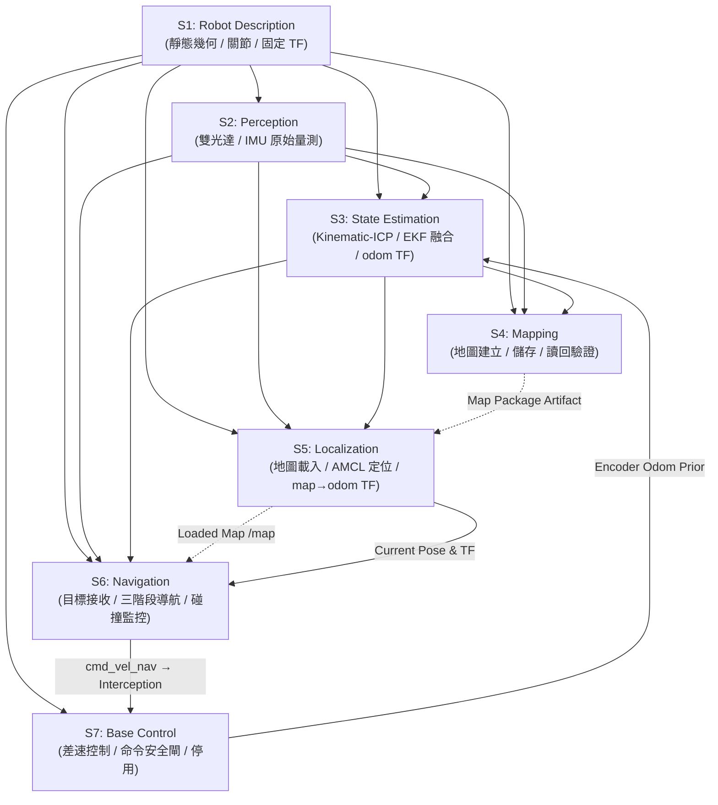
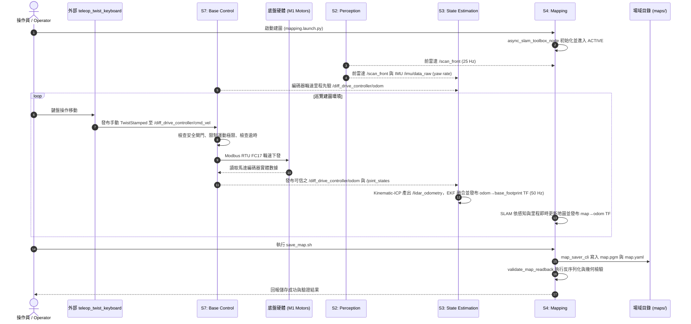
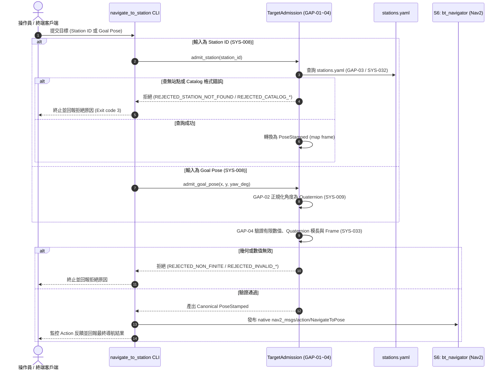
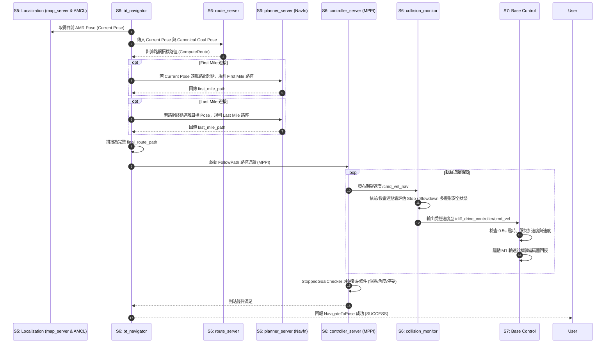

# System Architecture

本文件定義 `mobile_base` v0.1 之系統層級架構，包含系統邊界、操作模式、子系統劃分與責任配置、跨系統資料流與控制鏈、動態 TF 權限契約，以及全系統核心架構規範。

---

## 1. Purpose and Authority

### 1.1 上游基準與可行性證據約束
本架構文件嚴格以下列已核准文件為 **唯一 Normative Product Inputs**：
- [`docs/01_use_cases.md`](./01_use_cases.md)
- [`docs/02_capabilities.md`](./02_capabilities.md)
- [`docs/03_requirements.md`](./03_requirements.md)

本架構以 [`docs/04_reuse_assessment.md`](./04_reuse_assessment.md) 為 **Feasibility Evidence Base**。04 記錄了 exact-version 成熟套件對需求的覆蓋能力與 6 個 minimum custom gaps。

本架構為 `mobile_base` 目前 as-built 系統架構的**單一權威來源 (Single Canonical Authority)**。

### 1.2 下游關係與文件狀態
歷史子系統設計文件 [`docs/06_subsystem.md`](./06_subsystem.md) 已標記為 **SUPERSEDED**。本文件統籌定義全系統與子系統層級之架構責任與介面邊界，各子系統內部實作與配置以現行原始碼（`src/*`）、Launch 檔與參數 YAML 為準。

### 1.3 架構職權範圍 (Architecture Authority Boundaries)

| 05 System Architecture 決定 | 05 不應決定（保留至 Source / Config / Verification） |
|---|---|
| 系統分解為 S1–S7 主要 Subsystem 與責任配置 | Class / Struct / Function 內部程式碼實作細節 |
| 32 項已核准 SYS 需求與 6 個 Custom Gaps 的責任歸屬 | 具體原始碼檔案內部行級邏輯與資料結構 |
| 跨子系統之資料流、控制流與生命週期依賴關係 | Launch 檔與 YAML 配置之細部數值與調校表格 |
| 座標框架 TF Tree 的唯一動態與靜態發布權限契約 | 驅動程式內部暫存器編號與 Modbus 封包細部編解碼 |
| 速度命令鏈（Command Chain）與多層停止安全架構 | 操作命令指南、歷史開發日誌與過渡實作記錄 |
| Route-assisted 導航編排與 Station 導航架構 | 完整需求追溯矩陣（由 RTM 專責擁有）與驗證結果數據 |
| 場域資源（Map / Route Graph / Station Catalog）所有權與解析界線 | 導航演算法細部超參數調校與推測性根本原因分析 |

---

## 2. System Context

`mobile_base` 為基於 ROS 2 Jazzy 開發的自主移動機器人（AMR）底盤系統。系統邊界涵蓋 7 大核心子系統及其運行的軟體責任。

### 2.1 外部實體 (External Entities)
- **使用者 / 操作員 (Operator / User)**：提交建圖與儲存命令、操作鍵盤手動移動巡覽（透過外部 `teleop_twist_keyboard`）、提交導航目標（Station ID 或 Goal Pose）或發出取消請求。
- **實體感測器 (Physical Sensors)**：
  - 前左（Front-Left）與後右（Rear-Right）雙 SICK picoScan150 2D 激光雷達。
  - TDK IIM-42652 6 軸慣性測量單元（IMU）。
- **底盤動力硬體 (M1 Drive Hardware & Motors)**：
  - M1 雙驅動器差速動力總成，透過 RS-485 Modbus RTU 接收輪速控制命令並回傳實體編碼器量測狀態。
- **場域資源資料夾 (Site Artifacts)**：
  - 存放於 `maps/<site_name>/` 之二維佔據網格地圖（`map.pgm`, `map.yaml`）、路網圖（`route_graph.geojson`）與站點目錄（`stations.yaml`）。

### 2.2 系統脈絡圖 (System Context Diagram)

```text
       使用者 / 上層客戶端 (Operator / User)
          │                    │                     │
          │ 提交導航目標 / 取消 │ 啟動建圖 / 儲存      │ 操作鍵盤遙控 (Teleop)
          ▼                    ▼                     ▼
    ┌─────────────────────────────────────────────────────────────┐
    │                        mobile_base                          │
    │                                                             │
    │  ┌────────────────┐      ┌────────────────┐                 │
    │  │ S1 Robot Desc  │      │ S2 Perception  │◄─┼── 實體感測器 (LiDAR / IMU)
    │  └───────┬────────┘      └───────┬────────┘  │              │
    │          │                       │           │              │
    │          ▼                       ▼           │              │
    │  ┌────────────────┐      ┌────────────────┐  │              │
    │  │ S4 Mapping     │      │ S3 State Estim │  │              │
    │  └───────┬────────┘      └───────┬────────┘  │              │
    │          │                       │           │              │
    │          ▼ (Map Package)         ▼           │              │
    │  ┌────────────────┐      ┌────────────────┐  │              │
    │  │ S5 Localize    │─────►│ S6 Navigation  │  │              │
    │  └────────────────┘      └───────┬────────┘  │              │
    │                                  │           │              │
    │                                  ▼           │              │
    │                          ┌────────────────┐  │              │
    │                          │ S7 Base Control│◄─┴──────────────┘ (手動 TwistStamped)
    │                          └───────┬────────┘
    │                                  │
    │                                  ▼
    │                                  底盤動力硬體 (M1 Motors)
    └─────────────────────────────────────────────────────────────┘
                        ▲
                        │ 載入 Map Package / Route Graph / Station Catalog
           ┌────────────┴───────────┐
           │ 場域資源 (Site Artifacts)│
           └────────────────────────┘
```

---

## 3. Operational Modes

`mobile_base` v0.1 定義兩種**嚴格互斥 (Mutually Exclusive)** 的系統操作模式：

```text
                         ┌─────────────────┐
                         │   mobile_base   │
                         │   Shared Base   │
                         │ (S1,S2,S3,S7)   │
                         └────────┬────────┘
                                  │
                 ┌────────────────┴────────────────┐
                 ▼                                 ▼
      ┌─────────────────────┐           ┌─────────────────────┐
      │    Mapping Mode     │           │   Navigation Mode   │
      │       (UC-001)      │           │       (UC-002)      │
      ├─────────────────────┤           ├─────────────────────┤
      │ • S4 Mapping (建圖)  │           │ • S5 Localization   │
      │ • Teleop 速度命令輸入│           │   (map_server+AMCL) │
      │ • SLAM 擁有 map→odom │           │ • S6 Navigation     │
      │ • S5, S6 未啟用      │           │ • AMCL 擁有 map→odom│
      │                     │           │ • S4 未啟用         │
      └─────────────────────┘           └─────────────────────┘
```

### 3.1 Mapping Mode (UC-001)
- **目的**：巡覽未知環境，即時建立二維佔據網格地圖，並持久化儲存為 Map Package。
- **活躍子系統**：`S1 Robot Description`, `S2 Perception`, `S3 State Estimation`, `S4 Mapping`, `S7 Base Control`。
- **運動控制輸入**：操作員透過外部 `teleop_twist_keyboard` 發布手動速度命令（`geometry_msgs/msg/TwistStamped`）直接至 S7（`/diff_drive_controller/cmd_vel`，SYS-034）。未操作或命令停止時底盤停等，建圖程序維持運行。
- **動態 TF 權限**：由 S4 `slam_toolbox` 動態發布 `map -> odom` TF；由 S3 `robot_localization` EKF 動態發布 `odom -> base_footprint` TF。
- **互斥邊界**：`S5 Localization` 與 `S6 Navigation` **嚴格禁止啟動**。全系統僅存在單一手動運動命令源，不引入 `twist_mux` 或額外模式仲裁節點。

### 3.2 Navigation Mode (UC-002)
- **目的**：載入已建置地圖與路網資源，依據使用者提交之 Station 或 Goal Pose 目標執行三階段自主導航。
- **活躍子系統**：`S1 Robot Description`, `S2 Perception`, `S3 State Estimation`, `S5 Localization`（包含 `map_server` 地圖載入與 `amcl` 定位）, `S6 Navigation`, `S7 Base Control`。`S4 Mapping` 處於非活躍狀態（Inactive）。
- **運動控制輸入**：由 S6 Nav2 `controller_server` 運算自主軌跡，經 `collision_monitor` 安全閘門後輸出至 S7（`/diff_drive_controller/cmd_vel`）。
- **動態 TF 權限**：由 S5 `nav2_amcl` 唯一發布 `map -> odom` TF；由 S3 `robot_localization` EKF 唯一發布 `odom -> base_footprint` TF。
- **互斥邊界**：S4 `slam_toolbox` 建圖節點與外部 `teleop_twist_keyboard` **嚴格禁止啟動**。

---

## 4. Subsystem Architecture

系統劃分為 7 個高內聚、低耦合的子系統（S1–S7）：



---

### 4.1 S1: Robot Description
- **主要職責**：全系統幾何模型、車體外形（Footprint）、關節拓撲與感測器安裝靜態座標轉換（`/tf_static`）的唯一權威提供者。
- **承接需求**：`SYS-023`。
- **核心執行元件**：
  - `robot_state_publisher`（`mobile_base_description`）。
  - URDF/Xacro 幾何模型描述。
- **重要輸入**：
  - `/joint_states` (`sensor_msgs/msg/JointState`, 來自 S7)。
- **重要輸出**：
  - `/robot_description` (`std_msgs/msg/String`, Topic 與 Parameter)。
  - `/tf_static` (`tf2_msgs/msg/TFMessage`, 包含 `base_footprint -> base_link`、`base_link -> base_lidar_link_FL/BR`、`base_link -> base_imu_link`)。
  - `/tf` (`tf2_msgs/msg/TFMessage`, 輪端關節動態變換 `base_link -> driving_wheel_link_L/R`)。
- **TF 所有權**：所有靜態轉換與輪端關節狀態轉換。
- **架構約束**：嚴禁發布動態 `odom -> base_footprint` 或 `map -> odom`。
- **權威實作與配置參考**：
  - Launch: `src/mobile_base_description/launch/robot_description.launch.py`
  - Config: `src/mobile_base_description/config/robot_state_publisher.yaml`

---

### 4.2 S2: Perception
- **主要職責**：自實體硬體感測器（雙 2D 光達與 6 軸 IMU）擷取原始觀測量，轉換為標準 ROS 2 感測資料發布供下游子系統消耗。
- **承接需求**：`SYS-003`, `SYS-004`。
- **核心執行元件**：
  - `front_lidar_node` (`sick_scan_xd` 之 `sick_generic_caller`，讀取前左 SICK picoScan150)。
  - `rear_lidar_node` (`sick_scan_xd` 之 `sick_generic_caller`，讀取後右 SICK picoScan150)。
  - `imu_driver_node` (`tdk_ros2_imu` 之 `tdk_imu_node`，讀取 TDK IIM-42652)。
- **重要輸入**：實體感測器硬體通訊訊號（UDP / Serial）。
- **重要輸出**：
  - `/scan_front` (`sensor_msgs/msg/LaserScan`, Frame: `base_lidar_link_FL`, 25 Hz)。
  - `/scan_rear` (`sensor_msgs/msg/LaserScan`, Frame: `base_lidar_link_BR`, 25 Hz)。
  - `/imu/data_raw` (`sensor_msgs/msg/Imu`, Frame: `base_imu_link`, 50–100 Hz)。
- **TF 所有權**：無（由 S1 統一發布感測器靜態 Frame）。
- **架構約束**：
  - 採用**獨立雙雷達架構 (Independent Dual LiDAR)**。生產執行路徑中**完全不使用**虛擬融合節點 `dual_laser_merger`，亦無全局合併主題 `/scan`。
  - 各下游消費者（建圖、定位、里程、代價地圖、碰撞監控）直接訂閱所需之獨立雷達主題。
- **權威實作與配置參考**：
  - Launch: `src/mobile_base_perception/launch/sick_dual_lidar.launch.py`, `src/mobile_base_perception/launch/tdk_imu.launch.py`
  - Config: `src/mobile_base_perception/config/tdk_imu.yaml`

---

### 4.3 S3: State Estimation
- **主要職責**：以平面雷達掃描與輪速里程為先驗驅動 Kinematic-ICP，並由 EKF 融合雷達里程與 IMU 角速度，提供不依賴地圖的連續平面里程估測，作為全系統唯一權威發布 `odom -> base_footprint` 動態 TF。
- **承接需求**：`SYS-005`。
- **核心執行元件**：
  - `kinematic_icp_online_node` (`kinematic_icp`)。
  - `ekf_filter_node` (`robot_localization` / `mobile_base_state_estimation`)。
- **重要輸入**：
  - `/scan_front` (`sensor_msgs/msg/LaserScan`, 來自 S2)。
  - `/diff_drive_controller/odom` (`nav_msgs/msg/Odometry`, 來自 S7，作為 Kinematic-ICP 運動先驗)。
  - `/imu/data_raw` (`sensor_msgs/msg/Imu`, 來自 S2，EKF 僅融合 `yaw_rate`)。
- **重要輸出**：
  - `/lidar_odometry` (`nav_msgs/msg/Odometry`, 由 Kinematic-ICP 產出平面位姿 $x, y, \text{yaw}$)。
  - `/odometry/filtered` (`nav_msgs/msg/Odometry`, 由 EKF 融合輸出)。
  - 動態 TF: `odom -> base_footprint`（由 EKF 於 50 Hz 唯一發布）。
- **TF 所有權**：`odom -> base_footprint` 動態 TF 之**全系統唯一擁有者**。
- **架構約束**：
  - Kinematic-ICP 配置 `publish_odom_tf: false`，嚴禁發布 TF。
  - S7 `diff_drive_controller` 配置 `enable_odom_tf: false`，嚴禁發布 TF。
  - 生產架構中不存在任何 RF2O 元件或中間 `odom_lidar` 座標框架。
- **權威實作與配置參考**：
  - Config: `src/kinematic_icp/ros/config/kinematic_icp_ros.yaml`, `src/mobile_base_state_estimation/config/ekf.yaml`
  - Launch: `src/kinematic_icp/ros/launch/kinematic_icp.launch.py`, `src/mobile_base_state_estimation/launch/ekf.launch.py`

---

### 4.4 S4: Mapping
- **主要職責**：管理二維佔據網格地圖（Occupancy Grid）之建立與持久化生命週期：在 Mapping Mode 下接收感知與里程資訊，即時建立與更新地圖、持久化儲存為 Map Package（`map.pgm` 與 `map.yaml`），並執行儲存後讀回驗證（Read-back verification）。
- **承接需求**：`SYS-001`, `SYS-002`, `SYS-006`, `SYS-024`。
- **核心執行元件**：
  - `async_slam_toolbox_node` (`slam_toolbox`, Lifecycle Node)。
  - `map_saver_cli` (`nav2_map_server`)。
  - `validate_map_readback` (`mobile_base_mapping`)。
- **重要輸入**：
  - `/scan_front` (`sensor_msgs/msg/LaserScan`, 來自 S2)。
  - 動態 TF `odom -> base_footprint` (來自 S3)。
- **重要輸出**：
  - `/map` (`nav_msgs/msg/OccupancyGrid`, $0.05\,\text{m}$ 解析度)。
  - 動態 TF `map -> odom`（建圖模式下由 SLAM 暫時擁有並依 `transform_publish_period: 0.05` 發布）。
  - Map Package 實體檔案（`map.pgm`, `map.yaml`）。
- **TF 所有權**：Mapping Mode 下暫時擁有 `map -> odom` 動態 TF。
- **架構約束**：
  - 僅在 Mapping Mode 啟用；在 Navigation Mode 下保持非活躍（Inactive）。
  - 僅消耗前左雷達 `/scan_front`。
  - 地圖儲存流程必須在寫入後調用 `validate_map_readback` 進行反序列化與幾何元數據檢驗，確認合格後方判定儲存成功。
- **權威實作與配置參考**：
  - Config: `src/mobile_base_mapping/config/slam_toolbox.yaml`
  - Launch: `src/mobile_base_mapping/launch/mapping.launch.py`
  - Script: `src/mobile_base_bringup/scripts/save_map.sh`

---

### 4.5 S5: Localization
- **主要職責**：在 Navigation Mode 下，透過 `map_server` 載入所選定之 Map Package 提供佔據網格，並利用 AMCL 粒子濾波結合前雷達掃描與系統里程資訊，估測 AMR 在地圖中的全局位姿，作為唯一權威發布 `map -> odom` 動態座標轉換與標準定位 Pose；接收使用者提供之 Approximate Initial Pose 完成定位初始化。
- **承接需求**：`SYS-007`, `SYS-010`。
- **核心執行元件**：
  - `map_server` (`nav2_map_server`, Lifecycle Node)。
  - `amcl` (`nav2_amcl`, Lifecycle Node)。
  - `lifecycle_manager_localization` (`nav2_lifecycle_manager`，統籌管理 `map_server` 與 `amcl`)。
- **重要輸入**：
  - Map Package 檔案（經由 `site_resolution` 或 CLI 傳入 `map.yaml` 由 `map_server` 載入）。
  - `/scan_front` (`sensor_msgs/msg/LaserScan`, 來自 S2)。
  - 動態 TF `odom -> base_footprint` (來自 S3)。
  - `/initialpose` (`geometry_msgs/msg/PoseWithCovarianceStamped`, 來自 RViz2 或上層客戶端)。
- **重要輸出**：
  - `/map` (`nav_msgs/msg/OccupancyGrid`, 由 `map_server` 於導航期發布供定位與代價地圖使用)。
  - `/amcl_pose` (`geometry_msgs/msg/PoseWithCovarianceStamped`)。
  - 動態 TF `map -> odom`（導航模式下由 AMCL 唯一發布，`tf_broadcast: true`）。
- **TF 所有權**：Navigation Mode 下 `map -> odom` 動態 TF 之**唯一權威擁有者**。
- **架構約束**：僅在 Navigation Mode 啟用；僅消耗前雷達 `/scan_front`。
- **權威實作與配置參考**：
  - Config: `src/mobile_base_localization/config/amcl_params.yaml`
  - Launch: `src/mobile_base_localization/launch/localization.launch.py`

---

### 4.6 S6: Navigation
- **主要職責**：導航全生命週期任務編排（Navigation Task Orchestration）：
  1. **Target Admission**：接收外部目標，執行目標判別（GAP-01）、Goal Pose 正規化（GAP-02）、Station Catalog 查表解析（GAP-03）與 Canonical 幾何合法性驗證（GAP-04）。
  2. **Route Strategy**：讀取 `route_graph.geojson`，由 `route_server` 運算路網拓撲路徑。
  3. **Stage Execution**：編排與監控 First Mile → On Route → Last Mile 三階段路徑拼接與追蹤。
  4. **Supervision & Collision Protection**：透過 Nav2 Costmaps 維護障礙物代價，由 `collision_monitor` 攔截自主速度命令進行安全減速與煞停。
  5. **Completion & Result**：以 `StoppedGoalChecker` 評估到站停妥條件，對外統一回傳導航結果（Success / Failure / Canceled）。
- **承接需求**：`SYS-008`, `SYS-009`, `SYS-011`, `SYS-013`, `SYS-014`, `SYS-015`, `SYS-016`, `SYS-017`, `SYS-018`, `SYS-019`, `SYS-020`, `SYS-021`, `SYS-025`, `SYS-032`, `SYS-033`。
- **核心執行元件**：
  - `bt_navigator` (`nav2_bt_navigator`, 載入 `route_assisted_nav.xml`)。
  - `route_server` (`nav2_route`, 載入 `route_graph.geojson`)。
  - `planner_server` (`nav2_planner`, 使用 `nav2_navfn_planner::NavfnPlanner`)。
  - `controller_server` (`nav2_controller`, 使用 `nav2_mppi_controller::MPPIController` 與 `StoppedGoalChecker`)。
  - `collision_monitor` (`nav2_collision_monitor`)。
  - `lifecycle_manager_navigation` (`nav2_lifecycle_manager`)。
  - `navigate_to_station` CLI 應用程式（整合 `TargetAdmission` 模組）。
- **重要輸入**：
  - 外部目標（Station ID 或 Goal Pose）。
  - `/map` (來自 S5 `map_server`)。
  - `/scan_front` 與 `/scan_rear` (來自 S2，供 Local/Global Costmaps 與 Collision Monitor 使用)。
  - TF `map -> odom` (來自 S5) 與 `odom -> base_footprint` (來自 S3)。
  - 場域資源 `route_graph.geojson` 與 `stations.yaml`。
- **重要輸出**：
  - `/cmd_vel_nav` (`geometry_msgs/msg/TwistStamped`, 經 `collision_monitor` 攔截轉發至 S7 `/diff_drive_controller/cmd_vel`)。
  - 原生 Nav2 Action 介面反饋與結果 (`nav2_msgs/action/NavigateToPose`)。
- **TF 所有權**：無。
- **架構約束**：
  - 採用原生 `nav2_msgs/action/NavigateToPose` 進行導航目標調度，**系統不存在任何自製 `mobile_base_msgs/action/NavigateToStation` 介面**。
  - v0.1 關閉全域自由空間 Fallback（SYS-021）；當無可用路網解時直接終止任務並回報失敗。
- **權威實作與配置參考**：
  - Launch: `src/mobile_base_navigation/launch/navigation.launch.py`
  - Config: `src/mobile_base_navigation/config/nav2_params.yaml`
  - Behavior Tree: `src/mobile_base_navigation/behavior_trees/route_assisted_nav.xml`
  - Target Admission: `src/mobile_base_navigation/include/mobile_base_navigation/target_admission.hpp`
  - Station App: `src/mobile_base_navigation/src/navigate_to_station_app.cpp`

---

### 4.7 S7: Base Control
- **主要職責**：將自主或手動速度命令轉為差速輪運動控制，作為**底盤物理執行與安全防護的最終擁有者**：
  1. 執行差速輪閉迴路速度控制（SYS-022）。
  2. 接收並執行建圖期間來自外部手動速度命令（SYS-034）。
  3. 實施運動命令逾時保護（Command Timeout Stop, SYS-027）。
  4. 實施直線／旋轉速度與加速度極限限制（Operational Limits, SYS-028）。
  5. 檢核馬達驅動器編碼器回授狀態之有效性，提供可信的 Measured Wheel State（禁止偽造, GAP-05 / SYS-029）。
  6. 實施底盤硬體安全 Enable 自檢與停機 Safe Stop / Disable 序列（GAP-06 / SYS-026, SYS-030）。
- **承接需求**：`SYS-022`, `SYS-026`, `SYS-027`, `SYS-028`, `SYS-029`, `SYS-030`, `SYS-034`。
- **核心執行元件**：
  - `ros2_control_node` (`controller_manager`)。
  - `diff_drive_controller` (`diff_drive_controller/DiffDriveController`)。
  - `joint_state_broadcaster` (`joint_state_broadcaster/JointStateBroadcaster`)。
  - `M1Hardware` (`mobile_base_control/M1Hardware` SystemInterface Plugin)。
  - `M1Driver` (Modbus RTU 通訊庫)。
- **重要輸入**：
  - `/diff_drive_controller/cmd_vel` (`geometry_msgs/msg/TwistStamped`, 來自 S6 `collision_monitor` 或 Mapping 模式之 `teleop_twist_keyboard`)。
- **重要輸出**：
  - 物理輪端運動驅動（Modbus RTU FC17 輪速下發至 M1 驅動器）。
  - `/joint_states` (`sensor_msgs/msg/JointState`)。
  - `/diff_drive_controller/odom` (`nav_msgs/msg/Odometry`, 僅作為 S3 狀態估測先驗，不發布 TF)。
- **TF 所有權**：無。配置 `enable_odom_tf: false`，嚴禁向 `/tf` 發布 `odom -> base_footprint`。
- **架構約束**：
  - 控制迴圈運作於 30 Hz。
  - 嚴格實施時間戳 Stamped 速度命令逾時（$0.5\,\text{s}$）。
  - 實體編碼器回授無效時拒絕提供並發出警告，嚴禁以命令值冒充。
- **權威實作與配置參考**：
  - Launch: `src/mobile_base_control/launch/base_control.launch.py`
  - Config: `src/mobile_base_control/config/base_control_params.yaml`
  - Driver & Hardware: `src/mobile_base_control/src/m1_hardware.cpp`, `src/mobile_base_control/src/m1_driver.cpp`

---

## 5. Site Resources

### 5.1 場域資源模型 (Site Resource Artifacts)
v0.1 的場域資源集中存放於 `maps/<site_name>/` 目錄中，包含三項產品層資料：

```text
maps/<site_name>/
├── Map Package
│   ├── map.pgm             # 二維佔據網格影像 (UC-001 建圖產物)
│   └── map.yaml            # 地圖解析度 (0.05m)、原點與佔據門檻元數據
├── Route Graph
│   └── route_graph.geojson # 人工離線標註建立之路網拓撲 (GeoJSON 規範)
└── Station Catalog
    └── stations.yaml       # 站點 ID 與 map 座標/朝向映射表
```

### 5.2 資源責任與載入架構

| 場域資源 | 產物生命週期擁有者 (Artifact Lifecycle Owner) | 導航運行期載入擁有者 (Runtime Loading Owner) | 主要消費者 | 載入時機與條件 |
|---|---|---|---|---|
| **Map Package** (`map.yaml`, `map.pgm`) | `S4 Mapping` (建圖、儲存、讀回驗證) | `S5 Localization` (`map_server`) | `S5 AMCL`, `S6 Costmaps` | Navigation Mode 啟動時一次性載入 |
| **Route Graph** (`route_graph.geojson`) | 離線人工標註 / 場域維護 | `S6 Navigation` (`route_server`) | `S6 Navigation` (Route Server) | Navigation Mode 啟動時一次性載入 |
| **Station Catalog** (`stations.yaml`) | 離線人工定義 / 場域維護 | `S6 Navigation` (`TargetAdmission`) | `S6 Navigation` (CLI / Admission) | 提交 Station Target 時解析使用 |

### 5.3 資源解析層級 (Resolution Hierarchy)
啟動 Navigation Mode 時，資源路徑依據以下優先順序解析（由 `site_resolution.py` 實施）：
1. **Explicit CLI Overrides**：若指定 `map:=/path/to/map.yaml` 或 `route_graph:=/path/to/graph.geojson`，以顯式路徑優先。
2. **Site Directory Resolution**：若指定 `site:=<site_name>`，自動在 `maps/<site_name>/` 中尋找 `map.yaml`、`route_graph.geojson` 與 `stations.yaml`。
3. **錯誤防呆**：若未指定有效 site 且無 explicit map override，啟動腳本即刻中斷並回報原因。

> **架構邊界**：ROS 節點內部之演算法與超參數（如 AMCL 粒子數、MPPI 權重、控制器極限）屬於**部署配置 (Deployment Configuration)**，由套件 share 目錄中之參數 YAML 擁有，嚴禁混入現場資源目錄。

---

## 6. Cross-Subsystem Data Flows

### 6.1 建圖資料流 (Mapping Flow - UC-001)



---

### 6.2 導航目標接收與驗證流程 (Target Admission Flow)



---

### 6.3 路網導航執行流程 (Route-assisted Navigation Flow - UC-002)



---

## 7. TF Ownership

全系統嚴格規範每一段座標轉換（TF）的**唯一權威發布擁有者**，禁止任何未授權節點重複廣播造成 TF 跳動或競爭：

```text
[map]
  │
  │ 唯一動態擁有者:
  │ • Navigation Mode: S5 Localization (nav2_amcl)
  │ • Mapping Mode:    S4 Mapping (slam_toolbox)
  ▼
[odom]
  │
  │ 唯一動態擁有者: S3 State Estimation (robot_localization EKF)
  ▼
[base_footprint]
  │
  │ 唯一靜態擁有者: S1 Robot Description (robot_state_publisher)
  ▼
[base_link]
  │
  ├──► [base_lidar_link_FL]          (S1 /tf_static)
  ├──► [base_lidar_link_BR]          (S1 /tf_static)
  ├──► [base_imu_link]               (S1 /tf_static)
  ├──► [driving_wheel_link_L]        (S1 /tf, 依據 S7 /joint_states)
  └──► [driving_wheel_link_R]        (S1 /tf, 依據 S7 /joint_states)
```

### 7.1 TF 擁有權契約矩陣

| Transform | 模式 | 唯一權威發布者 | 發布介面 | 配置依據 | 嚴格禁止事項 |
|---|---|---|---|---|---|
| `map -> odom` | Mapping Mode | `S4 Mapping` (`slam_toolbox`) | `/tf` (Dynamic) | `transform_publish_period: 0.05` | 嚴禁 AMCL 同時啟動或發布。 |
| `map -> odom` | Navigation Mode | `S5 Localization` (`nav2_amcl`) | `/tf` (Dynamic) | `tf_broadcast: true` (變化時廣播) | 嚴禁 SLAM 同時啟動或發布。 |
| `odom -> base_footprint` | 全模式 (Mapping & Navigation) | `S3 State Estimation` (`ekf_filter_node`) | `/tf` (Dynamic) | `frequency: 50.0` (50 Hz) | 嚴禁 `diff_drive_controller` 或 `kinematic_icp` 發布此 TF。 |
| `base_footprint -> base_link` | 全模式 | `S1 Robot Description` (`robot_state_publisher`) | `/tf_static` | Latched | 靜態幾何高度固定（地面高程 $0.2560\,\text{m}$）。 |
| `base_link -> base_lidar_link_FL` | 全模式 | `S1 Robot Description` (`robot_state_publisher`) | `/tf_static` | Latched | 固定外參 $[+0.288, +0.267, -0.060]\,\text{m}$。 |
| `base_link -> base_lidar_link_BR` | 全模式 | `S1 Robot Description` (`robot_state_publisher`) | `/tf_static` | Latched | 固定外參 $[-0.247, -0.267, -0.060]\,\text{m}$。 |
| `base_link -> base_imu_link` | 全模式 | `S1 Robot Description` (`robot_state_publisher`) | `/tf_static` | Latched | 固定外參 $[+0.044, -0.008, -0.015]\,\text{m}$。 |
| `base_link -> driving_wheel_link_L/R` | 全模式 | `S1 Robot Description` (`robot_state_publisher`) | `/tf` (Dynamic) | `publish_frequency: 30.0` (30 Hz) | 依據 S7 提供之 `/joint_states` 發布。 |

---

## 8. Velocity Command and Safety Chain

系統建立階層式速度命令與安全攔截鏈，明確區分運動意圖產出與底盤安全防護：

```text
    ┌───────────────────────────┐         ┌───────────────────────────┐
    │       S6 Navigation       │         │   User / Operator         │
    │    (controller_server)    │         │   teleop_twist_keyboard   │
    │   (Navigation Mode 啟用)   │         │   (Mapping Mode 啟用)     │
    └─────────────┬─────────────┘         └─────────────┬─────────────┘
                  │                                     │
                  │ /cmd_vel_nav (TwistStamped)         │
                  │                                     │
                  ▼                                     │
    ┌───────────────────────────┐                       │
    │   S6 Collision Monitor    │                       │
    │  (前/後雷達多邊形安全防護)    │                       │
    └─────────────┬─────────────┘                       │
                  │                                     │
                  │ /diff_drive_controller/cmd_vel      │ /diff_drive_controller/cmd_vel
                  │ (經碰撞攔截後之安全命令)                 │ (手動巡覽速度命令, SYS-034)
                  │                                     │
                  └──────────────────┬──────────────────┘
                                     │
                                     ▼
                      ┌───────────────────────────┐
                      │      S7 Base Control      │
                      │  ┌─────────────────────┐  │
                      │  │ Base Safety Gate    │  │ ◄── 驅動警報 / 回授無效 / 停機中？ (SYS-030)
                      │  └──────────┬──────────┘  │     (異常即刻否決並停止)
                      │             ▼             │
                      │  ┌─────────────────────┐  │
                      │  │ Command Timeout     │  │ ◄── 超過 0.5s 未收到新命令？ (SYS-027)
                      │  └──────────┬──────────┘  │     (自動強制歸零煞停)
                      │             ▼             │
                      │  ┌─────────────────────┐  │
                      │  │ Operational Limits  │  │ ◄── 線速/角速與加速度限制 (SYS-028)
                      │  └──────────┬──────────┘  │
                      │             ▼             │
                      │  ┌─────────────────────┐  │
                      │  │ Diff-Drive Control  │  │ ──► Modbus RTU FC17 至 M1 驅動器
                      │  └─────────────────────┘  │
                      └───────────────────────────┘
```

### 8.1 多層停止安全架構 (Multi-Tier Stop Architecture)

| 停止層級 | 觸發來源 | 責任擁有者 | 行為語意與處置 |
|---|---|---|---|
| **Level 1a: Navigation Task Stop** | 抵達目標 / 任務取消 / 規劃失敗 | `S6 Navigation` | 終止導航任務、停止後續追蹤、輸出零速運動意圖。 |
| **Level 1b: Manual Movement Stop** | 建圖操作員放開按鍵 / 按下停止鍵 | 外部 `teleop_twist_keyboard` | 發布零速 `TwistStamped`，底盤受控減速煞停；建圖程序維持運作。 |
| **Level 1c: Collision Interception Stop** | 障礙物侵入 `PolygonStop` 安全多邊形 | `S6 Collision Monitor` | 攔截 `/cmd_vel_nav`，主動將輸出速度歸零發布至底盤，阻止碰撞。 |
| **Level 2: Command Timeout Stop** | 上游當機、通訊中斷或閒置超過 $0.5\,\text{s}$ | `S7 Base Control` | 控制器內部 Stale-command 逾時機制觸發，強制歸零輸出煞停（SYS-027）。 |
| **Level 3: Hardware Safe Stop** | 底盤故障 (`ERROR`) / 系統關機 / 停用請求 | `S7 Base Control` | 主動煞車減速、確認輪端完全停轉後切斷使能 (Servo-Off, SYS-030)。 |

---

## 9. Route-Assisted Navigation

`mobile_base` 導航編排採用路網優先（Route-assisted）的三階段移動架構：

```text
[Current Pose] ──First Mile──► [Route Entry] ──On Route──► [Route Exit] ──Last Mile──► [Canonical Goal Pose]
```

### 9.1 三階段架構行為
1. **First Mile（第一哩路）**：
   - 負責將 AMR 自當前初始位姿導引至路網入口（Route Entry）。
   - 由 Behavior Tree 節點 `ArePosesNear` 檢查；若 AMR 當前位姿已在路網起點容許範圍內，自動略過此階段。
   - 若未在起點，調用 `GridBased` (`NavfnPlanner`) 規劃自由空間路徑並與後續路徑拼接。
2. **On Route（路網主段）**：
   - 沿 `route_graph.geojson` 定義之拓撲路網移動，由 `route_server` 運算拓撲邊界與路徑。
3. **Last Mile（最後一哩路）**：
   - 負責將 AMR 自路網出口（Route Exit）導引至最終目標位姿（Canonical Goal Pose）。
   - 若路網出口與目標位姿重合，自動略過；否則調用 `GridBased` (`NavfnPlanner`) 規劃路徑並拼接。
4. **路徑追蹤與到站**：
   - 拼接完成之 `final_route_path` 交由 `MPPIController` (`FollowPath`) 統一追蹤。
   - 最終由 `StoppedGoalChecker` 確認位置誤差、朝向誤差與底盤停妥狀態（SYS-016）。

### 9.2 自由空間 Fallback 排除政策 (SYS-021)
- **v0.1 嚴格禁止全域自由空間 Fallback**。
- 當無法計算有效路網解或路網被障礙完全阻斷且無替代路線時，導航行為樹直接終止任務並回報失敗（`FAILURE`），嚴禁自動退化為全域自由空間尋路。

---

## 10. Station Navigation

Station 導航由專屬輕量客戶端與 Target Admission 模組驅動，完全建立於 Nav2 標準架構之上：

```text
navigate_to_station CLI
         │
         ▼
  TargetAdmission 函式庫 (GAP-01 ~ GAP-04)
  ├── GAP-01: Target Discriminator (辨識 Station ID 或 Goal Pose)
  ├── GAP-02: Goal Pose Normalizer (角度轉 Quaternion)
  ├── GAP-03: Station Catalog Resolver (查詢 stations.yaml)
  └── GAP-04: Canonical Goal Validator (驗證數值有限性與 Frame)
         │
         ▼ (產出 Canonical PoseStamped)
  原生 Action 調度: nav2_msgs/action/NavigateToPose
         │
         ▼
  Nav2 bt_navigator (執行 route_assisted_nav.xml)
```

### 10.1 架構特點
- **無自製 Action 介面**：系統**不定義亦不暴露**任何 `mobile_base_msgs/action/NavigateToStation` 自製 Action。
- **純客戶端解析**：Station 目錄查詢與座標轉換完全在客戶端 Target Admission 層完成，送入導航核心之目標皆為標準 `geometry_msgs/msg/PoseStamped`。
- **標準 Station Schema**：`stations.yaml` 採用簡潔標準格式（包含 `frame_id: map` 與 `stations: [{id, x, y, yaw_rad}]`）。

---

## 11. Architectural Constraints and Boundaries

1. **操作模式互斥 (Mode Mutual Exclusion)**：
   - Mapping Mode 與 Navigation Mode 具有完全不同的生命週期與 TF 拓撲，嚴禁同時運行。
   - 因模式嚴格互斥，系統維持最簡架構（Avoid Premature Structure），不引入額外之 `twist_mux` 節點。
2. **原始感測資料隔離 (Raw Perception Stream Isolation)**：
   - 雙光達原始資料 `/scan_front` 與 `/scan_rear` 獨立發布，不進行虛擬點雲合成。
   - IMU 僅向 EKF 提供角速度 `yaw_rate`，不提供易漂移之絕對姿態角度或線性加速度融合。
3. **底盤回授真實性約束 (Feedback Truthfulness Invariant)**：
   - S7 底盤驅動在通訊中斷或回授無效時必須拋出異常，嚴禁使用速度命令值偽造編碼器回授。
4. **已知受限邊界 (Bounded Operational Limitation)**：
   - 系統在特定回程軌跡（如 Station B $\rightarrow$ Station A）存在已記錄之進度逾時現象（Progress Timeout）。此現象屬於已知之受限運作邊界，不阻礙 MVP 基本架構之確立；細部參數最佳化與排查不屬於架構文件之範疇。

---

## 12. Requirement and Verification References

### 12.1 需求分配總表 (Subsystem Requirement Allocation)

| 子系統 ID | 子系統名稱 | 承接之系統需求 (SYS Requirements) | 客製缺口 (Custom Gaps) |
|---|---|---|---|
| **S1** | **Robot Description** | SYS-023 | - |
| **S2** | **Perception** | SYS-003, SYS-004 | - |
| **S3** | **State Estimation** | SYS-005 | - |
| **S4** | **Mapping** | SYS-001, SYS-002, SYS-006, SYS-024 | - |
| **S5** | **Localization** | SYS-007, SYS-010 | - |
| **S6** | **Navigation** | SYS-008, SYS-009, SYS-011, SYS-013, SYS-014, SYS-015, SYS-016, SYS-017, SYS-018, SYS-019, SYS-020, SYS-021, SYS-025, SYS-032, SYS-033 | GAP-01, GAP-02, GAP-03, GAP-04 |
| **S7** | **Base Control** | SYS-022, SYS-026, SYS-027, SYS-028, SYS-029, SYS-030, SYS-034 | GAP-05, GAP-06 |

### 12.2 權威追溯與驗證文件參照
- **系統需求定義**：參閱 [`docs/03_requirements.md`](./03_requirements.md)。
- **需求追溯矩陣 (RTM)**：全系統 32 項已核准需求與 2 項未分配編號（SYS-012, SYS-031）之實作檔案與驗證證據完整對映，參閱 [`docs/verification/traceability_matrix.md`](./verification/traceability_matrix.md)。
- **驗證證據索引 (Evidence Index)**：所有實機量測數據、測試報告與日誌索引，參閱 [`docs/verification/evidence_index.md`](./verification/evidence_index.md)。
