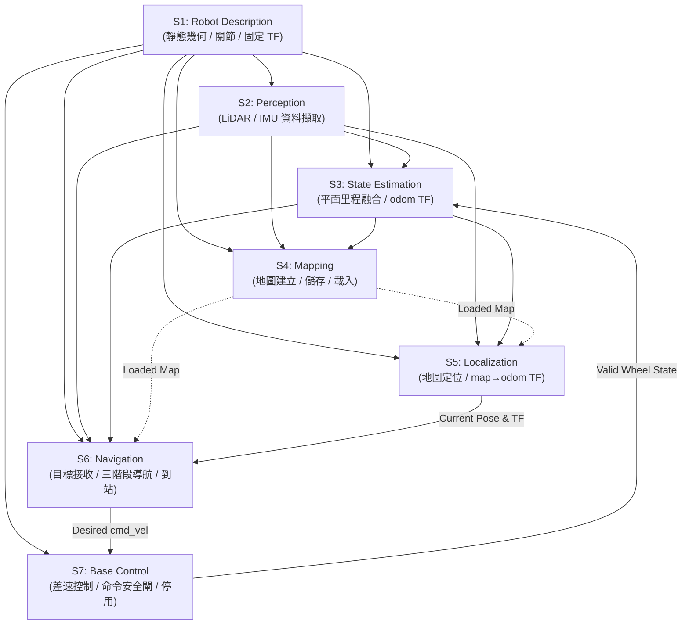
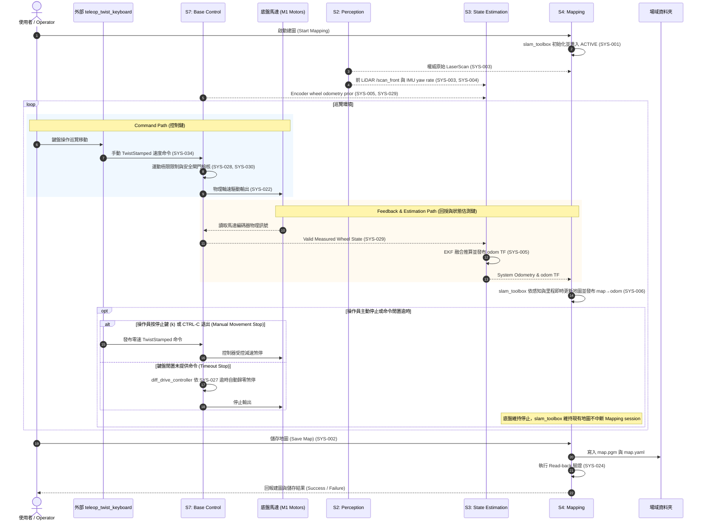
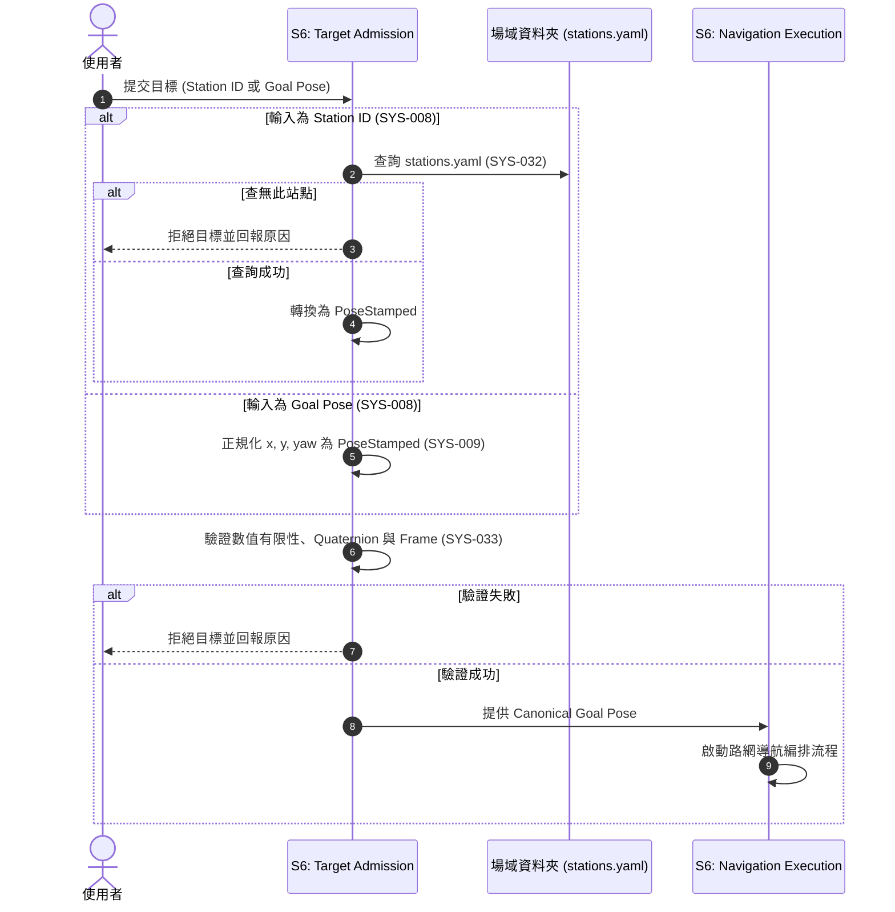
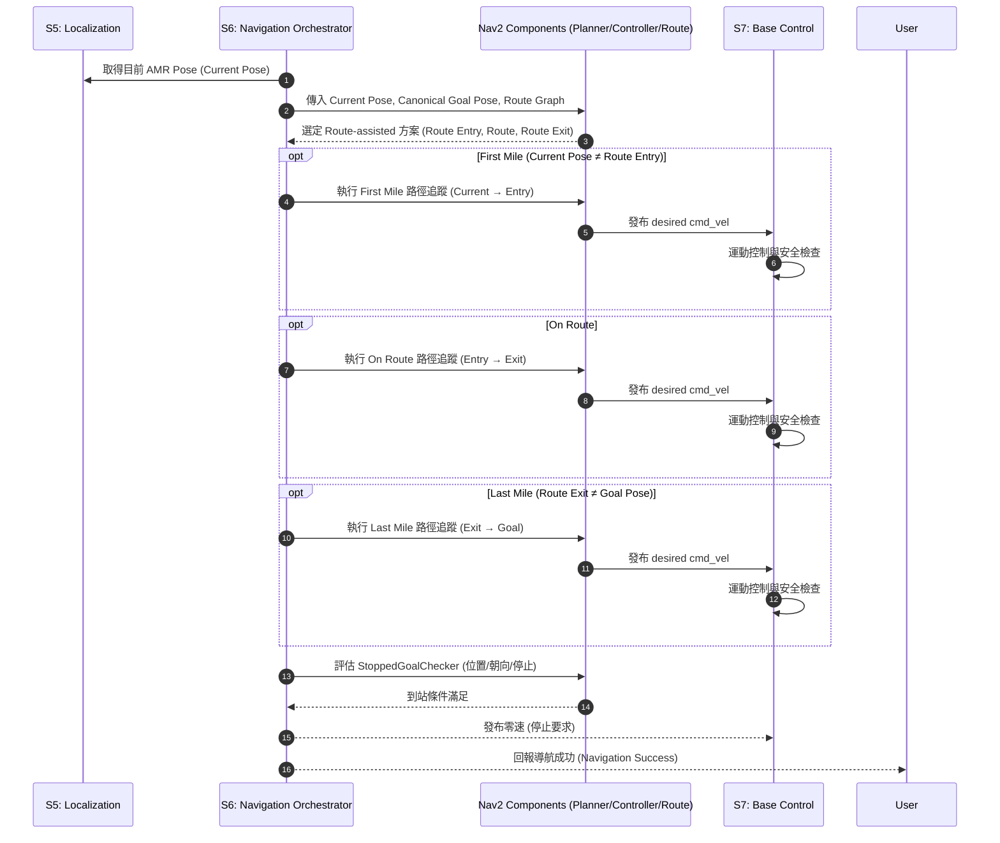

# System Architecture

本文件定義 `mobile_base` v0.1 之系統層級架構，包含系統邊界、子系統分解、責任配置、跨系統資料與控制流，以及全系統核心契約。

---

# 1. 目的、範圍與職權原則 (Purpose, Scope & Authority)

## 1.1 上游基準與可行性證據約束

本架構嚴格以下列已核准文件為 **唯一 Normative Product Inputs**：

- [`docs/01_use_cases.md`](file:///home/zzz/mobile_base/docs/01_use_cases.md)
- [`docs/02_capabilities.md`](file:///home/zzz/mobile_base/docs/02_capabilities.md)
- [`docs/03_requirements.md`](file:///home/zzz/mobile_base/docs/03_requirements.md)

本架構以 [`docs/04_reuse_assessment.md`](file:///home/zzz/mobile_base/docs/04_reuse_assessment.md) 為 **Feasibility Evidence Base**。04 記錄了 exact-version 成熟套件對需求的覆蓋能力與 6 個 minimum custom gaps。

本架構**不得**發明上游未定義的需求，亦**不得**在無證據的情況下推翻 04 的可行性結論；若架構推演中發現上游模型缺失，必須循序回溯修正上游文件。

## 1.2 下游邊界 (Downstream Documents)

本文件是 [`docs/06_subsystem.md`](file:///home/zzz/mobile_base/docs/06_subsystem.md) 的上游指引。06 負責各 Subsystem 內部的詳細設計、節點劃分、具體 ROS 2 介面（Topic/Service/Action）及配置定義。

06 必須完全服從 05 定義的子系統邊界、責任歸屬與跨系統契約，不得反向修改 05 的架構決策。

## 1.3 架構職權範圍 (Architecture Boundaries)

| 05 System Architecture 決定 | 05 不應決定（保留至 06 及實作） |
|---|---|
| 系統分解為哪些主要 Subsystem | Class / Struct / Function 內部程式碼 |
| 每個 Subsystem 的主要責任與非責任 | 內部 Package / Source File 目錄結構 |
| 32 項 SYS 需求的唯一 Subsystem 歸屬 | 具體 ROS Node 名稱、QoS Depth 設定 |
| 6 個 Custom Gaps 的責任區域配置 | ROS Topic / Service / Action 具體字串命名 |
| 成熟開源方案在架構中的責任配置 | 驅動程式內部 Register、Modbus 封包編解碼 |
| 跨子系統之資料流、控制流與生命週期依賴 | Launch 檔、YAML 配置之逐行參數值 |
| 座標框架 TF Tree 的唯一權威發布擁有權 | 單元測試與整合測試 Test Case 實作細節 |
| 速度命令鏈（Command Chain）與三層停止安全邊界 | 特定演算法內部數學推導或硬體 Bring-up 手冊 |

---

# 2. 架構驅動因子 (Architecture Drivers)

`mobile_base` v0.1 架構由下列核心驅動因子主導：

| ID | Architecture Driver | 關聯需求 | 架構對應設計原則 |
|---|---|---|---|
| **AD-001** | **可重複使用之地圖生命週期** | SYS-001, SYS-002, SYS-006, SYS-007, SYS-024 | 統一由 Mapping Subsystem 負責地圖之建立、更新、儲存、讀回驗證與載入；與導航定位生命週期乾淨分離。 |
| **AD-002** | **統一標準目標 (Canonical Target)** | SYS-008, SYS-009, SYS-032, SYS-033 | Station ID 與 Goal Pose 必須在進入導航編排前完成正規化與合法性驗證，轉為標準 `PoseStamped`。 |
| **AD-003** | **路網優先導航與三階段編排** | SYS-011, SYS-013, SYS-014, SYS-015, SYS-016, SYS-017, SYS-018, SYS-019, SYS-020, SYS-021, SYS-025 | 導航以 First Mile → On Route → Last Mile 組成；優先沿 Route Graph 移動；v0.1 簡化重選路邏輯，不實作自由空間 Fallback。 |
| **AD-004** | **共享感知與狀態估測分離** | SYS-003, SYS-004, SYS-005, SYS-010, SYS-029 | 原始感知資料（LiDAR/IMU）、不依賴地圖的平面里程估測（Odometry）與依賴地圖的全局定位（Localization）分屬獨立責任區域。 |
| **AD-005** | **閉迴路運動控制與硬體安全閘** | SYS-022, SYS-026, SYS-027, SYS-028, SYS-029, SYS-030, SYS-034 | 運動意圖與硬體執行權威分離；底盤控制具備獨立手動/自主命令執行、命令逾時、極限限制、回授有效性驗證與硬體安全停止能力。 |
| **AD-006** | **單一權威機器人幾何與座標系** | SYS-023 | 機器人幾何模型、關節結構與靜態 TF 擁有全系統唯一來源；動態 TF 段（`map→odom`、`odom→base_footprint`）嚴格單一發布。 |

---

# 3. 系統脈絡與操作模式 (System Context & Operational Modes)

## 3.1 系統邊界與外部實體 (System Context)

`mobile_base` 的系統邊界包含 7 大核心子系統及其運行的軟體責任。

外部實體包含：
- **使用者 / 上層客戶端 (User / Operator)**：提交建圖命令、操作鍵盤手動移動（透過外部 `teleop_twist_keyboard`）、提交導航目標或取消請求。
- **場域資料夾 (Site Artifacts)**：人工選定並確認之地圖、路網與站點檔案。
- **實體感測器 (LiDAR & IMU)**：提供原始物理量測訊號。
- **底盤動力硬體 (M1 Drive Hardware & Motors)**：接收物理驅動命令並回傳馬達編碼器狀態。

```text
       使用者 / 上層客戶端 (User / Operator)
          │                    │                     │
          │ 提交導航目標 / 取消 │ 啟動建圖 / 儲存      │ 操作鍵盤遙控 (Teleop)
          ▼                    ▼                     ▼
    ┌─────────────────────────────────────────────────────────────┐
    │                        mobile_base                          │
    │                                                             │
    │  ┌────────────────┐      ┌────────────────┐                 │
    │  │ S1 Robot Desc  │      │ S2 Perception  │◄─┼── 實體感測器 (LiDAR / IMU)
    │  └───────┬────────┘      └───────┬────────┘  │              │
    │          │                       │           │              │
    │          ▼                       ▼           │              │
    │  ┌────────────────┐      ┌────────────────┐  │              │
    │  │ S4 Mapping     │      │ S3 State Estim │  │              │
    │  └───────┬────────┘      └───────┬────────┘  │              │
    │          │                       │           │              │
    │          ▼                       ▼           │              │
    │  ┌────────────────┐      ┌────────────────┐  │              │
    │  │ S5 Localize    │─────►│ S6 Navigation  │  │              │
    │  └────────────────┘      └───────┬────────┘  │              │
    │                                  │           │              │
    │                                  ▼           │              │
    │                          ┌────────────────┐  │              │
    │                          │ S7 Base Control│◄─┴──────────────┘ (手動 TwistStamped)
    │                          └───────┬────────┘
    │                                  │
    │                                  ▼
    │                                  底盤動力硬體 (M1 Motors)
    └─────────────────────────────────────────────────────────────┘
                       ▲
                       │ 載入 Map Package / Route Graph / Station Catalog
          ┌────────────┴───────────┐
          │  場域資料夾 (Site Dir)  │
          └────────────────────────┘
```

## 3.2 互斥操作模式 (Operational Modes)

`mobile_base` v0.1 包含兩種**互斥（Mutually Exclusive）**的操作模式：

```text
                         ┌─────────────────┐
                         │   mobile_base   │
                         │   Shared Base   │
                         │ (S1,S2,S3,S7)   │
                         └────────┬────────┘
                                  │
                 ┌────────────────┴────────────────┐
                 ▼                                 ▼
      ┌─────────────────────┐           ┌─────────────────────┐
      │    Mapping Mode     │           │   Navigation Mode   │
      │       (UC-001)      │           │       (UC-002)      │
      ├─────────────────────┤           ├─────────────────────┤
      │ • S4 Mapping (建圖)  │           │ • S4 Mapping (載入) │
      │ • Teleop 速度命令輸入│           │ • S5 Localization   │
      │ • SLAM 擁有 map→odom │           │ • S6 Navigation     │
      │ • S5, S6 未啟用      │           │ • AMCL 擁有 map→odom│
      └─────────────────────┘           └─────────────────────┘
```

1. **Mapping Mode (UC-001)**：
   - 目的：建立環境二維佔據網格地圖並持久化為 Map Package。
   - 活躍子系統：`S1`, `S2`, `S3`, `S4`, `S7`。
   - 移動命令來源：使用者透過外部 `teleop_twist_keyboard` 發布手動速度命令（`geometry_msgs/msg/TwistStamped`）至 `S7 Base Control`（SYS-034）。手動命令停止或閒置時，底盤維持停止，不終止 Mapping session。
   - 命令仲裁：Mapping Mode 下 `S6 Navigation` 未啟用（inactive），`teleop_twist_keyboard` 為全系統唯一運動命令來源，不引入 command mux 或 mode manager。
   - TF 特性：由 SLAM 演算法（`slam_toolbox`）暫時擁有並發布 `map → odom` TF。
   - 互斥約束：`S5 Localization` 與 `S6 Navigation` **不得**處於活躍狀態。
2. **Navigation Mode (UC-002)**：
   - 目的：基於已載入地圖與路網，自主導航至指定目標。
   - 活躍子系統：`S1`, `S2`, `S3`, `S4` (僅載入), `S5`, `S6`, `S7`。
   - TF 特性：由 `S5 Localization` (AMCL) 唯一擁有並發布權威 `map → odom` TF。
   - 互斥約束：SLAM 建圖演算法與手動 teleop **不得** 處於活躍狀態。
   - 互斥約束：SLAM 建圖演算法 **不得** 處於活躍狀態。

---

# 4. 子系統分解與責任配置 (System Decomposition)

系統由 7 個高內聚、低耦合的 Subsystem 組成：



---

## S1: Robot Description

### 1. 主要職責
- 作為全系統唯一權威來源，提供機器人物理結構、外形幾何（Footprint）、關節（Joints）與感測器安裝之靜態座標轉換（Static Transforms）。
- 承接需求：**SYS-023**。

### 2. 邊界與非職責
- **In-Scope**：URDF 描述、`base_footprint → base_link`、`base_link → sensor_links` 等固定幾何關係發布。
- **Out-of-Scope**：動態運動狀態、動態里程計座標轉換（`odom → base_footprint`）、定位座標轉換（`map → odom`）。

### 3. 成熟技術配置
- ROS 2 Jazzy 標準 `robot_state_publisher` 與 `xacro` / URDF 機制。

---

## S2: Perception

### 1. 主要職責
- 負責自實體感測硬體（LiDAR、IMU）取得原始觀測量，並轉換為標準 ROS 感測資料向後發布。
- 承接需求：**SYS-003**, **SYS-004**。

### 2. 邊界與非職責
- **In-Scope**：LiDAR 驅動與標準 `sensor_msgs/msg/LaserScan` 提供；IMU 驅動與標準 `sensor_msgs/msg/Imu` 提供。
- **Out-of-Scope**：地圖建構、機器人位姿估測、感測資料融合估測、導航避障決策。

### 3. 成熟技術配置
- 成熟硬體驅動程式（如 `sllidar_ros2` 或同等雷達驅動、IMU 驅動節點）。

---

## S3: State Estimation

### 1. 主要職責
- 以前 LiDAR `/scan_front` 與 encoder wheel odometry `/diff_drive_controller/odom` 驅動 Kinematic-ICP，並由 EKF 融合 `/lidar_odometry` 的 x、y、yaw 與 IMU yaw rate，提供不依賴地圖的平面里程資訊。
- 作為全系統唯一權威，發布 `odom → base_footprint` 動態座標轉換。
- 承接需求：**SYS-005**。

### 2. 邊界與非職責
- **In-Scope**：平面里程融合估測、`odom → base_footprint` TF 發布、感測輸入異常時依預設預測模型持續推算。
- **Out-of-Scope**：地圖全域對齊定位（`map → odom`）、馬達驅動回授底層有效性檢查（由 S7 負責）。

### 3. 成熟技術配置
- `kinematic_icp` + `robot_localization` (`ekf_node`)；Kinematic-ICP 不發布 odom TF，EKF 為唯一 `odom → base_footprint` 發布者。

---

## S4: Mapping

### 1. 主要職責
- 管理二維佔據網格地圖（Occupancy Grid）的完整生命週期：
  1. Mapping Mode 下接收感知與里程資訊，即時建立與更新地圖。
  2. 將建圖結果持久化儲存為 Map Package（`map.pgm` 與 `map.yaml`）。
  3. 執行 Map Package 讀回驗證（Read-back verification）。
  4. Navigation Mode 下載入所選定的 Map Package 供定位與導航使用。
- 承接需求：**SYS-001**, **SYS-002**, **SYS-006**, **SYS-007**, **SYS-024**。

### 2. 邊界與非職責
- **In-Scope**：SLAM 建圖運算、地圖即時發布、地圖序列化儲存、地圖檔案載入。
- **Out-of-Scope**：導航定位估測計算、Route Graph 管理、Station Catalog 管理。

### 3. 成熟技術配置
- `slam_toolbox` (Online Async SLAM) + Nav2 `nav2_map_server` (MapIO)。

---

## S5: Localization

### 1. 主要職責
- 在 Navigation Mode 下，利用已載入之地圖、LiDAR 掃描與里程資訊，估測 AMR 在地圖中的全局位姿。
- 作為全系統唯一權威，發布 `map → odom` 動態座標轉換與標準定位 Pose。
- 接收使用者透過 RViz 人工提供的 Approximate Initial Pose 完成初始化。
- 承接需求：**SYS-010**。

### 2. 邊界與非職責
- **In-Scope**：蒙地卡羅粒子濾波定位（AMCL）、`map → odom` TF 發布、接收 Initial Pose。
- **Out-of-Scope**：地圖建立與管理、Odometry 本地估測、導航路徑規劃與控制決策。

### 3. 成熟技術配置
- Nav2 `nav2_amcl`。

---

## S6: Navigation

### 1. 主要職責
- 擁有完整的導航任務編排權限（Navigation Task Orchestration）：
  1. **Target Admission**：接收外部目標，執行正規化、Station 解析與幾何有效性驗證，轉為 Canonical Goal Pose。
  2. **Route Strategy**：讀取 Route Graph，建立路網優先移動策略。
  3. **Stage Execution**：編排與監控 First Mile → On Route → Last Mile 三階段移動。
  4. **Supervision**：路徑規劃、追蹤監控、利用 Costmap 避障、任務取消響應。
  5. **Completion & Result**：執行最終到站停止判定，統一產出導航結果（Success / Failure / Canceled）。
- 承接需求：**SYS-008**, **SYS-009**, **SYS-011**, **SYS-013**, **SYS-014**, **SYS-015**, **SYS-016**, **SYS-017**, **SYS-018**, **SYS-019**, **SYS-020**, **SYS-021**, **SYS-025**, **SYS-032**, **SYS-033**。

### 2. 邊界與非職責
- **In-Scope**：導航全生命週期編排、三階段執行切換、重新選路決策、最終結果發布。
- **Out-of-Scope**：底盤馬達物理控制、底盤安全停止與硬體 Disable、地圖定位運算。

### 3. 成熟技術配置與 Custom Gaps
- **成熟方案**：Nav2 Stack（`nav2_bt_navigator`, `nav2_planner`, `nav2_controller`, `nav2_route`, `nav2_costmap_2d`, `nav2_lifecycle_manager`）。
- **4 個 Custom Gaps (Target Admission Layer)**：
  - `SYS-008 Navigation Target Discriminator`：識別 Station 或 Goal Pose 輸入。
  - `SYS-009 Goal Pose Normalizer`：將終端座標與角度轉換為標準 `PoseStamped`。
  - `SYS-032 Station Catalog Resolver`：依場域 `stations.yaml` 查詢 Station ID。
  - `SYS-033 Canonical Goal Validator`：檢查數值有限性、Quaternion 合法性與 Frame。

---

## S7: Base Control

### 1. 主要職責
- 負責將 Navigation 提出的自主速度命令或 Mapping 模式下的手動速度命令轉為差速輪運動控制，並作為**底盤物理執行與安全防護的最終擁有者**：
  1. 執行差速輪閉迴路速度控制（SYS-022）。
  2. 接收並執行建圖期間來自外部的使用者手動速度命令（SYS-034）。
  3. 實施運動命令逾時保護（Command Timeout Stop, SYS-027）。
  4. 實施直線／旋轉速度與加速度極限限制（Operational Limits, SYS-028）。
  5. 驗證馬達驅動器回授狀態之有效性，提供可信的 Measured Wheel State（禁止偽造, SYS-029）。
  6. 處理底盤硬體錯誤、安全 Enable 條件檢查與安全 Stop / Disable 處置（SYS-026, SYS-030）。
- 承接需求：**SYS-022**, **SYS-026**, **SYS-027**, **SYS-028**, **SYS-029**, **SYS-030**, **SYS-034**。

### 2. 邊界與非職責
- **In-Scope**：差速運動學控制、手動與自主速度命令執行、底盤安全閘門（Safety Gate）、命令逾時停機、回授狀態檢核、硬體故障處置。
- **Out-of-Scope**：終端鍵盤輸入擷取（由外部成熟工具 `teleop_twist_keyboard` 承擔）、導航路徑規劃、避障決策、全域座標狀態估測。

### 3. 成熟技術配置與 Custom Gaps
- **成熟方案**：`ros2_control` 框架（`controller_manager`, `diff_drive_controller`）+ M1 專用 Hardware Interface；Mapping Mode 外部手動速度輸入由成熟方案 `teleop_twist_keyboard`（發布 `geometry_msgs/msg/TwistStamped`）提供。
- **2 個 Custom Gaps (Hardware / Safety Layer)**：
  - `SYS-029 Base Feedback Validity Checker`：檢核驅動器編碼器訊號有效性，無效時標記不可用，嚴禁以命令值替代。
  - `SYS-030 Base Safe Enable / Stop Logic`：開機通訊與狀態自檢後使能驅動；停機時確認停轉後切斷驅動使能。

---

# 5. 場域資源與載入職權 (Field Resources & Loading Responsibility)

## 5.1 場域資料夾模型 (Navigation Resources)

v0.1 的場域資料夾為人工維護之離線資料，僅包含以下三項產品層資源：

```text
場域資料夾 (Site Directory)
├── Map Package
│   ├── map.pgm         (二維佔據網格影像，UC-001 產物)
│   └── map.yaml        (地圖解析度、原點與門檻配置)
├── Route Graph
│   └── route_graph.geojson (人工離線標註建立之路網拓撲)
└── Station Catalog
    └── stations.yaml   (人工定義之站點 ID 與座標映射表，Station Target 使用)
```

> **架構決策**：
> 移除產品層的 `Navigation Configuration`。各 ROS 節點、AMCL、Nav2、控制器與底盤之設定參數回歸為**部署與子系統配置 (Deployment Configuration)**，不再作為場域資源。

## 5.2 資源載入責任矩陣 (Resource Loading Ownership)

系統不設立額外的「Resource Manager」子系統，各資源由使用它的子系統直接負責載入：

| 場域資源 | 載入與解析擁有者 | 主要消費者 | 載入時機與條件 |
|---|---|---|---|
| **Map Package** | `S4 Mapping` | `S5 Localization`, `S6 Navigation` | Navigation Mode 啟動時一次性載入 |
| **Route Graph** | `S6 Navigation` | `S6 Navigation` (Route Server) | Navigation Mode 啟動時載入 |
| **Station Catalog** | `S6 Navigation` | `S6 Navigation` (Target Admission) | 僅在使用者提交 Station Target 時條件式讀取 |

---

# 6. 跨系統執行與資料流 (Cross-Subsystem Flows)

## 6.1 建圖流程 (Mapping Flow - UC-001)



---

## 6.2 導航目標處理流程 (Navigation Target Admission Flow)



---

## 6.3 路網導航執行流程 (Route-assisted Navigation Flow - UC-002)



---

# 7. 全系統核心架構契約 (System-Wide Architectural Contracts)

## 7.1 座標框架與 TF Tree 唯一權威契約 (TF Authority Contract)

為防止 TF 跳動與多重發布衝突，全系統嚴格規範每一段 TF 的**唯一權威擁有者**：

```text
[map]
  │
  │ 唯一發布者: S5 Localization (AMCL)
  │ (建圖模式下暫由 S4 Mapping slam_toolbox 發布)
  ▼
[odom]
  │
  │ 唯一發布者: S3 State Estimation (robot_localization EKF)
  ▼
[base_footprint]
  │
  │ 唯一發布者: S1 Robot Description (robot_state_publisher)
  ▼
[base_link]
  │
  │ 唯一發布者: S1 Robot Description (robot_state_publisher)
  ├──► [laser_link]
  ├──► [imu_link]
  └──► [left_wheel_link / right_wheel_link]
```

> **禁止事項**：`diff_drive_controller` 或驅動節點嚴禁直接向 `/tf` 發布 `odom → base_footprint`。

---

## 7.2 速度命令與執行權限鏈契約 (Velocity Command Chain Contract)

```text
    ┌───────────────────────────┐         ┌───────────────────────────┐
    │       S6 Navigation       │         │   User / Operator         │
    │   (Navigation Mode 啟用)   │         │   teleop_twist_keyboard   │
    │                           │         │   (Mapping Mode 啟用)     │
    └─────────────┬─────────────┘         └─────────────┬─────────────┘
                  │                                     │
                  │ desired TwistStamped                │ manual TwistStamped
                  │ (自主導航運動意圖)                  │ (手動巡覽運動意圖, SYS-034)
                  │                                     │
                  └──────────────────┬──────────────────┘
                                     │
                                     ▼
                      ┌───────────────────────────┐
                      │      S7 Base Control      │
                      │  ┌─────────────────────┐  │
                      │  │ Base Safety Gate    │  │ ◄── 驅動警報 / 回授無效 / 停機中？ (SYS-030)
                      │  └──────────┬──────────┘  │     (若有異常，立即否決並停止)
                      │             ▼             │
                      │  ┌─────────────────────┐  │
                      │  │ Command Timeout     │  │ ◄── 超過 timeout 時間未收到新命令？ (SYS-027)
                      │  └──────────┬──────────┘  │     (自動強制歸零煞停)
                      │             ▼             │
                      │  ┌─────────────────────┐  │
                      │  │ Operational Limits  │  │ ◄── 限制速度/加速度 (SYS-028)
                      │  └──────────┬──────────┘  │
                      │             ▼             │
                      │  ┌─────────────────────┐  │
                      │  │ Diff-Drive Control  │  │ ──► 傳送輪速至 M1 硬體驅動 (SYS-022)
                      │  └─────────────────────┘  │
                      └───────────────────────────┘
```

1. **意圖與執行分離**：S6（導航模式）或外部 `teleop_twist_keyboard`（建圖模式）僅負責產出期望運動命令（Desired / Manual Velocity, `TwistStamped`）；S7 擁有底盤運動執行的最終安全與裁決權。
2. **命令源仲裁邊界 (Command Source Arbitration)**：
   - Mapping Mode 與 Navigation Mode 嚴格互斥。
   - 建圖期間 S6 未啟用，`teleop_twist_keyboard` 為全系統唯一的運動命令生產者。
   - 導航期間 teleop 不啟用，S6 為唯一的運動命令生產者。
   - 因此 v0.1 **不引入** `twist_mux` 或自製 mode manager 仲裁層，維持架構最簡（Avoid Premature Structure）。
3. **安全否決權 (Safety Gate)**：當底盤處於未 Enable、驅動器報警、通訊中斷或狀態回授無效時，S7 必須拒絕執行非零速度命令。
4. **命令逾時配置約束 (Command Timeout Configuration Constraint)**：
   - 為防止 teleop 配置破壞 `SYS-027` 運動命令逾時安全機制：
     - 若 `teleop_twist_keyboard` 採無按鍵重複發布（`repeat_rate = 0`），使用者停止按鍵後即停止發布新時間戳命令，由 S7 / `diff_drive_controller` 之 `cmd_vel_timeout` 提供 stale-command 逾時煞停保護。
     - 若未來配置非零 `repeat_rate`，必須同時配置有效之 `key_timeout`，使鍵盤放開後 teleop 主動轉發零速命令，嚴禁以重複發布舊 timestamp / 非零速度命令無限阻止 S7 逾時機制觸發。
     - 具體參數值保留至 06 子系統設計與實機驗證。

---

## 7.3 系統停止與安全語意契約 (Stop & Safety Semantics Contract)

系統明確區分下列層級與情境的「停止」，彼此獨立且互不替代：

| 停止類型 | 觸發來源 | 責任擁有者 | 行為語意與處置 |
|---|---|---|---|
| **Level 1a: Navigation Task Stop** | 使用者 Cancel / 導航階段失敗 / 抵達目標 | `S6 Navigation` | 終止或完成導航任務、停止後續路徑追蹤、向 S7 提出零速運動意圖（歸零 desired velocity）。 |
| **Level 1b: Manual Movement Stop** | 建圖操作員按停止鍵（如 `k`）/ `CTRL-C` 退出 | 外部 `teleop_twist_keyboard` | 主動發布零速 `TwistStamped` 命令，由 S7 控制器執行受控減速煞停；不涉及導航任務終止，亦不中斷 Mapping session。 |
| **Level 2: Timeout Stop** | 上游節點異常、通訊中斷或鍵盤操作閒置超過 `cmd_vel_timeout` | `S7 Base Control` | 底盤控制器在超過逾時門檻未收到新有效命令時，自動將速度 reference 強制歸零煞停（SYS-027）。 |
| **Level 3: Hardware Safe Stop** | 底盤硬體故障 (`ERROR`) / 系統關機 / 停用請求 | `S7 Base Control` | 主動煞車減速、確認輪端已完全停止、切斷馬達驅動器輸出 (Disable Drive)（SYS-030）。 |

---

## 7.4 障礙物資訊邊界契約 (Obstacle Information Contract)

- `S2 Perception` 僅負責以 `LaserScan` 提供標準環境量測。
- `S6 Navigation` 透過成熟 Nav2 Costmaps（Local/Global Costmap）消耗 `LaserScan` 並生成佔據代價與碰撞約束。
- S6 Orchestrator 本身不直接解析原始雷達點雲，避障與局部繞障完全委託 Nav2 成熟 Planning / Controller / Costmap 機制處理。

---

# 8. 導航編排、重新選路與 Fallback 策略 (Navigation Strategy)

## 8.1 階段轉換與零長度連接處理 (Stage Transition & Zero-length Handling)

導航任務由三個順序階段構成：

```text
[Current Pose] ──First Mile──► [Route Entry] ──On Route──► [Route Exit] ──Last Mile──► [Canonical Goal Pose]
```

- **Zero-length First Mile**：若 AMR 當前位姿已在適用的 Route Entry 上，First Mile 標記為 `NOT_REQUIRED` 並直接略過進入 On Route。
- **Zero-length Last Mile**：若 Route Exit 與 Canonical Goal Pose 重合（在容許誤差內），Last Mile 標記為 `NOT_REQUIRED` 並直接進入最終到站判定。
- **階段成功不等於導航成功**：First Mile 或 On Route 完成僅代表階段切換，**唯有最終 Canonical Goal Pose 的到站條件滿足**，導航才算成功。

---

## 8.2 MVP 重新選路策略 (MVP Route Reselection)

為符合 MVP 原則，系統不設計複雜的自製重路由演算法引擎：

```text
                On Route 執行受阻 / 階段失敗
                             │
                             ▼
              AMR 停止並取得最新 Current Pose
                             │
                             ▼
              重新呼叫既有 Route Selection 邏輯
                             │
            ┌────────────────┴────────────────┐
            ▼                                 ▼
   找到新的 Route-assisted 方案      無任何可用 Route-assisted 方案
            │                                 │
            ▼                                 ▼
       切換路徑並繼續執行            標記 NO_ROUTE_ASSISTED_SOLUTION
                                              │
                                              ▼
                                      導航失敗 (Navigation Failure)
```

---

## 8.3 Fallback 邊界與終止語意 (Reserved Fallback Boundary)

依據 **SYS-021**，系統保留 4 種 Free-space Fallback Eligibility 作為未來版本擴充點：
1. Current Pose 無法連接任何可用 Route Entry。
2. Route Graph 無法提供通往目標方向的可用 Route。
3. On Route 運動受阻且重新選路仍無可用 Route。
4. 所有 Route-assisted 候選路徑均無法自 Route Exit 安全 Last Mile 連接至目標。

### v0.1 執行規則：
- **v0.1 不實作且不執行 Free-space Fallback**。
- 當上述任一條件成立且已無可用路網方案時，系統判定為 `NO_ROUTE_ASSISTED_SOLUTION`，立即終止導航任務、要求底盤停止，並向使用者回報失敗。
- 嚴禁在路網失效時自動退化為全域自由空間導航。

---

## 8.4 到站判定與統一結果收斂 (Goal Completion & Unified Result)

### 1. 到站判定條件 (SYS-016)
僅當 AMR 同時滿足以下三項條件時，方可判定為導航成功：
$$\text{Position Error} \le \text{Position Tolerance}$$
$$\text{Orientation Error} \le \text{Orientation Tolerance}$$
$$\text{Base Status} == \text{STOPPED}$$

### 2. 統一導航結果 (SYS-017)
對外僅收斂為三種標準結果：
- **Success**：AMR 安全抵達目標且已完全停妥。
- **Failure**：導航過程中因目標不合法、規劃失敗、路徑追蹤中斷、路網用盡或硬體故障終止，並附帶原生錯誤原因。
- **Canceled**：使用者主動取消導航且系統已安全中止。

---

# 9. 需求與客製缺口追溯矩陣 (Traceability Matrix)

## 9.1 32 項系統需求歸屬表 (SYS Requirement Allocation)

| Requirement ID | 需求名稱 | 所屬 Subsystem | 對應 Capability | 架構實作機制 / 成熟方案 |
|---|---|---|---|---|
| **SYS-001** | 建立地圖 | `S4 Mapping` | CAP-001 | `slam_toolbox` Online Async SLAM |
| **SYS-002** | 儲存地圖 | `S4 Mapping` | CAP-001 | `nav2_map_server` MapIO 序列化輸出 |
| **SYS-003** | LiDAR 感知 | `S2 Perception` | CAP-001, 002 | 雷達硬體驅動程式發布 `LaserScan` |
| **SYS-004** | IMU 感知 | `S2 Perception` | CAP-001, 002 | IMU 硬體驅動程式發布 `Imu` |
| **SYS-005** | 系統里程 | `S3 State Estimation` | CAP-001, 002 | `robot_localization` EKF 融合發布 odom TF |
| **SYS-006** | 持續更新地圖 | `S4 Mapping` | CAP-001 | `slam_toolbox` 即時 Occupancy Grid 更新 |
| **SYS-007** | 載入地圖 | `S4 Mapping` | CAP-001 | `nav2_map_server` 地圖載入服務 |
| **SYS-008** | Navigation Target | `S6 Navigation` | CAP-002 | *Custom Gap*: Target Discriminator |
| **SYS-009** | Goal Pose Normalization | `S6 Navigation` | CAP-002 | *Custom Gap*: Pose Normalizer |
| **SYS-010** | 地圖定位 | `S5 Localization` | CAP-002 | Nav2 `nav2_amcl` (發布 `map→odom` TF) |
| **SYS-011** | 路徑規劃 | `S6 Navigation` | CAP-002 | Nav2 `nav2_planner` (Smac / NavFn) |
| **SYS-013** | Route-preferred Strategy | `S6 Navigation` | CAP-002 | Nav2 `nav2_route` + Stage Orchestration |
| **SYS-014** | 障礙物避讓 | `S6 Navigation` | CAP-002 | Nav2 `nav2_costmap_2d` 障礙層約束 |
| **SYS-015** | 路徑追蹤 | `S6 Navigation` | CAP-002 | Nav2 `nav2_controller` (MPPI) |
| **SYS-016** | 到站判定 | `S6 Navigation` | CAP-002 | Nav2 `StoppedGoalChecker` 停妥檢查 |
| **SYS-017** | 導航結果 | `S6 Navigation` | CAP-002 | Nav2 Action 回傳標準導航狀態 |
| **SYS-018** | First Mile | `S6 Navigation` | CAP-002 | Stage Orchestration (Current → Route Entry) |
| **SYS-019** | On Route Navigation | `S6 Navigation` | CAP-002 | Stage Orchestration (沿 Route Graph 移動) |
| **SYS-020** | Last Mile | `S6 Navigation` | CAP-002 | Stage Orchestration (Route Exit → Goal) |
| **SYS-021** | Reserved Fallback Boundary | `S6 Navigation` | CAP-002 | Fallback 判斷邏輯（v0.1 終止並回報失敗） |
| **SYS-022** | 底盤運動控制 | `S7 Base Control` | CAP-001, 002 | `ros2_control` `diff_drive_controller` |
| **SYS-023** | 機器人描述 | `S1 Robot Description` | CAP-001, 002 | `robot_state_publisher` + URDF/Xacro |
| **SYS-024** | Map Package Read-back | `S4 Mapping` | CAP-001 | `nav2_map_server` 儲存後讀回重解析檢驗 |
| **SYS-025** | 導航取消 | `S6 Navigation` | CAP-002 | Nav2 BT Navigator Action 取消響應 |
| **SYS-026** | 底盤故障處理 | `S7 Base Control` | CAP-001, 002 | `ros2_control` 硬體介面 ERROR 狀態處理 |
| **SYS-027** | 運動命令逾時 | `S7 Base Control` | CAP-001, 002 | `diff_drive_controller` `cmd_vel_timeout` |
| **SYS-028** | 底盤運動限制 | `S7 Base Control` | CAP-001, 002 | `diff_drive_controller` 速度/加速度限制 |
| **SYS-029** | 底盤狀態回授 | `S7 Base Control` | CAP-001, 002 | *Custom Gap*: Feedback Validity Checker |
| **SYS-030** | 底盤安全啟停 | `S7 Base Control` | CAP-001, 002 | *Custom Gap*: Safe Enable / Stop Logic |
| **SYS-032** | Station Target Resolution | `S6 Navigation` | CAP-002 | *Custom Gap*: Station Catalog Resolver |
| **SYS-033** | Canonical Goal Validation | `S6 Navigation` | CAP-002 | *Custom Gap*: Canonical Goal Validator |
| **SYS-034** | 手動移動控制 | `S7 Base Control` | CAP-001 | 外部 `teleop_twist_keyboard`（`TwistStamped`）+ `diff_drive_controller` 執行 |

---

## 9.2 6 個 Minimum Custom Gaps 配置表

| Gap ID | 關聯需求 | 責任 Subsystem | 架構位置 | 設計職責 |
|---|---|---|---|---|
| **GAP-01** | SYS-008 | `S6 Navigation` | Target Admission | 辨識終端提交之目標類型（Station ID 或 Goal Pose）。 |
| **GAP-02** | SYS-009 | `S6 Navigation` | Target Admission | 將使用者輸入之 x, y, yaw-deg 正規化為導航標準 `PoseStamped`。 |
| **GAP-03** | SYS-032 | `S6 Navigation` | Target Admission | 讀取場域 `stations.yaml`，將 Station ID 查表解析為對應 `PoseStamped`。 |
| **GAP-04** | SYS-033 | `S6 Navigation` | Target Admission | 檢核 `PoseStamped` 之數值有限性、Quaternion 合法性與 Frame 有效性。 |
| **GAP-05** | SYS-029 | `S7 Base Control` | Hardware Interface | 檢核馬達驅動器編碼器訊號有效性；無效時拒絕提供並發出警告，禁止以命令值冒充。 |
| **GAP-06** | SYS-030 | `S7 Base Control` | Hardware Interface | 啟動時自檢通訊與狀態後使能馬達；關機/停用時主動煞車並確認停轉後切斷使能。 |

---

## 9.3 成熟開源方案配置表

| 成熟方案模組 | 配置之 Subsystem | 負責之架構責任 | 排除之非職責（維持純粹性） |
|---|---|---|---|
| **`robot_state_publisher`** | `S1 Robot Description` | 靜態 TF 發布、機器人幾何描述 | 動態 odom / map TF 發布 |
| **Kinematic-ICP + `robot_localization` (EKF)** | `S3 State Estimation` | 前 LiDAR + wheel prior 產生 `/lidar_odometry`；EKF 融合 x/y/yaw 與 IMU yaw rate，發布 `odom→base_footprint` | merged `/scan` perception、全域地圖對齊 (`map→odom`) |
| **`slam_toolbox`** | `S4 Mapping` | Mapping Mode 下之 2D 建圖運算與 `map→odom` | 導航時之 AMCL 定位 |
| **`nav2_map_server`** | `S4 Mapping` | Map Package 序列化寫入、讀回驗證與載入 | 導航路徑規劃與控制 |
| **`nav2_amcl`** | `S5 Localization` | Navigation Mode 下基於地圖定位與發布 `map→odom` | 建圖與即時地圖更新 |
| **Nav2 Route / Planner / Controller** | `S6 Navigation` | 路網規劃、自由路徑規劃、路徑追蹤、到站檢查 | 底盤硬體通訊與馬達使能 |
| **`ros2_control` (`diff_drive_controller`)** | `S7 Base Control` | 差速閉迴路控制、命令逾時保護、運動極限限制 | 全域路徑規劃與避障決策 |
| **`teleop_twist_keyboard`** | 外部使用者輸入（對接 `S7 Base Control`） | Mapping Mode 下鍵盤手動速度命令（`TwistStamped`）發布 | 自主導航路徑規劃與避障 |
