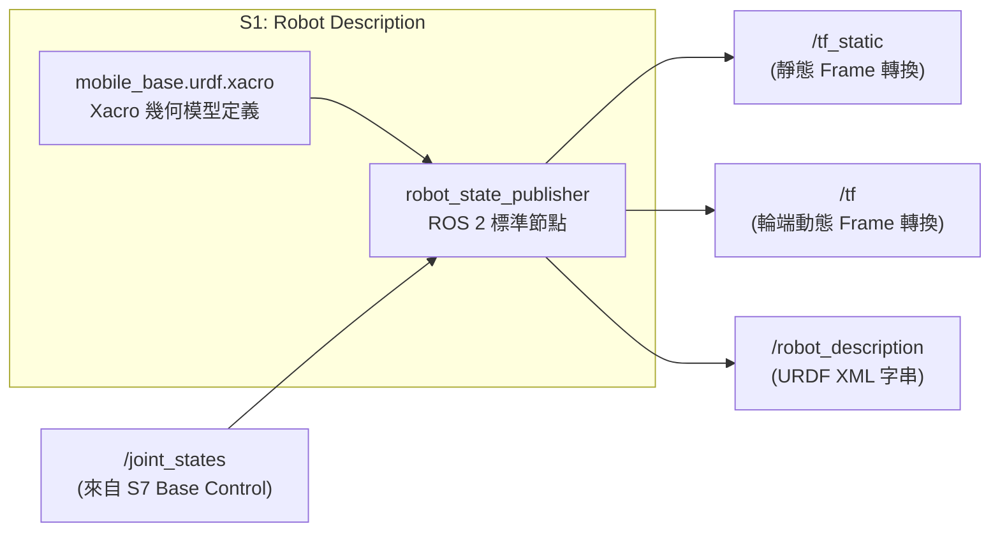
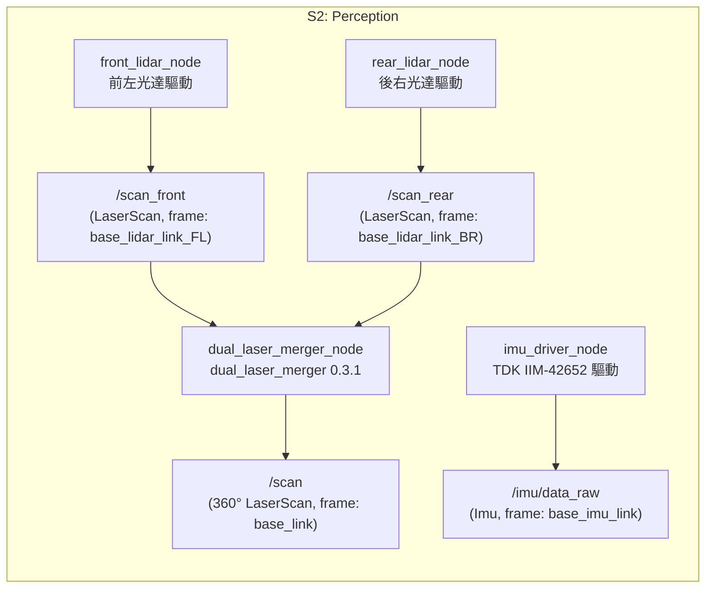
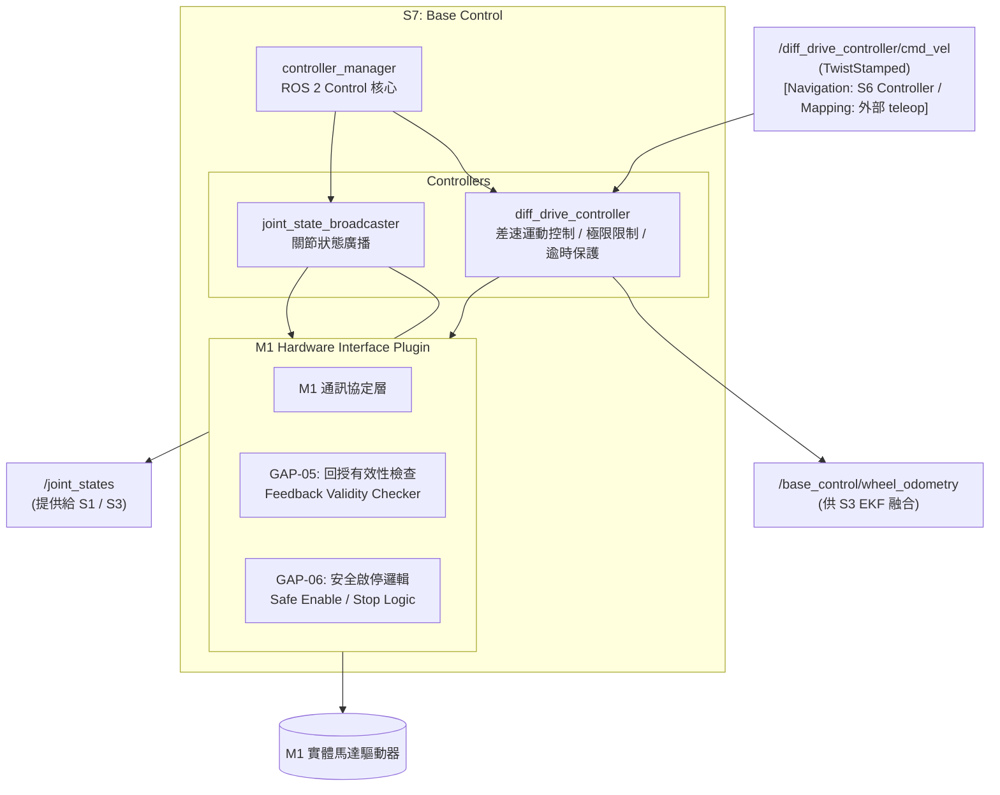
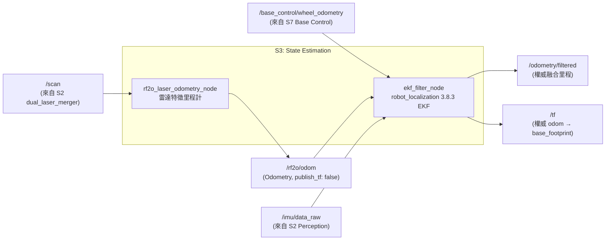

# Subsystem Design

本文件定義 `mobile_base` v0.1 各子系統的詳細設計，將 [`docs/05_architecture.md`](file:///home/zzz/mobile_base/docs/05_architecture.md) 已核准的 7 大子系統分解、責任配置、跨系統契約與操作流程，落實為可實作、可整合與可驗證的 ROS 2 軟體架構規格。

---

# 1. 目的、範圍與架構邊界 (Purpose, Scope & Authority)

## 1.1 Normative Input
本文件僅以 [`docs/05_architecture.md`](file:///home/zzz/mobile_base/docs/05_architecture.md) 為 **唯一 Normative Input**。

本文件負責定義：
- 各 Subsystem 的內部 ROS 2 Node / Lifecycle Component 分解；
- 權威 ROS 2 Interfaces（Topic, Service, Action, Message Type, Frame ID, QoS Profile）；
- YAML 參數結構與部署配置規範；
- 異常檢測（Failure Detection）、診斷（Diagnostics）與安全停止響應；
- 單元測試、整合測試與實機驗收規格（Verification Obligations）；
- 跨子系統協同契約（TF 權限、3-Tier 安全停止、三階段導航編排、6 個薄層 Custom Gaps）。

## 1.2 排除責任 (Excluded Responsibilities)
本文件不得：
- 反向修改 01–03 需求或 05 的 7 大子系統劃分與責任配置；
- 展開 function / class / method 內部實作演算法原始碼；
- 定義底層硬體暫存器編碼或 Modbus 封包細節（保留至 Driver 實作）；
- 虛構未經實機或整合驗證的運作參數。

---

# 2. 統一子系統設計模板 (Uniform Section Template)

每個子系統章節均嚴格遵循以下 6 大標準結構：
1. **Purpose & Architectural Boundary**：承接需求與邊界定義。
2. **Internal Component Decomposition**：內部節點劃分（成熟元件 vs Custom Gaps）。
3. **ROS 2 Authoritative Interfaces**：權威發布／訂閱介面、Message、Frame ID、QoS。
4. **Parameters & Configurations**：YAML 參數定義與 Schema。
5. **Failure Detection & Diagnostics**：錯誤處理與安全停止響應。
6. **Verification Obligations**：單元、介面、整合與實機驗證。

---

# 3. 子系統詳細設計 (Subsystem Detailed Design)

---

## 3.1 S1: Robot Description Subsystem

### 1. Purpose & Architectural Boundary
* **目的**：作為全系統唯一權威來源，提供 AMR 實體幾何外形（Footprint）、關節命名、靜態感測器安裝位置，以及發布靜態座標轉換（`/tf_static`）。
* **承接需求**：**SYS-023 機器人描述**。
* **邊界與排除**：
  * **In-Scope**：Xacro / URDF 模型定義、`base_footprint` / `base_link` / 驅動輪 / 感測器靜態座標轉換發布。
  * **Out-of-Scope**：動態里程計推算（S3 負責）、動態地圖定位（S5 負責）、關節物理馬達控制（S7 負責）。

### 2. Internal Component Decomposition


1. **`mobile_base_description` (Package / Model Asset)**：
   * 包含標準 Xacro 模型（`urdf/mobile_base.urdf.xacro`）與 3D Mesh 資源（`meshes/*.STL`）。
2. **`robot_state_publisher` (Node - ROS 2 Jazzy 標準元件)**：
   * 載入解析後的 URDF XML，廣播 `/tf_static`、`/robot_description`，並訂閱 `/joint_states` 發布輪端動態 `/tf`。

### 3. ROS 2 Authoritative Interfaces

#### 3.1 座標框架與外參定義 (Coordinate Frames - 遵守 REP-103 / REP-105)

| Frame ID | Parent Frame | 空間位置 $(x, y, z)\,\text{m}$ | 安裝朝向 $(r, p, y)\,\text{rad}$ | 實體說明 |
|---|---|---|---|---|
| **`base_footprint`** | - | $(0, 0, 0)$ | $(0, 0, 0)$ | 機器人投影於地表之二維基準原點。 |
| **`base_link`** | `base_footprint` | $(0, 0, \mathbf{+0.2560})$ | $(0, 0, 0)$ | 底盤本體幾何中心（地面高程 $256\,\text{mm}$）。 |
| **`driving_wheel_link_L`** | `base_link` | $(+0.0205, \mathbf{+0.2775}, \mathbf{-0.1760})$ | $(0, 0, 0)$ | 左驅動輪（輪距半寬 $0.2775\,\text{m}$，輪心高程 $-0.1760\,\text{m}$，半徑 $0.08\,\text{m}$）。 |
| **`driving_wheel_link_R`** | `base_link` | $(+0.0205, \mathbf{-0.2770}, \mathbf{-0.1760})$ | $(0, 0, 0)$ | 右驅動輪（輪距半寬 $0.2770\,\text{m}$，輪心高程 $-0.1760\,\text{m}$，半徑 $0.08\,\text{m}$）。 |
| **`base_lidar_link_FL`** | `base_link` | $(+0.28771, +0.26721, -0.06011)$ | $(\mathbf{\pi}, 0, \mathbf{+\pi/4})$ | 前左雷達（上下倒裝，逆時針旋轉 $45^\circ$）。 |
| **`base_lidar_link_BR`** | `base_link` | $(-0.24671, -0.26721, -0.06011)$ | $(\mathbf{\pi}, 0, \mathbf{-3\pi/4})$ | 後右雷達（上下倒裝，順時針旋轉 $135^\circ$）。 |
| **`base_imu_link`** | `base_link` | $(+0.04375, -0.00800, -0.01459)$ | $(0, 0, \mathbf{+\pi/2})$ | IMU 晶片（逆時針旋轉 $90^\circ$）。 |

#### 3.2 訂閱介面 (Subscribed Interfaces)
| 介面名稱 | 介面型別 | 提供者 (Producer) | QoS Profile | 說明 |
|---|---|---|---|---|
| `/joint_states` | `sensor_msgs/msg/JointState` | `S7 Base Control` | Reliable, Volatile, Depth: 10 | 包含 `driving_wheel_joint_L` 與 `driving_wheel_joint_R` 之即時狀態。 |

#### 3.3 發布介面 (Published Interfaces)
| 介面名稱 | 介面型別 | QoS Profile | 權威發布內容 |
|---|---|---|---|
| `/robot_description` | `std_msgs/msg/String` (Topic & Parameter) | TransientLocal, Reliable | 完整 URDF XML 字串供 RViz2、Nav2 Costmap 等使用。 |
| `/tf_static` | `tf2_msgs/msg/TFMessage` | TransientLocal, Reliable | 靜態座標轉換：`base_footprint → base_link`、`base_link → base_lidar_link_FL/BR`、`base_link → base_imu_link`。 |
| `/tf` | `tf2_msgs/msg/TFMessage` | Dynamic, SystemDefault | 依據 `/joint_states` 發布 `base_link → driving_wheel_link_L/R`。 |

### 4. Parameters & Configurations

```yaml
# config/robot_state_publisher.yaml
robot_state_publisher:
  ros__parameters:
    publish_frequency: 30.0 # 關節動態 TF 發布頻率 (Hz)
    ignore_timestamp: false
    use_sim_time: false
    frame_prefix: ""
```

* **幾何常數（封裝於 Xacro 宏定義中，供 S7 引用）**：
  * `wheel_separation`: `0.5545`（公尺）
  * `wheel_radius`: `0.080`（公尺）
  * `ground_clearance`: `0.2560`（公尺）

### 5. Failure Detection & Diagnostics
1. **URDF 語法/檔案缺失**：`robot_state_publisher` 啟動時崩潰並輸出 FATAL 日誌，終止系統啟動流程，防止無座標系統運行。
2. **`/joint_states` 訊號中斷**：`/tf_static` 保持正常廣播，但輪端動態 TF 停止更新；由 S7 底盤診斷模組發出警告。
3. **Frame 缺失防護**：下游節點（Nav2、AMCL）啟動時由 `tf2_ros::Buffer` 檢查所需 Frame，若超時未收到則拒絕進入 Active 狀態。

### 6. Verification Obligations
1. **靜態模型語法驗證 (Unit Test)**：執行 `xacro mobile_base.urdf.xacro` 並通過 `check_urdf` 檢查無斷鏈。
2. **靜態 TF 完整性驗證 (Interface Test)**：節點啟動後，使用 `tf2_echo base_footprint base_lidar_link_FL`、`base_lidar_link_BR` 與 `base_imu_link`，確認 Transform 數值與 RPY 精確無誤。
3. **實機物理驗收 (Real-hardware Validation)**：實車量測雷達、IMU 安裝距離與輪距，確認與 Xacro 數值誤差 $< 2\,\text{mm}$。

---

## 3.2 S2: Perception Subsystem

### 1. Purpose & Architectural Boundary
* **目的**：自前左/後右雙光達硬體與 6 軸 IMU 取得原始物理量測，並透過成熟雷達融合節點產出全域 360° 掃描，提供標準 ROS 2 `LaserScan` 與 `Imu` 訊息供全系統使用。
* **承接需求**：
  * **SYS-003 LiDAR 感知**：提供掃描資料供建圖（S4）、定位（S5）與導航（S6）使用。
  * **SYS-004 IMU 感知**：提供 IMU 數據供狀態估測（S3）使用。
* **邊界與排除**：
  * **In-Scope**：感測器驅動通訊、標準訊息封裝、Frame ID 標記、`dual_laser_merger` 雙雷達融合、感測器斷線與逾時偵測。
  * **Out-of-Scope**：TF 發布（由 S1 統一發布）、狀態估測融合（S3 負責）、建圖（S4 負責）、導航代價地圖解讀（S6 負責）。

### 2. Internal Component Decomposition


1. **`front_lidar_node` (Driver Node)**：通訊讀取前左 2D 光達，發布原始 `/scan_front`。
2. **`rear_lidar_node` (Driver Node)**：通訊讀取後右 2D 光達，發布原始 `/scan_rear`。
3. **`dual_laser_merger_node` (ROS 2 Jazzy `dual_laser_merger` 0.3.1 成熟元件)**：
   * 訂閱 `/scan_front` 與 `/scan_rear`，透過 S1 `/tf_static` 空間幾何將兩路掃描在 `base_link` 坐標系下合成為單一 360° `/scan`。
4. **`imu_driver_node` (Driver Node - TDK IIM-42652)**：讀取 3 軸角速度與 3 軸線性加速度，發布 `/imu/data_raw`。

### 3. ROS 2 Authoritative Interfaces

#### 3.1 發布介面 (Published Interfaces)
| 介面名稱 | 訊息型別 | `frame_id` (來自 S1) | QoS Profile | 典型頻率 | 說明與消費者 |
|---|---|---|---|---|---|
| **`/scan`** | `sensor_msgs/msg/LaserScan` | `base_link` | `SensorData` / `SystemDefaults` | $15 \sim 25\,\text{Hz}$ | **360° 融合雷達資料**。<br/>供 **S3 RF2O**、**S4 slam_toolbox**、**S5 AMCL** 訂閱。 |
| **`/scan_front`** | `sensor_msgs/msg/LaserScan` | `base_lidar_link_FL_1` | `Reliable / TransientLocal` (Driver Default) | $25\,\text{Hz}$ | 前左原始掃描（Layer 1 光學掃描面）。<br/>供 S6 Nav2 Costmap 避障及 `dual_laser_merger` 融合使用。 |
| **`/scan_rear`** | `sensor_msgs/msg/LaserScan` | `base_lidar_link_BR_1` | `Reliable / TransientLocal` (Driver Default) | $25\,\text{Hz}$ | 後右原始掃描（Layer 1 光學掃描面）。<br/>供 S6 Nav2 Costmap 避障及 `dual_laser_merger` 融合使用。 |
| **`/imu/data_raw`** | `sensor_msgs/msg/Imu` | `base_imu_link` | `SensorData` | $50 \sim 100\,\text{Hz}$ | 原始 3 軸角速度與線性加速度。<br/>供 **S3 robot_localization EKF** 訂閱。 |

### 4. Parameters & Configurations

> **配置原則**：06 規範核心架構參數（如 `frame_id`、發布頻率、主題名稱綁定）；底層硬體連線細節（如 IP 位址、串列埠號 `/dev/ttyUSB*`、原廠濾波設定）依實車安裝與選用套件之 Native Schema 於實作階段填入。

```yaml
# config/perception_params.yaml
front_lidar_node:
  ros__parameters:
    frame_id: "base_lidar_link_FL"
    scan_frequency: 15.0

rear_lidar_node:
  ros__parameters:
    frame_id: "base_lidar_link_BR"
    scan_frequency: 15.0

dual_laser_merger_node:
  ros__parameters:
    laser_1_topic: "/scan_front"
    laser_2_topic: "/scan_rear"
    target_frame: "base_link"
    merged_scan_topic: "/scan"
    angle_min: -3.14159265
    angle_max: 3.14159265
    scan_time: 0.0666667
    range_min: 0.05
    range_max: 25.0

imu_driver_node:
  ros__parameters:
    frame_id: "base_imu_link"
    publish_rate: 100.0
```

### 5. Failure Detection & Diagnostics
1. **感測器通訊逾時**：驅動節點若超過 $0.5\,\text{秒}$ 未收到硬體數據，透過 `/diagnostics` 發布 `ERROR` 狀態。
2. **點雲遮擋與無效點處理**：小於 `range_min` 或大於 `range_max` 者填充為 `+Inf`，嚴禁填充為 `NaN`。
3. **融合節點 TF 依賴防護**：若 `dual_laser_merger` 無法取得 `base_lidar_link_FL/BR → base_link` 之 TF 轉換，停止發布 `/scan` 並輸出警告，防止發布畸變點雲。

### 6. Verification Obligations
1. **介面與 Frame 驗證 (Interface Test)**：
   * 確認 `/scan_front` (`base_lidar_link_FL`)、`/scan_rear` (`base_lidar_link_BR`)、`/scan` (`base_link`) 與 `/imu/data_raw` (`base_imu_link`) 之 Header Frame ID 與 QoS 正確。
2. **雷達 360° 融合完整性檢驗 (Integration Test)**：
   * 在 RViz2 中以 `base_link` 為 Fixed Frame 同時可視化 `/scan_front`、`/scan_rear` 與 `/scan`，確認重疊區域點雲平滑對齊無雙重重影。
3. **IMU 靜態重力檢驗 (Unit Test)**：
   * 機器人靜止時，`/imu/data_raw` 經 S1 TF 轉換後之車體 $Z$ 軸加速度應為 $+9.81 \pm 0.2\,\text{m/s}^2$。

---

## 3.3 S7: Base Control Subsystem

### 1. Purpose & Architectural Boundary
* **目的**：接收上層自主速度命令或建圖期間外部手動速度命令，依差速運動學控制 M1 馬達動力硬體執行移動，實施命令逾時保護與運動極限約束，檢驗馬達回授有效性（GAP-05），並掌管底盤安全啟停與硬體故障安全閘門（GAP-06）。
* **承接需求**：
  * **SYS-022 底盤運動控制**：差速輪閉迴路速度控制。
  * **SYS-026 底盤故障處理**：Hardware Interface 回傳 `ERROR` 時停用 Controller 並暴露錯誤。
  * **SYS-027 運動命令逾時**：逾時未收到新速度命令強制底盤停止。
  * **SYS-028 底盤運動限制**：限制直線/旋轉速度及加速度在 Operational Limits 內。
  * **SYS-029 底盤狀態回授**：提供驅動器有效回授之輪端狀態，**禁止以命令值冒充**（GAP-05）。
  * **SYS-030 底盤安全啟停**：自檢後安全 Enable；停機時確認停轉後切斷驅動使能（GAP-06）。
  * **SYS-034 手動移動控制**：建圖期間接收並執行外部手動速度命令（`geometry_msgs/msg/TwistStamped`），依差速輪運動學驅動底盤巡覽環境，嚴格服從命令逾時、運動限制與安全啟停保護；未提供命令或命令停止時底盤停止，不中斷建圖程序。
* **邊界與排除**：
  * **In-Scope**：`ros2_control` 框架整合、`diff_drive_controller`、M1 專用 Hardware Interface、GAP-05 回授檢查、GAP-06 安全啟停邏輯、接收 `TwistStamped` 速度命令。
  * **Out-of-Scope**：終端鍵盤輸入捕捉（由外部成熟工具 `teleop_twist_keyboard` 負責）、全域路徑規劃（S6 負責）、多感測器里程融合（S3 負責）、動態 TF 發布（**S7 嚴禁發布 `odom → base_footprint` TF**）。

### 2. Internal Component Decomposition


1. **`diff_drive_controller` (ROS 2 Jazzy 成熟控制器，Exact Version: 4.42.1)**：
   * 訂閱 `/diff_drive_controller/cmd_vel`（`geometry_msgs/msg/TwistStamped`），依 S1 定義的輪距與輪徑轉換為雙輪目標角速度。
   * 實施 `cmd_vel_timeout`（$0.5\,\text{s}$ 逾時歸零，SYS-027）與速度/加速度限制（SYS-028）。
   * 依據 `header.stamp` 與節點 Clock 檢驗時間戳新鮮度；`frame_id` 僅供訊息標準化，控制器不執行 TF 轉換。
   * **關閉內建 TF 發布**（`enable_odom_tf: false`），由 S3 唯一發布。
2. **`joint_state_broadcaster` (ROS 2 成熟元件)**：
   * 讀取硬體介面的輪端狀態，發布 `/joint_states`（提供給 S1 廣播動態關節 TF）。
3. **`M1HardwareInterface` (Custom SystemInterface Plugin - 包含 GAP-05 與 GAP-06)**：
   * 透過 RS-485 / CAN 通訊存取 M1 底盤驅動器。
   * **GAP-05 (回授有效性檢查)**：檢核編碼器訊號與通訊 CRC；若回授中斷或異常，將 State 標記為 Invalid/NaN，**嚴禁以命令速度填充假數據**。
   * **GAP-06 (安全啟停邏輯)**：
     * **Enable 流程**：自檢通訊正常、無驅動器警報、輪端靜止 $\rightarrow$ 下發馬達使能。
     * **Disable / Stop 流程**：下發零速煞車 $\rightarrow$ 監控實際輪速至完全停止（$< 0.01\,\text{rad/s}$）$\rightarrow$ 關閉馬達使能。任一步驟失敗不阻止其他安全動作。
4. **外部成熟組件：`teleop_twist_keyboard` (ROS 2 Jazzy 2.4.1-1)**：
   * 於建圖模式（Mapping Mode）下作為外部使用者輸入來源，由操作員在互動終端中執行。
   * **互動與發布機制**：節點以 raw TTY 模式自標準輸入讀取按鍵（`sys.stdin.read(1)`）。每接收到一次有效按鍵字元，即時組裝並發布**單一筆**包含當前 timestamp 之 `geometry_msgs/msg/TwistStamped`。
   * **持續移動與停止行為**：點按一次移動鍵會發布一筆非零速度命令；若後續無新按鍵輸入，該命令在 $0.5\,\text{s}$ 後由 SYS-027 判定為 stale，S7 將速度 reference 歸零並依 SYS-028 減速度限制執行受控停止。持續按鍵時是否形成連續命令流取決於目標終端環境的 keyboard autorepeat 行為，須於 target Jetson / operator terminal integration validation 中確認。

### 3. ROS 2 Authoritative Interfaces

#### 3.1 訂閱介面 (Subscribed Interfaces)
| 介面名稱 | 訊息型別 | 提供者 (Producer) | QoS Profile | 說明 |
|---|---|---|---|---|
| **`/diff_drive_controller/cmd_vel`** | `geometry_msgs/msg/TwistStamped` | `S6 Navigation` (導航模式) 或 外部 `teleop_twist_keyboard` (建圖模式) | SystemDefault / Reliable, Volatile, Depth: 10 | 期望車體線速度與角速度（含時間戳）。下游控制器依據 stamp 與本地 clock 檢驗命令新鮮度並實施 `cmd_vel_timeout`（SYS-027）；`frame_id` 凍結為空字串 `""`，控制器直接依差速運動學運算，無額外 TF 座標轉換依賴。 |

#### 3.2 發布介面 (Published Interfaces)
| 介面名稱 | 訊息型別 | QoS Profile | 典型頻率 | 說明與消費者 |
|---|---|---|---|---|
| **`/joint_states`** | `sensor_msgs/msg/JointState` | Reliable, Volatile, Depth: 10 | $30\,\text{Hz}$ | 包含 `driving_wheel_joint_L` 與 `driving_wheel_joint_R` 狀態，供 S1 發布動態 TF。 |
| **`/base_control/wheel_odometry`** | `nav_msgs/msg/Odometry` | SensorData / Reliable | $30\,\text{Hz}$ | 輪端純量測里程計資訊，供 S3 EKF 融合使用。 |
| **`/diagnostics`** | `diagnostic_msgs/msg/DiagnosticArray` | SystemDefault | $1\,\text{Hz}$ | 回報 M1 驅動器警報碼、通訊狀態與安全閘門開關狀態。 |

#### 3.3 服務介面 (Service Interfaces)
| 介面名稱 | 服務型別 | 說明 |
|---|---|---|
| **`/base/enable`** | `std_srvs/srv/SetBool` | 請求安全使能（Enable）或停用（Disable）馬達動力。 |
| **`/base/reset_fault`** | `std_srvs/srv/Trigger` | 清除 M1 可恢復之硬體警報。 |

### 4. Parameters & Configurations

#### 4.1 S7 底盤控制配置 (`config/base_control_params.yaml`)
```yaml
# config/base_control_params.yaml
controller_manager:
  ros__parameters:
    update_rate: 30 # 控制迴路更新率 (Hz)；依 IMP-008 實機時序實證凍結之 Synchronous Model A2 基準

diff_drive_controller:
  ros__parameters:
    left_wheel_names: ["driving_wheel_joint_L"]
    right_wheel_names: ["driving_wheel_joint_R"]
    wheel_separation: 0.5545 # 實車輪距 (m, 綁定 S1)
    wheel_radius: 0.080 # 實車輪徑 (m, 綁定 S1)

    # 介面契約與安全防護 (SYS-027, SYS-028, SYS-034)
    use_stamped_vel: true # 接收標準 geometry_msgs/msg/TwistStamped
    cmd_vel_timeout: 0.5 # 命令逾時判定時間 (秒, SYS-027 stale command timeout；與 M1 RS485 response_timeout_ms=50ms 區分)
    enable_odom_tf: false # 嚴禁 S7 發布 TF (保留由 S3 唯一發布)
    open_loop: false # 啟用閉迴路反饋
    position_feedback: true

    # 權威運作速度與加速度極限 (SYS-028 Authoritative Operational Limits)
    # 註：ROS 2 Jazzy diff_drive_controller 4.42.1 參數 schema 要求減速度為負值 (<= 0)；
    # 物理安全減速度大小仍分別為 1.0 m/s^2 與 2.0 rad/s^2。
    linear.x.max_velocity: 1.0 # 最大線速度 (m/s)
    linear.x.min_velocity: -0.5
    linear.x.max_acceleration: 0.5 # 最大加速度 (m/s^2)
    linear.x.max_deceleration: -1.0 # 減速度參數表述 (物理減速度大小 1.0 m/s^2)

    angular.z.max_velocity: 1.5 # 最大角速度 (rad/s)
    angular.z.min_velocity: -1.5
    angular.z.max_acceleration: 1.0 # 最大角加速度 (rad/s^2)
    angular.z.max_deceleration: -2.0 # 減速度參數表述 (物理角減速度大小 2.0 rad/s^2)
```

#### 4.2 外部手動控制配置與 CLI 規格 (External Teleop Configuration & Operator CLI)

在 Mapping Mode（UC-001）下，操作員使用 mature package `teleop_twist_keyboard`（Exact Version 2.4.1）。

##### 參數凍結與職權劃分

| 參數名稱 | 型別 | 凍結配置值 | 來源與職權劃分 |
|---|---|---|---|
| `stamped` | `bool` | `true` | **必填配置**。強制輸出 `geometry_msgs/msg/TwistStamped`，精確契合下游 `diff_drive_controller` 契約。 |
| `frame_id` | `string` | `""` | **凍結為官方預設值**。`diff_drive_controller` 直接在車體差速幾何下計算輪速，不執行 TF 轉換，維持預設空字串以避免無需求之 frame 語意。 |
| `speed` | `double` | `0.5` | **凍結為官方預設值**（m/s）。此為操作端初始步進刻度（Tool Command Scale），可於運行時透過 `w/x/q/z` 動態增減，**完全受制於 S7 SYS-028 SpeedLimiter 硬性限幅（$1.0\,\text{m/s}$）**。 |
| `turn` | `double` | `1.0` | **凍結為官方預設值**（rad/s）。此為操作端初始步進角速度刻度，可於運行時透過 `e/c/q/z` 動態增減，**完全受制於 S7 SYS-028 SpeedLimiter 硬性限幅（$1.5\,\text{rad/s}$）**。 |

> **職權邊界澄清**：
> - **Authoritative Safety Limits**：唯一由 `SYS-028` 與 S7 `diff_drive_controller`（`SpeedLimiter`）擁有與強制實施。
> - **Teleop Command Scale**：僅為外部操作工具之初始步進刻度，非產品安全極限。

##### 正式操作與啟動流程 (Authoritative Operator & Bring-up Workflow)

###### Terminal 1: S7 Base Control 啟動
```bash
ros2 launch mobile_base_control base_control.launch.py response_timeout_ms:=50
```

###### Verify: 控制器與硬體介面狀態檢驗
```bash
ros2 control list_controllers
ros2 control list_hardware_components
```
*預期狀態*：`diff_drive_controller` 與 `joint_state_broadcaster` 均為 `active`；`M1Hardware` 狀態為 `active`（`claimed`）。

###### Terminal 2: 建圖手動遙控操作 (Operator Teleop CLI)
```bash
ros2 run teleop_twist_keyboard teleop_twist_keyboard --ros-args \
  -p stamped:=true \
  -r cmd_vel:=/diff_drive_controller/cmd_vel
```

###### 操作語意與邊界說明
- **鍵盤連發與連續移動**：`teleop_twist_keyboard` 每收到一個 stdin 字元發布一筆命令。在本次 target Jetson / operator terminal 實測中，keyboard autorepeat 平均約 20 Hz；實際頻率屬環境特性。
- **閒置逾時停止 (SYS-027)**：放開按鍵後終端停止發布，無鍵盤輸入時節點阻塞等待，S7 `diff_drive_controller` 於 `cmd_vel_timeout = 0.5 s` 判定陳舊並依 SYS-028 減速度限制接管受控停止。
- **主動停止 (Active Stop)**：`k` 立即發布 zero `TwistStamped`；S7 `diff_drive_controller` 隨後依 `SYS-028` 減速度限制（$1.0\,\text{m/s}^2, 2.0\,\text{rad/s}^2$）執行受控停止（command-zero timing $\neq$ physical complete-stop timing）。
- **實機邊界**：AMR 未完成實體著地行駛與空間巡覽驗證前，On-Ground Mapping traversal 仍標記為 `UNVERIFIED — Requires On-Ground Validation`。

### 5. Failure Detection & Diagnostics
1. **手動主動停止處置 (Manual Active Stop)**：
   * 當操作員輸入非移動鍵（如 `k` 或空白鍵）或按下 `CTRL-C` 退出時，`teleop_twist_keyboard` 主動發布零速 `TwistStamped` 命令。
   * `diff_drive_controller` 收到零速命令，依 `linear.x.max_deceleration`（$1.0\,\text{m/s}^2$）及 `angular.z.max_deceleration`（$2.0\,\text{rad/s}^2$）執行受控減速停止。
   * `slam_toolbox`（S4）維持在 ACTIVE 狀態並保留現有地圖，Mapping session 不中斷。
2. **命令閒置與通訊逾時保護 (Stale Command Detection & Timeout Stop / SYS-027)**：
   * 無論上游停止產生速度命令、teleop 程序異常終止或 command stream 中斷，若 S7 在 `cmd_vel_timeout = 0.5 s` 內未收到新的有效命令，應將速度 reference 歸零並依 SYS-028 減速度限制開始受控停止。
   * 實體停止時間與停止距離須依 SYS-027 / SYS-028 於整合及實機驗證取得 evidence。
   * `slam_toolbox` 維持在 ACTIVE 狀態並保留現有地圖。
3. **驅動器硬體故障處理 (SYS-026)**：
   * 若 M1 回傳驅動器過流、過溫、通訊斷線等故障，Hardware Interface 回傳 `ERROR`，`controller_manager` 自動將控制器轉入 Inactive 狀態並向全系統發布錯誤診斷。
4. **回授無效防護 (GAP-05 / SYS-029)**：
   * 當編碼器回授中斷或校驗錯誤，Hardware Interface 標記狀態不可用，嚴禁以命令速度替代量測值。
5. **安全停轉防護 (GAP-06 / SYS-030)**：
   * 系統關機或停用時，先主動減速並輪詢實際回授直到車輪完全停止，再切斷馬達使能（防止未停穩即自由滑行）。

### 6. Verification Obligations
1. **命令逾時與安全閘驗證 (Interface Test)**：
   * 下發持續 `TwistStamped` 命令後中斷發布，驗證 S7 控制器在最後一筆命令逾時超過 $0.5\,\text{秒}$（`cmd_vel_timeout`）時立即將目標速度歸零並依減速度限制開始受控煞停（SYS-027），實測記錄減速曲線與最終停止完成時間。
   * 確認 `enable_odom_tf` 為 `false`，`/tf` 中無任何來自 S7 的 `odom` TF。
2. **手動移動控制、限幅與終端輸入驗證 (Interface & Integration Test - SYS-034 / SYS-028)**：
   * 執行正式 CLI，驗證下發移動命令時底盤平穩運動，且實際輪速受 `SpeedLimiter` 硬性限幅（不超過 $1.0\,\text{m/s}$ 與 $1.5\,\text{rad/s}$）。
   * 驗證按 `k` 鍵主動發布零速與 `CTRL-C` 退出清理時目標速度即時歸零並受控停止。
   * **Terminal Autorepeat 整合驗證**：於目標 Jetson / 操作終端環境中實測鍵盤 autorepeat 啟用狀態、初始延遲與 repeat 頻率，確認操作員長按時能維持平穩連續命令流而不異常觸發 `cmd_vel_timeout`。
3. **GAP-05 回授防偽造檢驗 (Unit Test)**：
   * 模擬硬體通訊斷線，確認 `/joint_states` 與 `/base_control/wheel_odometry` 不會輸出上一次的目標速度。
4. **GAP-06 安全啟停流程檢驗 (Integration Test)**：
   * 在運動狀態下發送 `/base/enable: false`，驗證系統依序執行「煞車 $\rightarrow$ 確認停妥 $\rightarrow$ 釋放使能」。
5. **建圖巡覽與地圖持續更新整合驗收 (Integration & Real-hardware Validation - UC-001)**：
   * 在 Mapping Mode 啟動狀態下，透過鍵盤操作 AMR 巡覽環境，驗證 `slam_toolbox` 即時擴展 `/map` 佔據柵格；在操作員暫停按鍵時底盤安全受控停止且地圖完整保留。

---

## 3.4 S3: State Estimation Subsystem

### 1. Purpose & Architectural Boundary
* **目的**：匯流多源運動學與慣性量測（S7 輪端里程、S2 RF2O 雷達里程、S2 IMU），以擴展卡爾曼濾波（EKF）推算高頻、平滑、抗打滑且連續的二維平面里程估測（System Planar Odometry），並作為**全系統唯一權威發布 `odom → base_footprint` 動態座標轉換**。
* **承接需求**：
  * **SYS-005 系統里程**：融合多源量測產生地圖無關之平面里程；輸入異常或逾時時，依 EKF 原生預測模型或其餘有效量測持續推算。
* **邊界與排除**：
  * **In-Scope**：RF2O 雷達里程計算、`robot_localization` 2D EKF 融合、發布 `/odometry/filtered` 與 `odom → base_footprint` TF。
  * **Out-of-Scope**：全域地圖對齊定位（`map → odom` 由 S5 負責）、輪端底層回授真偽檢查（由 S7 GAP-05 負責）。

### 2. Internal Component Decomposition


1. **`rf2o_laser_odometry_node` (ROS 2 Jazzy 成熟雷達里程計)**：
   * 訂閱 S2 的 360° `/scan`，基於連續雷達幀特徵匹配計算平面位移與速度，發布 `/rf2o/odom`（**停用 TF 發布：`publish_tf: false`**）。
2. **`ekf_filter_node` (ROS 2 Jazzy `robot_localization` 3.8.3 成熟 EKF 節點)**：
   * 設定為嚴格 2D 模式（`two_d_mode: true`）。
   * 融合三大來源：
     * **`odom0` (S7 輪端里程)**：提供 $v_x, \omega_z$。
     * **`odom1` (RF2O 雷達里程)**：提供 $v_x, v_y, \omega_z$（輔助抑制輪端打滑）。
     * **`imu0` (S2 IMU)**：提供 $\omega_z, a_x$（提供高頻角速度與加速度動態）。
   * **全系統唯一發布 `odom → base_footprint` TF**（`publish_tf: true`）。

### 3. ROS 2 Authoritative Interfaces

#### 3.1 訂閱介面 (Subscribed Interfaces)
| 介面名稱 | 訊息型別 | 提供者 (Producer) | QoS Profile | 融合配置 (EKF Role) |
|---|---|---|---|---|
| **`/base_control/wheel_odometry`** | `nav_msgs/msg/Odometry` | `S7 Base Control` | SensorData / Reliable | `odom0`：融合 $v_x, \omega_z$（輪端速度基準）。 |
| **`/scan`** | `sensor_msgs/msg/LaserScan` | `S2 Perception` | SensorData | `rf2o` 專用雷達掃描輸入。 |
| **`/imu/data_raw`** | `sensor_msgs/msg/Imu` | `S2 Perception` | SensorData | `imu0`：融合 $\omega_z, a_x$（高頻角速度與加速度）。 |

#### 3.2 發布介面 (Published Interfaces)
| 介面名稱 | 訊息型別 | QoS Profile | 典型頻率 | 說明與消費者 |
|---|---|---|---|---|
| **`/odometry/filtered`** | `nav_msgs/msg/Odometry` | SystemDefault / Reliable | $50\,\text{Hz}$ | **全系統權威平面里程狀態**。<br/>供 **S4 Mapping**、**S5 Localization** 與 **S6 Navigation** 訂閱。 |
| **`/rf2o/odom`** | `nav_msgs/msg/Odometry` | SensorData | $15 \sim 20\,\text{Hz}$ | RF2O 內部發布之雷達里程，供 EKF 訂閱。 |
| **`/tf`** | `tf2_msgs/msg/TFMessage` | Dynamic, SystemDefault | $50\,\text{Hz}$ | **全系統唯一發布 `odom → base_footprint`**。 |

### 4. Parameters & Configurations

```yaml
# config/state_estimation_params.yaml
rf2o_laser_odometry_node:
  ros__parameters:
    laser_scan_topic: "/scan"
    odom_topic: "/rf2o/odom"
    base_frame_id: "base_footprint"
    odom_frame_id: "odom"
    publish_tf: false # 嚴禁 RF2O 發布 TF

ekf_filter_node:
  ros__parameters:
    frequency: 50.0 # EKF 濾波器發布率 (Hz)
    two_d_mode: true # 嚴格限制為 2D 平面移動 (忽略 z, roll, pitch)
    publish_tf: true # 全系統唯一授權發布 odom -> base_footprint
    map_frame: "map"
    odom_frame: "odom"
    base_link_frame: "base_footprint"
    world_frame: "odom"

    # odom0: S7 輪端里程 (融合 vx, yaw_rate)
    odom0: "/base_control/wheel_odometry"
    odom0_config:
      [
        false,
        false,
        false,
        false,
        false,
        false,
        true,
        false,
        false,
        false,
        false,
        true,
        false,
        false,
        false,
      ]

    # odom1: RF2O 雷達里程 (融合 vx, vy, yaw_rate)
    odom1: "/rf2o/odom"
    odom1_config:
      [
        false,
        false,
        false,
        false,
        false,
        false,
        true,
        true,
        false,
        false,
        false,
        true,
        false,
        false,
        false,
      ]

    # imu0: S2 IMU (融合 yaw_rate, ax)
    imu0: "/imu/data_raw"
    imu0_config:
      [
        false,
        false,
        false,
        false,
        false,
        false,
        false,
        false,
        false,
        false,
        false,
        true,
        true,
        false,
        false,
      ]
    imu0_remove_gravitational_acceleration: true
```

### 5. Failure Detection & Diagnostics
1. **單一感知源中斷之容錯（SYS-005 原生行為）**：
   * 若輪端打滑或 S7 回授短暫異常，EKF 自動依靠 RF2O 與 IMU 維持速度推算。
   * 若雷達特徵不足（如空曠場域），EKF 自動依靠輪端里程與 IMU 維持推算。
   * 若全部感測器中斷，EKF 依據最後有效速度之動力學預測模型平滑衰減，不發布跳變 TF。
2. **極端跳變過濾 (Mahalanobis Distance Rejection)**：
   * EKF 內建馬氏距離檢驗，自動過濾超過 $3\sigma$ 的感測器雜訊或異常躍變。

### 6. Verification Obligations
1. **TF 單一發布驗證 (Interface Test)**：
   * 啟動全系統，執行 `ros2 run tf2_ros tf2_monitor odom base_footprint`，確認僅有 `/ekf_filter_node` 一個 Broadcaster，且發布頻率穩定為 $50 \pm 2\,\text{Hz}$。
2. **打滑抗干擾整合檢驗 (Integration Test)**：
   * 模擬將機器人驅動輪架空（輪端空轉打滑），觀察在 RF2O 與 IMU 作用下，`/odometry/filtered` 不會隨空轉輪速產生劇烈位置漂移。
3. **實車直行與旋轉精度驗收 (Real-hardware Validation)**：
   * 實車直行 $5.0\,\text{m}$，比對 EKF 里程計估算距離與地面雷射測距儀量測距離，累積誤差 $< 1.5\%$；實車原地自轉 5 圈 ($1800^\circ$)，航向角累積誤差 $< 3.0^\circ$。

---

## 3.5 S4: Mapping Subsystem

### 1. Purpose & Architectural Boundary
* **目的**：在建圖模式（Mapping Mode, UC-001）下，訂閱 S2 融合雷達與 S3 系統里程計，透過非同步圖優化（Graph SLAM）即時構建高精度 2D 佔據柵格地圖（Occupancy Grid），發布建圖期的 `map → odom` 座標轉換，並提供具備寫入回讀驗證（Read-back Validation）的地圖序列化儲存與載入服務。
* **承接需求**：
  * **SYS-001 2D 佔據柵格地圖生成**：生成解析度 $0.05\,\text{m}$ 之 2D 柵格地圖。
  * **SYS-002 地圖儲存與載入**：支援標準 YAML/PGM 格式之儲存與載入。
  * **SYS-006 SLAM 模式與定位模式互斥**：建圖模式與定位模式嚴格互斥，不得同時發布 `map → odom`。
  * **SYS-007 地圖生命週期管理**：管理地圖 Active / Loaded / Inactive 生命週期。
  * **SYS-024 地圖管理**：提供地圖儲存、載入與儲存後**回讀語法/維度校驗（Read-back Validation）**。
* **邊界與排除**：
  * **In-Scope**：`slam_toolbox` 非同步即時 SLAM、建圖期 `map → odom` TF 發布、`nav2_map_server` MapIO 服務與回讀校驗。
  * **Out-of-Scope**：導航定位模式下的地圖定位匹配（由 S5 AMCL 負責）、代價地圖障礙物膨脹（由 S6 負責）。

### 2. Internal Component Decomposition
```mermaid
graph TD
    subgraph S4: Mapping (僅於建圖模式運作)
        SLAM[async_slam_toolbox_node<br/>slam_toolbox 2D Graph SLAM]
        MAP_IO[nav2_map_server / map_saver<br/>地圖生命週期與 MapIO]
    end
    
    SCAN["/scan<br/>(來自 S2 dual_laser_merger)"] --> SLAM
    TF_ODOM["TF: odom → base_footprint<br/>(來自 S3 EKF)"] --> SLAM
    
    SLAM --> MAP_TOPIC["/map<br/>(OccupancyGrid, 0.05m)"]
    SLAM --> MAP_TF["/tf<br/>(建圖期權威 map → odom)"]
    
    MAP_TOPIC --> MAP_IO
    MAP_IO -.-> DISK[(磁碟檔案: .yaml / .pgm<br/>含回讀校驗)]
```

1. **`async_slam_toolbox_node` (ROS 2 Jazzy `slam_toolbox` 成熟元件)**：
   * 僅於建圖模式（Mapping Mode）啟動。
   * 訂閱 S2 的 `/scan` 與 S3 的 `odom → base_footprint` TF，執行掃描匹配與回環檢測（Loop Closure）。
   * 即時產出 `/map`，並作為**建圖模式下唯一發布 `map → odom` TF 的節點**。
2. **`nav2_map_server` & `map_saver` (ROS 2 Jazzy 成熟 MapIO 元件)**：
   * 負責地圖生命週期管理（Lifecycle Node）。
   * 響應地圖儲存請求，將記憶體中的佔據柵格序列化為標準 `.yaml` 與 `.pgm` 檔案。
   * **SYS-024 回讀校驗機制**：寫入磁碟後，立刻回讀檔案並校驗 YAML 語法、檔案大小與 PGM 影像維度，校驗無誤後方回傳成功。

### 3. ROS 2 Authoritative Interfaces

#### 3.1 訂閱介面 (Subscribed Interfaces)
| 介面名稱 | 訊息型別 | 提供者 (Producer) | QoS Profile | 說明 |
|---|---|---|---|---|
| **`/scan`** | `sensor_msgs/msg/LaserScan` | `S2 Perception` | SensorData | 360° 融合雷達掃描資料。 |
| **`/tf`** | `tf2_msgs/msg/TFMessage` | `S3 State Estimation` | Dynamic, SystemDefault | 訂閱 `odom → base_footprint` 動態座標轉換。 |

#### 3.2 發布介面 (Published Interfaces)
| 介面名稱 | 訊息型別 | QoS Profile | 典型頻率 | 說明與消費者 |
|---|---|---|---|---|
| **`/map`** | `nav_msgs/msg/OccupancyGrid` | TransientLocal, Reliable | $1 \sim 2\,\text{Hz}$ / 變更時 | 建圖期佔據柵格地圖（解析度 $0.05\,\text{m}$）。 |
| **`/map_metadata`** | `nav_msgs/msg/MapMetaData` | TransientLocal, Reliable | 變更時 | 地圖原點、寬度、高度與解析度元資料。 |
| **`/tf`** | `tf2_msgs/msg/TFMessage` | Dynamic, SystemDefault | $20\,\text{Hz}$ | **建圖模式下唯一發布 `map → odom`**（定位模式下停用）。 |

#### 3.3 服務介面 (Service Interfaces)
| 介面名稱 | 服務型別 | 說明 |
|---|---|---|
| **`/slam_toolbox/save_map`** | `slam_toolbox/srv/SaveMap` | 儲存當前 SLAM 地圖至指定路徑（含姿態圖）。 |
| **`/map_saver/save_map`** | `nav2_msgs/srv/SaveMap` | 儲存標準 Nav2 YAML/PGM 地圖並執行 SYS-024 回讀檢驗。 |
| **`/map_server/load_map`** | `nav2_msgs/srv/LoadMap` | 自磁碟載入指定 YAML 地圖至記憶體。 |

### 4. Parameters & Configurations

```yaml
# config/slam_toolbox_params.yaml
async_slam_toolbox_node:
  ros__parameters:
    # 模式與座標框架配置
    mode: "mapping"
    map_frame: "map"
    odom_frame: "odom"
    base_frame: "base_footprint"
    scan_topic: "/scan"

    # 柵格解析度 (SYS-001)
    resolution: 0.05 # 5cm 佔據柵格
    max_laser_range: 20.0 # 最大雷達有效距離 (m)
    minimum_time_interval: 0.2
    transform_publish_period: 0.05 # map -> odom TF 發布週期 (20Hz)

    # 圖優化與匹配參數
    use_scan_matching: true
    do_loop_closing: true
    loop_match_minimum_chain_size: 10
    loop_match_maximum_variance_coarse: 3.0

# config/map_server_params.yaml
map_server:
  ros__parameters:
    frame_id: "map"
    topic_name: "map"
    free_thresh: 0.25
    occupied_thresh: 0.65
```

### 5. Failure Detection & Diagnostics
1. **SLAM 掃描匹配失步 (Scan-matching Degraded)**：
   * 當雷達特徵不足時，`slam_toolbox` 依據 S3 里程計位姿維持圖約束，並發布警告日誌，避免圖結構發散。
2. **地圖儲存/回讀失敗 (SYS-024 Failure Handling)**：
   * 若磁碟空間不足、寫入權限異常或儲存後檔案回讀解析失敗，Service 回傳 `RESULT_FAILED` 與具體錯誤原因，嚴禁回傳假成功。
3. **模式互斥保護 (SYS-006)**：
   * 系統 Launch 啟動管理確保 `slam_toolbox`（S4）與 `amcl`（S5）不同時運行，從根本上杜絕 `map → odom` TF 重複廣播衝突。

### 6. Verification Obligations
1. **佔據柵格解析度與介面驗證 (Interface Test)**：
   * 啟動 SLAM，訂閱 `/map`，檢驗 `info.resolution == 0.05`，`header.frame_id == "map"`。
2. **地圖儲存與回讀檢驗 (Integration Test)**：
   * 呼叫儲存地圖服務至 `/tmp/test_map`，驗證 `/tmp/test_map.yaml` 與 `/tmp/test_map.pgm` 確實產出，且 YAML 解析出的寬高與 PGM 影像標頭一致。
3. **模式互斥驗收 (System Mode Exclusion Test)**：
   * 驗證在 Mapping Mode 下僅有 `slam_toolbox` 發布 `map → odom` TF；切換至 Navigation Mode 後，`slam_toolbox` 完全終止或釋放 TF 發布權。

---

## 3.6 S5: Localization Subsystem

### 1. Purpose & Architectural Boundary
* **目的**：在導航定位模式（Navigation Mode, UC-002）下，載入已知靜態地圖，訂閱 S2 融合雷達與 S3 系統里程計，透過自適應蒙地卡羅定位演算法（AMCL）即時追蹤機器人相對於地圖坐標系的二維全域位姿 $(x, y, \theta)$，接收操作者初始位姿設定（`/initialpose`），並作為**導航模式下全系統唯一權威發布 `map → odom` 動態座標轉換**。
* **承接需求**：
  * **SYS-010 初始位姿估測**：接收外部或工具之初始位姿輸入，配置協方差並完成粒子群初始化。
  * **SYS-006 模式互斥約定**：在導航模式下成為 `map → odom` TF 的唯一發布者（建圖模式下由 S4 負責）。
* **邊界與排除**：
  * **In-Scope**：`nav2_amcl` 生命週期節點、初始位姿注入、粒子濾波定位估算、發布 `/amcl_pose` 與 `map → odom` 動態 TF、定位發散診斷。
  * **Out-of-Scope**：地圖生成與編輯（由 S4 負責）、短程連續打滑抑制（由 S3 EKF 負責）、路徑規劃與避障（由 S6 負責）。

### 2. Internal Component Decomposition
```mermaid
graph TD
    subgraph S5: Localization (僅於導航定位模式運作)
        AMCL[amcl<br/>nav2_amcl 2D 粒子濾波定位]
    end
    
    MAP["/map<br/>(來自 S4 nav2_map_server)"] --> AMCL
    SCAN["/scan<br/>(來自 S2 dual_laser_merger)"] --> AMCL
    TF_ODOM["TF: odom → base_footprint<br/>(來自 S3 EKF)"] --> AMCL
    INIT_POSE["/initialpose<br/>(來自 RViz2 或 操作工具)"] --> AMCL
    
    AMCL --> POSE["/amcl_pose<br/>(PoseWithCovarianceStamped)"]
    AMCL --> PARTICLES["/particle_cloud<br/>(ParticleCloud)"]
    AMCL --> TF_MAP["/tf<br/>(導航期權威 map → odom)"]
```

1. **`amcl` (ROS 2 Jazzy `nav2_amcl` 成熟生命週期節點)**：
   * 僅於導航模式（Navigation Mode）進入 Active 狀態。
   * 訂閱 S4 已載入的 `/map`、S2 的 360° `/scan` 與 S3 的 `odom → base_footprint` TF。
   * 依據觀測雷達與地圖似然場（Likelihood Field）權重更新粒子群，估計車體全域位姿。
   * **導航模式下唯一授權發布 `map → odom` 動態 TF**。
   * 支援接收 `/initialpose`（SYS-010），立即以該位姿與初始協方差重新分佈粒子群。

### 3. ROS 2 Authoritative Interfaces

#### 3.1 訂閱介面 (Subscribed Interfaces)
| 介面名稱 | 訊息型別 | 提供者 (Producer) | QoS Profile | 說明 |
|---|---|---|---|---|
| **`/initialpose`** | `geometry_msgs/msg/PoseWithCovarianceStamped` | RViz2 / 外部工具 | SystemDefault / Reliable | **SYS-010 初始位姿輸入**（含 $(x, y, \text{yaw})$ 及協方差）。 |
| **`/map`** | `nav_msgs/msg/OccupancyGrid` | `S4 Mapping` (`map_server`) | TransientLocal, Reliable | 已載入之靜態佔據柵格地圖。 |
| **`/scan`** | `sensor_msgs/msg/LaserScan` | `S2 Perception` | SensorData | 360° 融合雷達掃描資料。 |
| **`/tf`** | `tf2_msgs/msg/TFMessage` | `S3 State Estimation` | Dynamic, SystemDefault | 訂閱 `odom → base_footprint` 動態座標轉換。 |

#### 3.2 發布介面 (Published Interfaces)
| 介面名稱 | 訊息型別 | QoS Profile | 典型頻率 | 說明與消費者 |
|---|---|---|---|---|
| **`/amcl_pose`** | `geometry_msgs/msg/PoseWithCovarianceStamped` | SystemDefault | 運動時發布 ($10 \sim 20\,\text{Hz}$) | 帶協方差之車體全域估計位姿，供 S6 導航監控與起終點校驗。 |
| **`/particle_cloud`** | `nav2_msgs/msg/ParticleCloud` | SensorData | 運動時發布 | 當前粒子群分佈，供可視化與定位品質診斷。 |
| **`/tf`** | `tf2_msgs/msg/TFMessage` | Dynamic, SystemDefault | $20\,\text{Hz}$ | **導航模式下唯一發布 `map → odom`**。 |

### 4. Parameters & Configurations

```yaml
# config/amcl_params.yaml
amcl:
  ros__parameters:
    # 座標框架配置
    global_frame_id: "map"
    odom_frame_id: "odom"
    base_frame_id: "base_footprint"
    scan_topic: "/scan"
    tf_broadcast: true # 導航期發布 map -> odom

    # 粒子濾波器配置
    min_particles: 500
    max_particles: 2000
    resample_interval: 1
    update_min_d: 0.1 # 移動 0.1m 更新一次粒子權重
    update_min_a: 0.1 # 旋轉 0.1rad 更新一次粒子權重

    # 雷達似然場模型
    laser_model_type: "likelihood_field"
    laser_max_range: 20.0
    laser_min_range: 0.05
    z_hit: 0.9
    z_rand: 0.1
    sigma_hit: 0.2

    # 差速運動模型
    odom_model_type: "diff-corrected"
    alpha1: 0.2 # 旋轉運動帶來的旋轉噪聲
    alpha2: 0.2 # 直線運動帶來的旋轉噪聲
    alpha3: 0.2 # 直線運動帶來的直線噪聲
    alpha4: 0.2 # 旋轉運動帶來的直線噪聲

    # 初始位姿預設 (SYS-010)
    set_initial_pose: false # 預設由 /initialpose 顯式注入
```

### 5. Failure Detection & Diagnostics
1. **定位發散檢測 (Localization Divergence)**：
   * 監控 `/amcl_pose` 協方差矩陣矩陣跡（Trace）或粒子分佈方差；若 $\sigma_x > 0.5\,\text{m}$ 或 $\sigma_y > 0.5\,\text{m}$，向診斷系統發出定位精度降級警告。
2. **雷達掃描遺失 (Scan Dropout)**：
   * 若 `/scan` 中斷，`amcl` 停止更新粒子權重，維持既有 `map → odom` 偏差；由 S6 障礙物與規劃監控觸發保護。
3. **未初始化防護 (Uninitialized Gate)**：
   * 在未收到 `/initialpose` 且未配置初始位姿前，`amcl` 不發布高度確信位姿，防止 S6 在未知全域位置下冒然規劃路徑。

### 6. Verification Obligations
1. **初始位姿注入檢驗 (Unit / Interface Test)**：
   * 發布特定座標之 `/initialpose`（如 $(1.0, 2.0, 0.0)$），驗證 `/particle_cloud` 瞬間收斂於該點周圍，且 `/amcl_pose` 之位置與設定值誤差 $< 0.02\,\text{m}$。
2. **TF 單一發布檢驗 (Interface Test)**：
   * 在導航模式下執行 `ros2 run tf2_ros tf2_monitor map odom`，確認廣播者唯一為 `amcl`，且轉換頻率維持於 $20 \pm 2\,\text{Hz}$。
3. **實車動態定位精度驗收 (Real-hardware Validation)**：
   * 實車在已建圖環境中巡航，隨機停於 5 個物理標記點，比對 AMCL 估算位姿與實地量測位姿，位置誤差 $< 50\,\text{mm}$，角度誤差 $< 2.0^\circ$。

---

## 3.7 S6: Navigation Subsystem

### 1. Purpose & Architectural Boundary
* **目的**：在導航定位模式（Navigation Mode, UC-002）下，作為 AMR 自主移動決策中樞。負責接收導航目標（座標點或站點名稱）、解析站點清單、校驗目標合法性、編排三階段任務（First Mile 自由規劃 $\rightarrow$ On Route 拓撲路網導航 $\rightarrow$ Last Mile 最終進站）、維護全域與局部障礙物代價地圖（Costmap）、追蹤路徑並下發速度命令至 S7，落實停止確認機制（StoppedGoalChecker）與 Step 19A 簡化版路徑重選及降級安全停止。
* **承接需求（共 15 項系統需求）**：
  * **SYS-008 Navigation Target**：識別使用者提交的 Station 或 Goal Pose 目標（GAP-01）。
  * **SYS-009 Goal Pose Normalization**：將終端提交的 `x`、`y`、`yaw-deg` 正規化為 canonical `PoseStamped`（GAP-02）。
  * **SYS-011 路徑規劃**：依目前位姿與 active stage 目標，透過 Navigation2 產生有效且非空的路徑。
  * **SYS-013 Route-preferred Navigation Strategy**：存在有效且安全的 route-assisted solution 時，優先使用 Route Graph 範圍。
  * **SYS-014 障礙物避讓**：使用有效環境障礙物資訊，避免規劃或執行穿越占用區域的運動。
  * **SYS-015 路徑追蹤**：透過 Navigation2 `FollowPath` 追蹤目前 active stage 的有效路徑。
  * **SYS-016 到站判定**：僅在位置、朝向與底盤停止條件皆滿足時判定導航成功。
  * **SYS-017 導航結果**：透過 Navigation2 原生結果回報 Success、Failure 或 Canceled。
  * **SYS-018 First Mile**：必要時由 Current Pose 安全連接至選定的 Route Entry；零長度時合法略過。
  * **SYS-019 On Route Navigation**：沿選定 Route Graph route，由 Route Entry 移動至 Route Exit。
  * **SYS-020 Last Mile**：必要時由 Route Exit 安全連接至 Canonical Goal Pose；零長度時合法略過。
  * **SYS-021 Reserved Free-space Fallback Boundary**：v0.1 路網方案用盡時不執行 Free-space Fallback，終止導航、嘗試停止並回報 unavailable。
  * **SYS-025 導航取消**：接受進行中導航任務的取消要求、終止任務並回報取消結果。
  * **SYS-032 Station Target Resolution**：使用目前場域 Station Catalog 將 Station ID 解析為 canonical `PoseStamped`（GAP-03）。
  * **SYS-033 Canonical Goal Pose Validation**：在導航開始前檢查 canonical pose 的有限值、frame 與 quaternion（GAP-04）。
* **邊界與排除**：
  * **In-Scope**：Target Admission 模組（GAP-01~04）、Nav2 BT Navigator、Route Server、Planner Server、Controller Server、Costmap 2D、StoppedGoalChecker、Action 介面。
  * **Out-of-Scope**：底層馬達物理加速度與極限控制（由 S7 負責）、動態 TF 生成（由 S1/S3/S5 負責）。

### 2. Internal Component Decomposition
```mermaid
graph TD
    subgraph S6: Navigation
        subgraph TargetAdmission [Target Admission 輕量薄層模組]
            GAP01[GAP-01: Target Discriminator<br/>目標型態識別 (Pose vs Station)]
            GAP02[GAP-02: Goal Pose Normalizer<br/>x / y / yaw-deg → PoseStamped]
            GAP03[GAP-03: Station Catalog Resolver<br/>station_catalog.yaml 查表解析]
            GAP04[GAP-04: Canonical Goal Validator<br/>有限值 / Frame / Quaternion 檢查]
        end
        
        subgraph Nav2Stack [Nav2 Jazzy 導航核心]
            BT[bt_navigator<br/>三階段任務編排器 (First/On/Last Mile)<br/>Step 19A 重選路與 Fallback 終止]
            ROUTE[route_server<br/>拓撲路網規劃器 (route_graph.geojson)]
            PLANNER[planner_server<br/>自由路徑幾何規劃 (Navfn / Smac)]
            CONTROLLER[controller_server<br/>路徑追隨控制 (MPPI)]
            COSTMAP[nav2_costmap_2d<br/>全域與局部障礙物代價地圖]
            CHECKER[stopped_goal_checker<br/>停轉確認檢測器]
        end
    end
    
    USER_GOAL["導航請求 (Pose 或 站點名稱)"] --> GAP01
    GAP01 -->|Pose| GAP02
    GAP01 -->|Station| GAP03
    GAP03 --> GAP02
    GAP02 --> GAP04
    GAP04 -->|通過驗證之標準目標| BT
    
    BT --> ROUTE
    BT --> PLANNER
    BT --> CONTROLLER
    CONTROLLER --> CHECKER
    CONTROLLER --> CMD_VEL["/diff_drive_controller/cmd_vel<br/>(TwistStamped 發布至 S7)"]
    
    SCANS["/scan_front, /scan_rear, /scan<br/>(來自 S2 Perception)"] --> COSTMAP
```

### 2.1 Target Admission 輕量薄層模組（GAP-01 ~ GAP-04）
1. **`GAP-01: Target Discriminator`**：識別使用者提交的 Navigation Target 為 Station 或 Goal Pose（SYS-008）。
2. **`GAP-02: Goal Pose Normalizer`**：將終端提交且以公尺表示的 `x`、`y` 與以度表示的 `yaw-deg` 轉換為目前導航全域座標框架中的 canonical `PoseStamped`，包含 yaw-to-quaternion、frame 與 timestamp 設定（SYS-009）。
3. **`GAP-03: Station Catalog Resolver`**：載入目前場域的 `station_catalog.yaml`，依 Station ID 查表解析為 canonical `PoseStamped`；空值、查無站點或資料無法解析時拒絕並回報原因（SYS-032）。
4. **`GAP-04: Canonical Goal Validator`**：檢驗 canonical `PoseStamped` 的位置與方向數值為有限值、Frame 非空且可轉換至導航全域座標框架、Quaternion 有效；不合法時立即拒絕並回傳具體原因（SYS-033）。障礙物占用與路徑安全性由 Nav2 Costmap／Planner 承接 SYS-014，不重複納入此 Gap。

### 2.2 Nav2 導航核心元件
1. **`bt_navigator` (行為樹導航編排器)**：
   * **三階段執行流程**：
     * **First Mile**：呼叫 `planner_server` 自當前位置自由規劃至最近之拓撲路網入口節點。
     * **On Route**：呼叫 `route_server` 產出拓撲路徑，由 `controller_server` 沿拓撲邊追隨行駛。
     * **Last Mile**：到達目標站點之拓撲出口節點後，呼叫 `planner_server` 精確規劃對齊至最終目標位姿。
   * **Step 19A 簡化版路徑重選與安全降級**：
     * 當拓撲邊受阻，使用最新 Current Pose 重新執行既有 route-assisted 選路；仍存在有效且安全方案時繼續優先使用 Route Graph（SYS-013）。
     * 若無替代路徑或恢復重試耗盡，直接下發零速安全停止，回傳 Action 失敗（SYS-021），嚴禁無限自旋重試。
2. **`route_server` (Nav2 拓撲路網伺服器)**：
   * 載入 `route_graph.geojson`，依 connectivity、direction 與 availability constraints 計算 Route Entry 至 Route Exit 的 route-assisted 路徑（SYS-013、SYS-019）。
3. **`planner_server` (Nav2 自由幾何規劃器)**：
   * 使用 `nav2_navfn_planner` 或 `SmacPlanner2D`，依目前位姿與 active stage 目標計算有效且非空的 2D 路徑（SYS-011）。
4. **`controller_server` & `stopped_goal_checker` (Nav2 控制器與停轉檢測)**：
   * 使用 `nav2_mppi_controller::MPPIController`，透過 Navigation2 `FollowPath` 追蹤 active stage 路徑並輸出 `/cmd_vel` 至 S7（SYS-015）。
   * 抵達目標容差半徑後，由 `stopped_goal_checker` 檢驗實際線速度 $< 0.01\,\text{m/s}$ 且角速度 $< 0.02\,\text{rad/s}$，確認位置、朝向與底盤停止皆滿足後方判定成功（SYS-016）；最終結果透過 Navigation2 原生結果回報（SYS-017）。
5. **`nav2_costmap_2d` (全域與局部代價地圖)**：
   * 訂閱 S2 的 `/scan_front` 與 `/scan_rear`（或融合 `/scan`），進行光線投射（Ray-tracing）、障礙物標記與膨脹層計算，避免規劃或執行穿越占用區域（SYS-014）。

---

## 3. ROS 2 權威介面規格 (Authoritative Interfaces)

### 3.1 Action 與服務介面 (Action & Service Interfaces)
| 介面名稱 | 介面型別 | 角色 | 說明 |
|---|---|---|---|
| **`/navigate_to_pose`** | `nav2_msgs/action/NavigateToPose` | Server (提供外部呼叫) | 接收標準座標目標位姿，執行三階段導航。 |
| **`/navigate_to_station`** | `mobile_base_msgs/action/NavigateToStation` | Server (提供外部呼叫) | 接收站點名稱目標，經 GAP-03 解析後執行導航。 |
| **`/route_server/compute_route`** | `nav2_msgs/action/ComputeRoute` | Internal Action | 請求拓撲路網最短路徑。 |

### 3.2 發布介面 (Published Interfaces)
| 介面名稱 | 訊息型別 | QoS Profile | 典型頻率 | 說明與消費者 |
|---|---|---|---|---|
| **`/diff_drive_controller/cmd_vel`** | `geometry_msgs/msg/TwistStamped` | SystemDefault / Reliable, Volatile, Depth: 10 | $20\,\text{Hz}$ | **輸出車體目標速度至 S7 Base Control**（依 controller 契約配置 `TwistStamped`）。 |
| **`/plan`** | `nav_msgs/msg/Path` | TransientLocal / SystemDefault | 變更時 | 全域路徑規劃軌跡。 |
| **`/local_plan`** | `nav_msgs/msg/Path` | SystemDefault | $20\,\text{Hz}$ | 局部軌跡追隨視覺化。 |
| **`/global_costmap/costmap`** | `nav_msgs/msg/OccupancyGrid` | TransientLocal | $1\,\text{Hz}$ | 全域障礙物膨脹代價地圖。 |
| **`/local_costmap/costmap`** | `nav_msgs/msg/OccupancyGrid` | SystemDefault | $5\,\text{Hz}$ | 局部即時避障代價地圖。 |

### 3.3 訂閱介面 (Subscribed Interfaces)
| 介面名稱 | 訊息型別 | 提供者 (Producer) | QoS Profile | 說明 |
|---|---|---|---|---|
| **`/map`** | `nav_msgs/msg/OccupancyGrid` | `S4 / S5` (`map_server`) | TransientLocal, Reliable | 靜態全域佔據地圖。 |
| **`/scan_front`** | `sensor_msgs/msg/LaserScan` | `S2 Perception` | SensorData | 前左雷達原始掃描（局部避障）。 |
| **`/scan_rear`** | `sensor_msgs/msg/LaserScan` | `S2 Perception` | SensorData | 後右雷達原始掃描（局部避障）。 |
| **`/amcl_pose`** | `geometry_msgs/msg/PoseWithCovarianceStamped` | `S5 Localization` | SystemDefault | 全域車體位姿輸入。 |
| **`/tf`** | `tf2_msgs/msg/TFMessage` | `S1, S3, S5` | Dynamic | 獲取 `map → odom → base_footprint` 完整座標鏈。 |

---

## 4. 參數與配置結構 (Parameters & Configuration)

### 4.1 資源檔案 Schema（Station Catalog 承接 SYS-032；Route Graph 支援 SYS-013 與 SYS-019）

* **站點清單 (`maps/station_catalog.yaml`)**：
  ```yaml
  version: "1.0.0"
  namespace: "default_factory"
  stations:
    - name: "STATION_A"
      x: 2.50
      y: 1.20
      yaw: 0.0
      metadata:
        description: "Loading dock 1"
    - name: "STATION_B"
      x: 8.00
      y: 5.50
      yaw: 1.5708
      metadata:
        description: "Unloading dock 2"
  ```

* **拓撲路網 (`maps/route_graph.geojson`)**：
  * **格式與載入器**：遵循 Nav2 `nav2_route` 原生標準 GeoJSON FeatureCollection 規範，由 `nav2_route::GeoJsonGraphFileLoader` 載入解析為拓撲路網圖。
  * **結構契約**：
    * 頂層為標準 GeoJSON `FeatureCollection`。
    * **節點（Point Features）**：以 `Point` 幾何定義位置坐標，屬性包含 `id`（整數）與 `frame`（預設 `"map"`）。
    * **邊（MultiLineString Features）**：以 `MultiLineString` 幾何定義路段幾何線段，屬性包含 `id`、`startid`、`endid`，並可透過 `metadata` 定義 `speed_limit` 等運營屬性。

### 4.2 Nav2 核心參數配置

```yaml
# config/nav2_params.yaml
controller_server:
  ros__parameters:
    controller_frequency: 20.0
    min_x_velocity_threshold: 0.001
    min_theta_velocity_threshold: 0.001
    failure_tolerance: 0.3
    progress_checker_plugin: "progress_checker"
    goal_checker_plugins: ["stopped_goal_checker"]
    controller_plugins: ["FollowPath"]

    FollowPath:
      plugin: "nav2_mppi_controller::MPPIController"

    stopped_goal_checker:
      plugin: "nav2_controller::StoppedGoalChecker"
      xy_goal_tolerance: 0.05 # 抵達半徑 5cm (SYS-016)
      yaw_goal_tolerance: 0.05 # 抵達角度 0.05 rad
      trans_stopped_velocity: 0.01 # 線速度停轉門檻 (10mm/s)
      rot_stopped_velocity: 0.02 # 角速度停轉門檻 (0.02rad/s)

planner_server:
  ros__parameters:
    planner_plugins: ["GridBased"]
    GridBased:
      plugin: "nav2_navfn_planner::NavfnPlanner"
      tolerance: 0.1
      use_astar: true

local_costmap:
  local_costmap:
    ros__parameters:
      update_frequency: 5.0
      publish_frequency: 2.0
      global_frame: "odom"
      robot_base_frame: "base_footprint"
      rolling_window: true
      width: 3.0
      height: 3.0
      resolution: 0.05
      footprint: "[ [0.35, 0.30], [0.35, -0.30], [-0.35, -0.30], [-0.35, 0.30] ]"
      plugins: ["obstacle_layer", "inflation_layer"]
      obstacle_layer:
        plugin: "nav2_costmap_2d::ObstacleLayer"
        observation_sources: "scan_front scan_rear"
        scan_front:
          topic: "/scan_front"
          max_obstacle_height: 2.0
          clearing: true
          marking: true
          data_type: "LaserScan"
        scan_rear:
          topic: "/scan_rear"
          max_obstacle_height: 2.0
          clearing: true
          marking: true
          data_type: "LaserScan"
      inflation_layer:
        plugin: "nav2_costmap_2d::InflationLayer"
        cost_scaling_factor: 3.0
        inflation_radius: 0.55
```

---

## 5. 異常處理與診斷 (Failure Detection & Diagnostics)

1. **Canonical Goal 不合法即時拒絕 (GAP-04 / SYS-033)**：
   * 若 canonical `PoseStamped` 包含非有限值、空白或不可轉換之 Frame、或無效 Quaternion，Target Admission 立即拒絕並回報具體原因，AMR 保持靜止。地圖占用與路徑安全性由 Nav2 Costmap／Planner 依 SYS-014 處理。
2. **路徑受阻與 Step 19A 重選路 (SYS-013 / SYS-021)**：
   * 當前方拓撲邊被障礙物阻擋無法通行時，BT 觸發重選路；若無可行拓撲路徑，系統直接發布零速煞停，Action 回傳 `FAILED`，終止任務以維護安全。
3. **任務取消防滑行 (SYS-025)**：
   * 接收到客戶端 `/cancel_goal` 時，終止進行中的導航任務、要求停止運動，並透過 Navigation2 原生結果回報 `CANCELED`。
4. **停轉確認逾時防護 (SYS-016)**：
   * 到達目標點後，若因外力或坡道導致在 $2.0\,\text{秒}$ 內無法達到停轉門檻，輸出警告日誌且不得回報導航成功；透過 Navigation2 原生失敗結果終止。

---

## 6. 驗證規格 (Verification Obligations)

1. **Target Admission 單元測試 (Unit Test)**：
   * 測試無效 Station ID（拒絕並回報原因）、測試缺失或無法解析的 Goal Pose 欄位、測試非有限座標、空白／不可轉換 Frame 與無效 Quaternion；只有通過驗證的 canonical `PoseStamped` 可進入導航流程。
2. **三階段導航整合測試 (Integration Test)**：
   * 在模擬環境中下發導航至 `STATION_B`，追蹤記錄並驗證狀態依序流經「First Mile $\rightarrow$ On Route $\rightarrow$ Last Mile $\rightarrow$ StoppedGoalChecker」。
3. **Step 19A 重選路與安全停止測試 (Fault Injection Test)**：
   * 封鎖主要拓撲邊，驗證 BT 正確呼叫替代路徑；封鎖全部路徑，驗證車輛在障礙物前安全煞停並回傳 `FAILED`。
4. **實車終點定位精度與停轉驗收 (Real-hardware Validation)**：
   * 實車連續執行 10 次站點導航，檢驗每次抵達目標後完全停穩（線速度 $< 0.01\,\text{m/s}$），實測終點位置誤差 $< 50\,\text{mm}$，角度誤差 $< 3.0^\circ$。

---

# 4. 跨子系統協同契約與系統操作 (Cross-Subsystem Contracts)

## 4.1 全域 TF 樹單一權限矩陣 (Global TF Authority Matrix)

| Transform Edge | Mapping Mode (UC-001) | Navigation Mode (UC-002) | 權限擁有者 |
|---|---|---|---|
| `base_footprint → base_link` | Active (`/tf_static`) | Active (`/tf_static`) | **S1 Robot Description** |
| `base_link → base_lidar_link_FL/BR` | Active (`/tf_static`) | Active (`/tf_static`) | **S1 Robot Description** |
| `base_link → base_imu_link` | Active (`/tf_static`) | Active (`/tf_static`) | **S1 Robot Description** |
| `base_link → driving_wheel_link_L/R` | Active (`/tf`) | Active (`/tf`) | **S1 Robot Description** (由 S7 `/joint_states` 驅動) |
| `odom → base_footprint` | Active (`/tf`) | Active (`/tf`) | **S3 State Estimation** (`robot_localization` 唯一發布) |
| `map → odom` | **Active (`/tf`)** (S4 發布) | **Disabled** (S4 停用) | **S4 Mapping** (`slam_toolbox`) |
| `map → odom` | **Disabled** (S5 停用) | **Active (`/tf`)** (S5 發布) | **S5 Localization** (`nav2_amcl`) |

## 4.2 停止與安全合約實施矩陣 (Stop & Safety Semantics Matrix)

| 停止等級 | 觸發來源 | S6 Navigation 動作 | 外部 Teleop 動作 | S7 Base Control 動作 | 物理馬達硬體狀態與建圖影響 |
|---|---|---|---|---|---|
| **Tier 1a: 導航任務停止** | 抵達目標點 / 使用者 Cancel / 19A 路網耗盡 | 終止規劃與路徑追蹤，下發 zero velocity 意圖 | 不適用（導航模式未啟用） | 目標速度歸零，依 SYS-028 減速度限制執行受控減速停止 | 維持閉迴路使能（保持位置） |
| **Tier 1b: 手動巡覽停止** | 建圖操作員按 `k`、空白鍵或 `CTRL-C` 退出 | 不適用（建圖模式未啟用） | 主動發布零速 `TwistStamped` 命令 | 目標速度歸零，依 SYS-028 減速度限制（$1.0\,\text{m/s}^2$）執行受控減速停止 | 維持閉迴路使能；**S4 地圖完整保留不中斷** |
| **Tier 2: 命令逾時停止 (SYS-027)** | 上游通訊斷線、節點崩潰或操作員停止按鍵輸入超過 $0.5\,\text{s}$ | 不適用 | 阻塞於 `stdin` 不發布新 timestamp 命令 | 超過 `cmd_vel_timeout = 0.5 s` 判定 stale，目標速度歸零並依 SYS-028 減速度限制執行受控停止；實體停止時間由實測驗證 | 維持閉迴路使能；**S4 地圖完整保留** |
| **Tier 3: 硬體故障安全停止 (SYS-030)** | M1 驅動器 Alarm、急停按下、通訊校驗嚴重錯誤 | 收到故障診斷，Action 回傳失敗 | 不適用 | Hardware Interface 回傳 `ERROR`，觸發 GAP-06 安全停轉檢驗 | **煞停確認停轉後切斷驅動使能 (Disabled)** |

## 4.3 6 個 Custom Gaps 架構歸屬與落地

| Gap 編號 | Gap 名稱 | 所屬子系統 | 實施元件與檔案位置 | 承接需求 |
|---|---|---|---|---|
| **GAP-01** | Target Discriminator | S6 Navigation | `mobile_base_navigation::TargetAdmission` | SYS-008 |
| **GAP-02** | Goal Pose Normalizer | S6 Navigation | `mobile_base_navigation::TargetAdmission` | SYS-009 |
| **GAP-03** | Station Catalog Resolver | S6 Navigation | `mobile_base_navigation::StationResolver` | SYS-032 |
| **GAP-04** | Canonical Goal Validator | S6 Navigation | `mobile_base_navigation::TargetAdmission` | SYS-033 |
| **GAP-05** | Base Feedback Validity Checker | S7 Base Control | `M1HardwareInterface::read()` | SYS-029 |
| **GAP-06** | Base Safe Enable / Stop Logic | S7 Base Control | `M1HardwareInterface::perform_safe_stop()` | SYS-030 |

## 4.4 建圖模式啟動與命令單一性契約 (Mapping Mode Activation & Single Producer Contract)

在 UC-001 建圖模式下，系統透過既有 Launch Composition 與操作邊界維持單一運動命令來源：

1. **子系統活躍狀態**：
   * **S1 Robot Description**：`robot_state_publisher` 廣播 `/tf_static` 與動態關節 TF（ACTIVE）。
   * **S2 Perception**：`sick_dual_lidar`, `dual_laser_merger`, `tdk_imu` 廣播 `/scan` 與 `/imu/data_raw`（ACTIVE）。
   * **S3 State Estimation**：`rf2o_laser_odometry_node`, `ekf_filter_node` 融合並發布權威 `odom → base_footprint` TF（ACTIVE）。
   * **S4 Mapping**：`mapping.launch.py` 啟動 `async_slam_toolbox_node` Lifecycle 節點並轉換至 ACTIVE，擁有建圖期 `map → odom` TF（ACTIVE）。
   * **S7 Base Control**：`controller_manager` 載入並啟用 `diff_drive_controller`、`joint_state_broadcaster` 與 `M1HardwareInterface`（ACTIVE）。
2. **互斥非活躍子系統**：
   * **S5 Localization**（`nav2_amcl`）與 **S6 Navigation**（`bt_navigator`, `planner_server`, `controller_server`）嚴格處於**未啟動（Not Launched / Inactive）**狀態。
3. **命令單一性與仲裁邊界**：
   * 操作員於獨立終端執行 `teleop_twist_keyboard`（發布 `TwistStamped` 至 `/diff_drive_controller/cmd_vel`）。
   * 全系統在 Mapping Mode 下存在且僅存在該單一運動命令生產者，無任何自主規劃節點介入，從架構與啟動層面消除命令競爭。
   * 因此無需額外配置 `twist_mux` 或自訂 Mode Manager 仲裁節點，嚴格遵守 Avoid Premature Structure 原則。

---

# 5. 系統需求追溯矩陣 (SYS Requirement Traceability Matrix)

| 系統需求編號 | 需求名稱 | 所屬 Subsystem | 實施元件與介面 | 06 章節 |
|---|---|---|---|---|
| **SYS-001** | 2D 佔據柵格地圖生成 | S4 Mapping | `async_slam_toolbox_node` (`/map`, 0.05m) | 3.5 |
| **SYS-002** | 地圖儲存與載入 | S4 Mapping | `nav2_map_server` (`.yaml` / `.pgm`) | 3.5 |
| **SYS-003** | LiDAR 感知 | S2 Perception | `front/rear_lidar_node`, `dual_laser_merger` | 3.2 |
| **SYS-004** | IMU 感知 | S2 Perception | `imu_driver_node` (`/imu/data_raw`) | 3.2 |
| **SYS-005** | 系統里程 | S3 State Estimation | `ekf_filter_node` (`/odometry/filtered`, TF) | 3.4 |
| **SYS-006** | SLAM / 定位模式互斥 | S4 Mapping / S5 Loc | Launch Manager / Mutex lifecycle | 3.5, 3.6, 4.1 |
| **SYS-007** | 地圖生命週期管理 | S4 Mapping | `nav2_map_server` Lifecycle | 3.5 |
| **SYS-008** | Navigation Target | S6 Navigation | GAP-01：識別 Station 或 Goal Pose | 3.7 |
| **SYS-009** | Goal Pose Normalization | S6 Navigation | GAP-02：終端 `x`, `y`, `yaw-deg` → canonical `PoseStamped` | 3.7 |
| **SYS-010** | 初始位姿估測 | S5 Localization | `nav2_amcl` (`/initialpose`) | 3.6 |
| **SYS-011** | 路徑規劃 | S6 Navigation | `planner_server`：目前位姿與 active stage 目標 → 有效非空路徑 | 3.7 |
| **SYS-013** | Route-preferred Navigation Strategy | S6 Navigation | `route_server` + BT：優先執行有效 route-assisted solution | 3.7 |
| **SYS-014** | 障礙物避讓 | S6 Navigation | `nav2_costmap_2d` (Obstacle & Inflation) | 3.7 |
| **SYS-015** | 路徑追蹤 | S6 Navigation | Navigation2 `FollowPath` + Controller / Progress Checker | 3.7 |
| **SYS-016** | 到站判定 | S6 Navigation | Goal acceptance + `StoppedGoalChecker` | 3.7 |
| **SYS-017** | 導航結果 | S6 Navigation | Navigation2 原生 Success / Failure / Canceled 結果 | 3.7 |
| **SYS-018** | First Mile | S6 Navigation | Current Pose → Route Entry；零長度時略過 | 3.7 |
| **SYS-019** | On Route Navigation | S6 Navigation | Route Entry → Route Exit，遵守 Route Graph constraints | 3.7 |
| **SYS-020** | Last Mile | S6 Navigation | Route Exit → Canonical Goal Pose；零長度時略過 | 3.7 |
| **SYS-021** | Reserved Free-space Fallback Boundary | S6 Navigation | v0.1 路網方案用盡時終止、停止並回報 unavailable | 3.7 |
| **SYS-022** | 底盤運動控制 | S7 Base Control | `diff_drive_controller` | 3.3 |
| **SYS-023** | 機器人描述 | S1 Robot Description | `robot_state_publisher`, `mobile_base.urdf.xacro` | 3.1 |
| **SYS-024** | 地圖管理 | S4 Mapping | `nav2_map_server` Read-back Validation | 3.5 |
| **SYS-025** | 導航取消 | S6 Navigation | Navigation2 Action cancel：終止任務並回報 Canceled | 3.7 |
| **SYS-026** | 底盤故障處理 | S7 Base Control | `M1HardwareInterface::read()` -> ERROR | 3.3 |
| **SYS-027** | 運動命令逾時 | S7 Base Control | `diff_drive_controller::cmd_vel_timeout` | 3.3 |
| **SYS-028** | 底盤運動限制 | S7 Base Control | `diff_drive_controller` linear/angular limits | 3.3 |
| **SYS-029** | 底盤狀態回授 | S7 Base Control | GAP-05 Feedback Validity Checker | 3.3 |
| **SYS-030** | 底盤安全啟停 | S7 Base Control | GAP-06 Safe Enable / Stop Logic | 3.3 |
| **SYS-032** | Station Target Resolution | S6 Navigation | GAP-03：Station Catalog → canonical `PoseStamped` | 3.7 |
| **SYS-033** | Canonical Goal Pose Validation | S6 Navigation | GAP-04：有限值、Frame 與 Quaternion 驗證 | 3.7 |
| **SYS-034** | 手動移動控制 | S7 Base Control | `teleop_twist_keyboard` (`stamped:=true`, `/diff_drive_controller/cmd_vel`) + `diff_drive_controller` | 3.3, 4.2, 4.4 |
