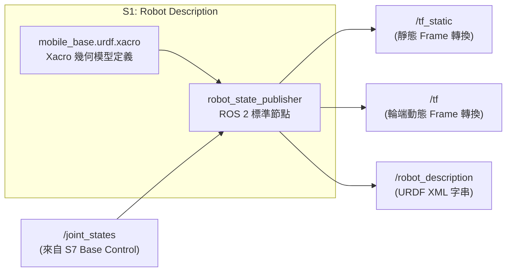
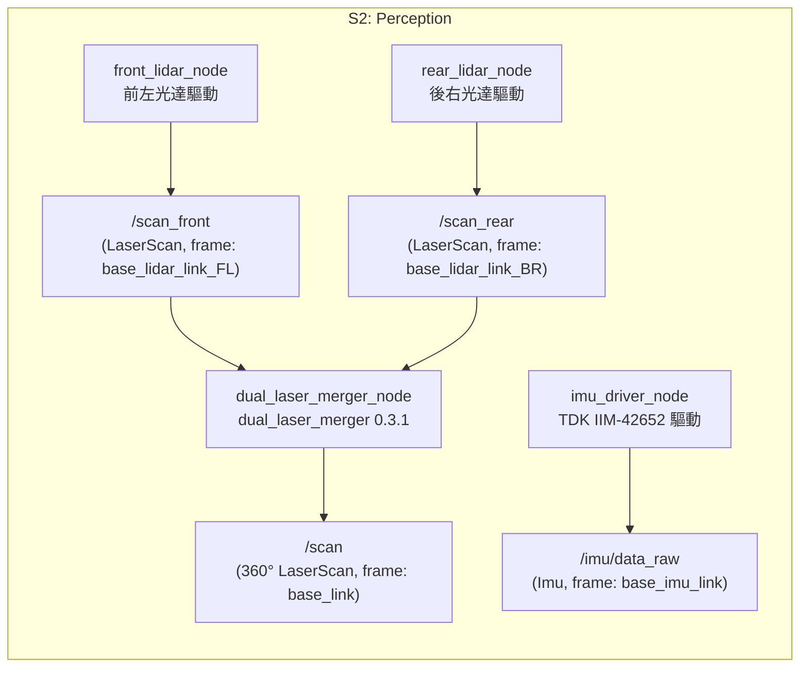

# Subsystem Design

本文件定義 `mobile_base` v0.1 各子系統的詳細設計，將 [`docs/05_architecture.md`](file:///home/zzz/mobile_base/docs/05_architecture.md) 已核准的 7 大子系統分解、責任配置、跨系統契約與操作流程，落實為可實作、可整合與可驗證的 ROS 2 軟體架構規格。

---

# 1. 目的、範圍與架構邊界 (Purpose, Scope & Authority)

## 1.1 Normative Input
本文件僅以 [`docs/05_architecture.md`](file:///home/zzz/mobile_base/docs/05_architecture.md) 為 **唯一 Normative Input**。

本文件負責定義：
- 各 Subsystem 的內部 ROS 2 Node / Lifecycle Component 分解；
- 權威 ROS 2 Interfaces（Topic, Service, Action, Message Type, Frame ID, QoS Profile）；
- YAML 參數結構與部署配置規範；
- 異常檢測（Failure Detection）、診斷（Diagnostics）與安全停止貢獻；
- 單元測試、整合測試與實機驗收規格（Verification Obligations）。

## 1.2 排除責任 (Excluded Responsibilities)
本文件不得：
- 反向修改 01–03 需求或 05 的 7 大子系統劃分與責任配置；
- 展開 function / class / method 內部實作演算法原始碼；
- 定義底層硬體暫存器編碼或 Modbus 封包細節（保留至 Driver 實作）；
- 虛構未經實機或整合驗證的運作參數。

---

# 2. 統一子系統設計模板 (Uniform Section Template)

每個子系統章節均嚴格遵循以下 6 大標準結構：
1. **Purpose & Architectural Boundary**：承接需求與邊界定義。
2. **Internal Component Decomposition**：內部節點劃分（成熟元件 vs Custom Gaps）。
3. **ROS 2 Authoritative Interfaces**：權威發布／訂閱介面、Message、Frame ID、QoS。
4. **Parameters & Configurations**：YAML 參數定義與 Schema。
5. **Failure Detection & Diagnostics**：錯誤處理與安全停止響應。
6. **Verification Obligations**：單元、介面、整合與實機驗證。

---

# 3. 子系統詳細設計 (Subsystem Detailed Design)

---

## 3.1 S1: Robot Description Subsystem

### 1. Purpose & Architectural Boundary
* **目的**：作為全系統唯一權威來源，提供 AMR 實體幾何外形（Footprint）、關節命名、靜態感測器安裝位置，以及發布靜態座標轉換（`/tf_static`）。
* **承接需求**：**SYS-023 機器人描述**。
* **邊界與排除**：
  * **In-Scope**：Xacro / URDF 模型定義、`base_footprint` / `base_link` / 驅動輪 / 感測器靜態座標轉換發布。
  * **Out-of-Scope**：動態里程計推算（S3 負責）、動態地圖定位（S5 負責）、關節物理馬達控制（S7 負責）。

### 2. Internal Component Decomposition


1. **`mobile_base_description` (Package / Model Asset)**：
   * 包含標準 Xacro 模型（`urdf/mobile_base.urdf.xacro`）與 3D Mesh 資源（`meshes/*.STL`）。
2. **`robot_state_publisher` (Node - ROS 2 Jazzy 標準元件)**：
   * 載入解析後的 URDF XML，廣播 `/tf_static`、`/robot_description`，並訂閱 `/joint_states` 發布輪端動態 `/tf`。

### 3. ROS 2 Authoritative Interfaces

#### 3.1 座標框架與外參定義 (Coordinate Frames - 遵守 REP-103 / REP-105)

| Frame ID | Parent Frame | 空間位置 $(x, y, z)\,\text{m}$ | 安裝朝向 $(r, p, y)\,\text{rad}$ | 實體說明 |
|---|---|---|---|---|
| **`base_footprint`** | - | $(0, 0, 0)$ | $(0, 0, 0)$ | 機器人投影於地表之二維基準原點。 |
| **`base_link`** | `base_footprint` | $(0, 0, \mathbf{+0.2560})$ | $(0, 0, 0)$ | 底盤本體幾何中心（地面高程 $256\,\text{mm}$）。 |
| **`driving_wheel_link_L`** | `base_link` | $(+0.0205, \mathbf{+0.2775}, -0.0800)$ | $(0, 0, 0)$ | 左驅動輪（輪距半寬 $0.2775\,\text{m}$，半徑 $0.08\,\text{m}$）。 |
| **`driving_wheel_link_R`** | `base_link` | $(+0.0205, \mathbf{-0.2770}, -0.0800)$ | $(0, 0, 0)$ | 右驅動輪（輪距半寬 $0.2770\,\text{m}$，半徑 $0.08\,\text{m}$）。 |
| **`base_lidar_link_FL`** | `base_link` | $(+0.28771, +0.26721, -0.06011)$ | $(\mathbf{\pi}, 0, \mathbf{+\pi/4})$ | 前左雷達（上下倒裝，逆時針旋轉 $45^\circ$）。 |
| **`base_lidar_link_BR`** | `base_link` | $(-0.24671, -0.26721, -0.06011)$ | $(\mathbf{\pi}, 0, \mathbf{-3\pi/4})$ | 後右雷達（上下倒裝，順時針旋轉 $135^\circ$）。 |
| **`base_imu_link`** | `base_link` | $(+0.04375, -0.00800, -0.01459)$ | $(0, 0, \mathbf{+\pi/2})$ | IMU 晶片（逆時針旋轉 $90^\circ$）。 |

#### 3.2 訂閱介面 (Subscribed Interfaces)
| 介面名稱 | 介面型別 | 提供者 (Producer) | QoS Profile | 說明 |
|---|---|---|---|---|
| `/joint_states` | `sensor_msgs/msg/JointState` | `S7 Base Control` | Reliable, Volatile, Depth: 10 | 包含 `driving_wheel_joint_L` 與 `driving_wheel_joint_R` 之即時狀態。 |

#### 3.3 發布介面 (Published Interfaces)
| 介面名稱 | 介面型別 | QoS Profile | 權威發布內容 |
|---|---|---|---|
| `/robot_description` | `std_msgs/msg/String` (Topic & Parameter) | TransientLocal, Reliable | 完整 URDF XML 字串供 RViz2、Nav2 Costmap 等使用。 |
| `/tf_static` | `tf2_msgs/msg/TFMessage` | TransientLocal, Reliable | 靜態座標轉換：`base_footprint → base_link`、`base_link → base_lidar_link_FL/BR`、`base_link → base_imu_link`。 |
| `/tf` | `tf2_msgs/msg/TFMessage` | Dynamic, SystemDefault | 依據 `/joint_states` 發布 `base_link → driving_wheel_link_L/R`。 |

### 4. Parameters & Configurations

```yaml
# config/robot_state_publisher.yaml
robot_state_publisher:
  ros__parameters:
    publish_frequency: 30.0    # 關節動態 TF 發布頻率 (Hz)
    ignore_timestamp: false
    use_sim_time: false
    frame_prefix: ""
```

* **幾何常數（封裝於 Xacro 宏定義中，供 S7 引用）**：
  * `wheel_separation`: `0.5545`（公尺）
  * `wheel_radius`: `0.080`（公尺）
  * `ground_clearance`: `0.2560`（公尺）

### 5. Failure Detection & Diagnostics
1. **URDF 語法/檔案缺失**：`robot_state_publisher` 啟動時崩潰並輸出 FATAL 日誌，終止系統啟動流程，防止無座標系統運行。
2. **`/joint_states` 訊號中斷**：`/tf_static` 保持正常廣播，但輪端動態 TF 停止更新；由 S7 底盤診斷模組發出警告。
3. **Frame 缺失防護**：下游節點（Nav2、AMCL）啟動時由 `tf2_ros::Buffer` 檢查所需 Frame，若超時未收到則拒絕進入 Active 狀態。

### 6. Verification Obligations
1. **靜態模型語法驗證 (Unit Test)**：執行 `xacro mobile_base.urdf.xacro` 並通過 `check_urdf` 檢查無斷鏈。
2. **靜態 TF 完整性驗證 (Interface Test)**：節點啟動後，使用 `tf2_echo base_footprint base_lidar_link_FL`、`base_lidar_link_BR` 與 `base_imu_link`，確認 Transform 數值與 RPY 精確無誤。
3. **實機物理驗收 (Real-hardware Validation)**：實車量測雷達、IMU 安裝距離與輪距，確認與 Xacro 數值誤差 $< 2\,\text{mm}$。

---

## 3.2 S2: Perception Subsystem

### 1. Purpose & Architectural Boundary
* **目的**：自前左/後右雙光達硬體與 6 軸 IMU 取得原始物理量測，並透過成熟雷達融合節點產出全域 360° 掃描，提供標準 ROS 2 `LaserScan` 與 `Imu` 訊息供全系統使用。
* **承接需求**：
  * **SYS-003 LiDAR 感知**：提供掃描資料供建圖（S4）、定位（S5）與導航（S6）使用。
  * **SYS-004 IMU 感知**：提供 IMU 數據供狀態估測（S3）使用。
* **邊界與排除**：
  * **In-Scope**：感測器驅動通訊、標準訊息封裝、Frame ID 標記、`dual_laser_merger` 雙雷達融合、感測器斷線與逾時偵測。
  * **Out-of-Scope**：TF 發布（由 S1 統一發布）、狀態估測融合（S3 負責）、建圖（S4 負責）、導航代價地圖解讀（S6 負責）。

### 2. Internal Component Decomposition


1. **`front_lidar_node` (Driver Node)**：通訊讀取前左 2D 光達，發布原始 `/scan_front`。
2. **`rear_lidar_node` (Driver Node)**：通訊讀取後右 2D 光達，發布原始 `/scan_rear`。
3. **`dual_laser_merger_node` (ROS 2 Jazzy `dual_laser_merger` 0.3.1 成熟元件)**：
   * 訂閱 `/scan_front` 與 `/scan_rear`，透過 S1 `/tf_static` 空間幾何將兩路掃描在 `base_link` 坐標系下合成為單一 360° `/scan`。
4. **`imu_driver_node` (Driver Node - TDK IIM-42652)**：讀取 3 軸角速度與 3 軸線性加速度，發布 `/imu/data_raw`。

### 3. ROS 2 Authoritative Interfaces

#### 3.1 發布介面 (Published Interfaces)
| 介面名稱 | 訊息型別 | `frame_id` (來自 S1) | QoS Profile | 典型頻率 | 說明與消費者 |
|---|---|---|---|---|---|
| **`/scan`** | `sensor_msgs/msg/LaserScan` | `base_link` | `SensorData` | $15 \sim 20\,\text{Hz}$ | **360° 融合雷達資料**。<br/>供 **S3 RF2O**、**S4 slam_toolbox**、**S5 AMCL** 訂閱。 |
| **`/scan_front`** | `sensor_msgs/msg/LaserScan` | `base_lidar_link_FL` | `SensorData` | $15 \sim 20\,\text{Hz}$ | 前左原始掃描。<br/>供 S6 Nav2 Costmap 避障使用。 |
| **`/scan_rear`** | `sensor_msgs/msg/LaserScan` | `base_lidar_link_BR` | `SensorData` | $15 \sim 20\,\text{Hz}$ | 後右原始掃描。<br/>供 S6 Nav2 Costmap 避障使用。 |
| **`/imu/data_raw`** | `sensor_msgs/msg/Imu` | `base_imu_link` | `SensorData` | $50 \sim 100\,\text{Hz}$ | 原始 3 軸角速度與線性加速度。<br/>供 **S3 robot_localization EKF** 訂閱。 |

### 4. Parameters & Configurations

> **配置原則**：06 規範核心架構參數（如 `frame_id`、發布頻率、主題名稱綁定）；底層硬體連線細節（如 IP 位址、串列埠號 `/dev/ttyUSB*`、原廠濾波設定）依實車安裝與選用套件之 Native Schema 於實作階段填入。

```yaml
# config/perception_params.yaml
front_lidar_node:
  ros__parameters:
    frame_id: "base_lidar_link_FL"
    scan_frequency: 15.0

rear_lidar_node:
  ros__parameters:
    frame_id: "base_lidar_link_BR"
    scan_frequency: 15.0

dual_laser_merger_node:
  ros__parameters:
    laser_1_topic: "/scan_front"
    laser_2_topic: "/scan_rear"
    target_frame: "base_link"
    merged_scan_topic: "/scan"
    angle_min: -3.14159265
    angle_max: 3.14159265
    scan_time: 0.0666667
    range_min: 0.05
    range_max: 25.0

imu_driver_node:
  ros__parameters:
    frame_id: "base_imu_link"
    publish_rate: 100.0
```

### 5. Failure Detection & Diagnostics
1. **感測器通訊逾時**：驅動節點若超過 $0.5\,\text{秒}$ 未收到硬體數據，透過 `/diagnostics` 發布 `ERROR` 狀態。
2. **點雲遮擋與無效點處理**：小於 `range_min` 或大於 `range_max` 者填充為 `+Inf`，嚴禁填充為 `NaN`。
3. **融合節點 TF 依賴防護**：若 `dual_laser_merger` 無法取得 `base_lidar_link_FL/BR → base_link` 之 TF 轉換，停止發布 `/scan` 並輸出警告，防止發布畸變點雲。

### 6. Verification Obligations
1. **介面與 Frame 驗證 (Interface Test)**：
   * 確認 `/scan_front` (`base_lidar_link_FL`)、`/scan_rear` (`base_lidar_link_BR`)、`/scan` (`base_link`) 與 `/imu/data_raw` (`base_imu_link`) 之 Header Frame ID 與 QoS 正確。
2. **雷達 360° 融合完整性檢驗 (Integration Test)**：
   * 在 RViz2 中以 `base_link` 為 Fixed Frame 同時可視化 `/scan_front`、`/scan_rear` 與 `/scan`，確認重疊區域點雲平滑對齊無雙重重影。
3. **IMU 靜態重力檢驗 (Unit Test)**：
   * 機器人靜止時，`/imu/data_raw` 經 S1 TF 轉換後之車體 $Z$ 軸加速度應為 $+9.81 \pm 0.2\,\text{m/s}^2$。
