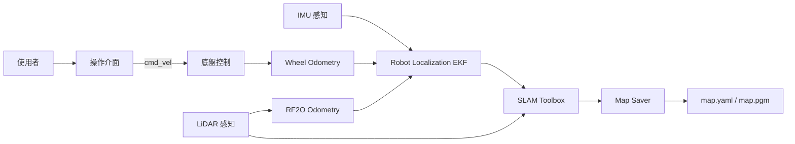

# System Architecture

## CAP-001 建立可重複使用之地圖

### 架構目標

系統整合底盤控制、環境感知、運動估測與建圖功能，支援使用者以鍵盤控制 AMR 完成二維地圖建立與儲存。

---

## 系統組成

| 子系統 | 職責 | 對應需求 |
|---|---|---|
| 操作介面 | 接收鍵盤操作並產生速度命令 | SYS-001、SYS-002 |
| 底盤控制 | 執行速度命令並提供 Wheel Odometry | SYS-005 |
| LiDAR 感知 | 提供雙 LiDAR 掃描資料 | SYS-003 |
| IMU 感知 | 提供 IMU 資料 | SYS-004 |
| Wheel Odometry | 由底盤回授建立輪式里程資訊 | SYS-005 |
| RF2O Odometry | 由 LiDAR 掃描估測雷射里程資訊 | SYS-003 |
| EKF 運動估測 | 融合 Wheel Odometry、RF2O Odometry 與 IMU，提供系統里程資訊 | SYS-003、SYS-004、SYS-005 |
| 建圖 | 建立 Occupancy Grid 地圖 | SYS-001、SYS-006 |
| 地圖儲存 | 儲存建圖成果 | SYS-007、SYS-008 |

---

## 邏輯架構

---

## 執行流程

1. 使用者啟動建圖模式。
2. 使用者透過鍵盤控制 AMR。
3. 底盤控制執行速度命令。
4. 底盤持續提供 Wheel Odometry。
5. 兩顆 LiDAR 持續提供 Scan Topic。
6. RF2O 由 LiDAR Scan 建立雷射里程資訊。
7. IMU 持續提供姿態量測資料。
8. Robot Localization EKF 融合：
   - Wheel Odometry
   - RF2O Odometry
   - IMU
9. SLAM Toolbox 使用：
   - LiDAR Scan
   - EKF Odometry
10. Map Saver 儲存：
    - map.yaml
    - map.pgm

---

## 部署架構

| 裝置 | 介面 |
|---|---|
| Jetson AGX Orin Developer Kit | ROS 2 主機 |
| DEXMART M1C-N016RE ×2 | `/dev/ttyUSB0`、RS-485、Modbus Multi-drive 2.0 |
| TDK IIM-42652 IMU | `/dev/ttyACM0` |
| SICK picoScan150 ×2 | Ethernet |

所有功能部署於 Docker Compose。

---

## 軟體組成

| 子系統 | 初版實作 |
|---|---|
| 操作介面 | teleop_twist_keyboard |
| 底盤控制 | mobile_base_driver |
| LiDAR 感知 | SICK ROS Driver |
| IMU 感知 | IIM-42652 Driver |
| Wheel Odometry | mobile_base_driver |
| RF2O Odometry | rf2o_laser_odometry |
| EKF 運動估測 | robot_localization |
| 建圖 | slam_toolbox |
| 地圖儲存 | nav2_map_server |

---

## Traceability

| Requirement | Architecture |
|---|---|
| SYS-001 | 操作介面、SLAM Toolbox |
| SYS-002 | 操作介面、底盤控制 |
| SYS-003 | LiDAR 感知、RF2O Odometry、EKF 運動估測、SLAM Toolbox |
| SYS-004 | IMU 感知、EKF 運動估測 |
| SYS-005 | 底盤控制、Wheel Odometry、EKF 運動估測 |
| SYS-006 | SLAM Toolbox |
| SYS-007 | Map Saver |
| SYS-008 | Map Saver |