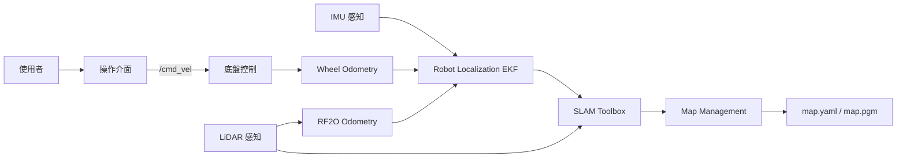

# System Architecture

## CAP-001 建立可重複使用之地圖

### 架構目標

系統整合底盤控制、環境感知、運動估測、建圖與地圖管理功能，支援使用者建立、儲存與重複使用二維地圖。

---

## Navigation Principle

所有導航任務皆以 AMR 目前位姿作為起點。

導航目標依任務需求分為兩種類型：

- 路網站點（Station）
- 任意位姿（Pose）

系統依目前位姿、導航目標與路網資訊，自動選擇適當導航策略完成任務。

First Mile、On Route 與 Last Mile 為 Navigation 子系統之導航策略，由系統依任務情境自動決定，不屬於 Use Case。

---

## 系統組成

| 子系統 | 職責 | 對應需求 |
|---|---|---|
| 操作介面 | 接收鍵盤操作並產生速度命令 | SYS-001、SYS-002 |
| 底盤控制 | 執行速度命令並提供 Wheel Odometry | SYS-005 |
| LiDAR 感知 | 提供雙 LiDAR 掃描資料 | SYS-003 |
| IMU 感知 | 提供 IMU 資料 | SYS-004 |
| Wheel Odometry | 建立輪式里程資訊 | SYS-005 |
| RF2O Odometry | 建立雷射里程資訊 | SYS-003 |
| Robot Localization EKF | 融合 Wheel Odometry、RF2O Odometry 與 IMU，提供系統里程資訊 | SYS-003、SYS-004、SYS-005 |
| SLAM Toolbox | 建立 Occupancy Grid 地圖 | SYS-001、SYS-006 |
| Map Management | 管理地圖儲存與載入 | SYS-007、SYS-008 |

---

## 邏輯架構



---

## UC-001 執行流程

1. 使用者啟動建圖模式。
2. 使用者透過鍵盤控制 AMR。
3. 底盤控制執行速度命令。
4. Wheel Odometry 持續建立輪式里程資訊。
5. LiDAR 持續發布掃描資料。
6. RF2O 建立雷射里程資訊。
7. IMU 持續提供慣性量測資料。
8. Robot Localization EKF 融合：
   - Wheel Odometry
   - RF2O Odometry
   - IMU
9. SLAM Toolbox 建立 Occupancy Grid。
10. Map Management 儲存地圖。

---

## ROS Topic

| Topic | Publisher |
|---|---|
| `/cmd_vel` | 操作介面 |
| `/scan_front` | Front LiDAR |
| `/scan_rear` | Rear LiDAR |
| `/imu/data_raw` | IMU Driver |
| `/wheel_odom` | Wheel Odometry |
| `/rf2o_odom` | RF2O Odometry |
| `/odom` | Robot Localization EKF |
| `/map` | SLAM Toolbox |

---

## TF Tree

```text
map
 │
 └── odom
      │
      └── base_footprint
            │
            └── base_link
                  ├── front_laser_frame
                  ├── rear_laser_frame
                  └── imu_link
```

---

## 部署架構

| 裝置 | 介面 |
|---|---|
| Jetson AGX Orin Developer Kit | ROS 2 主機 |
| DEXMART M1C-N016RE ×2 | `/dev/ttyUSB0`、RS-485、Modbus Multi-drive 2.0 |
| TDK IIM-42652 | `/dev/ttyACM0` |
| SICK picoScan150 ×2 | Ethernet |

所有功能部署於 Docker Compose。

---

## 軟體組成

| 子系統 | 初版實作 |
|---|---|
| 操作介面 | teleop_twist_keyboard |
| 底盤控制 | mobile_base_driver |
| LiDAR 感知 | SICK ROS Driver |
| IMU 感知 | TDK ROS Driver |
| Wheel Odometry | mobile_base_driver |
| RF2O Odometry | rf2o_laser_odometry |
| Robot Localization EKF | robot_localization |
| SLAM Toolbox | slam_toolbox |
| Map Management | nav2_map_server |

---

## Traceability

| Requirement | Architecture |
|---|---|
| SYS-001 | 操作介面、SLAM Toolbox |
| SYS-002 | 操作介面、底盤控制 |
| SYS-003 | LiDAR 感知、RF2O Odometry、Robot Localization EKF |
| SYS-004 | IMU 感知、Robot Localization EKF |
| SYS-005 | 底盤控制、Wheel Odometry、Robot Localization EKF |
| SYS-006 | SLAM Toolbox |
| SYS-007 | Map Management |
| SYS-008 | Map Management |