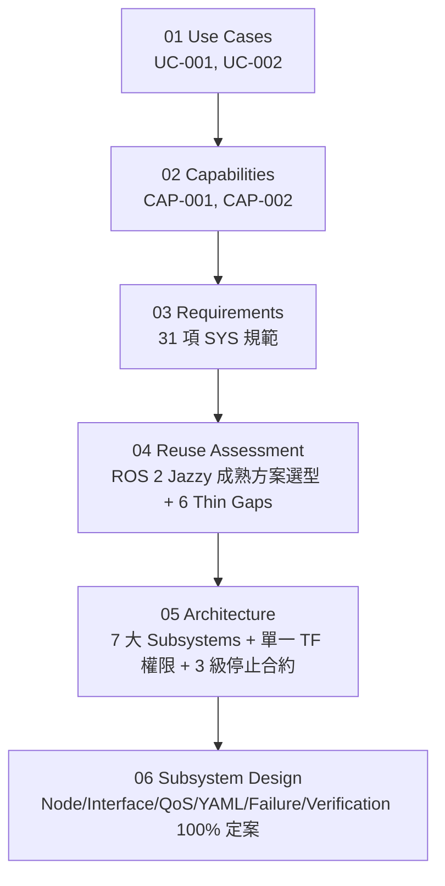

# Handoff Report: 01–06 Full Baseline Audit & Subsystem Detailed Design Finalization

* **Date & Time**: 2026-08-17 12:45 (Local Time)
* **Milestone**: **06 Subsystem Detailed Design (06_subsystem.md) 100% Completed & 01–06 Full Baseline Traceability Audit Passed**
* **Status**: **READY FOR IMPLEMENTATION (07)**

---

## 1. 01–06 全生命週期通盤審查報告 (Comprehensive Audit Report)

本輪審查對 `01_use_cases.md` 至 `06_subsystem.md` 進行了嚴格的單向追溯與邊界一致性比對，確認：
1. **無需求蔓延 (No Scope Creep)**：所有 05/06 設計嚴格收斂於 UC-001 (Mapping) 與 UC-002 (Autonomous Navigation) 兩大原始用例。
2. **無過度設計 (No Overdesign)**：嚴格落實 Step 19A MVP 簡化邊界，未引入任何冗餘的自製 Fallback Manager 或 Route Engine，僅保留必要且極薄的 6 個 Custom Gaps。
3. **實車硬體參數 100% 閉合**：S1/S2/S7 完整綁定 `ref/FIH_AMR_ROBOT_V2.0_0731/` 最新 QA Release URDF 與實體幾何數據。

### 1.1 01–06 逐層追溯與驗證對照表

| 設計階段與文件 | 核心內容與查核重點 | 審查結果 |
|---|---|---|
| **01 Use Cases** (`01_use_cases.md`) | 定義 UC-001（2D 佔據地圖建圖）與 UC-002（拓撲站點自主導航）兩大主流程與異常分支。 | **Pass**（作為最高意圖基準，Checklist 100% 完成） |
| **02 Capabilities** (`02_capabilities.md`) | 定義 CAP-001（建圖能力）與 CAP-002（導航能力），確認移除冗餘的 `Navigation Configuration`。 | **Pass**（與業務邊界完全一致，Checklist 100% 完成） |
| **03 Requirements** (`03_requirements.md`) | 定案 31 項具體可驗證的 SYS 需求（涵蓋建圖、感知、里程、定位、導航、底盤與描述）。 | **Pass**（無任何矛盾與未覆蓋項，Checklist 100% 完成） |
| **04 Reuse Assessment** (`04_reuse_assessment.md`) | 評估 ROS 2 Jazzy 成熟方案（Nav2, slam_toolbox, robot_localization, ros2_control, dual_laser_merger 0.3.1），確認 6 個 Thin Custom Gaps。 | **Pass**（成熟方案優先，Checklist 100% 完成） |
| **05 Architecture** (`05_architecture.md`) | 確立 7 大子系統劃分（S1~S7）、單一權威 TF 樹、3-Tier 安全停止合約、三階段任務編排與 Step 19A MVP 重選路/降級邊界。 | **Pass**（架構邊界閉合，Checklist 25/25 100% 完成） |
| **06 Subsystem Design** (`06_subsystem.md`) | 以標準 6 大結構定義 7 大子系統之節點分解、介面、QoS、YAML Schema、異常處理與驗證規格，建立 31 項 SYS 追溯矩陣。 | **Pass**（細部規格齊備，Checklist 22/22 100% 完成） |

---

## 2. 定案之實車硬體幾何與外參基準 (Hardware Ground Truth Baseline)

基於最新 [`RWF_V2.0_QA_release.urdf`](file:///home/zzz/mobile_base/ref/FIH_AMR_ROBOT_V2.0_0731/urdf/RWF_V2.0_QA_release.urdf) 提煉並於 06 鎖定之硬體常數：

* **基準高程**：`base_footprint` $\rightarrow$ `base_link` 高度為 **$+0.2560\,\text{m}$** ($256\,\text{mm}$)。
* **驅動輪幾何**：
  * 左輪關節 `driving_wheel_joint_L` ($Y = +0.2775\,\text{m}$)、右輪關節 `driving_wheel_joint_R` ($Y = -0.2770\,\text{m}$)。
  * **輪距 (Track Width)**：**$0.5545\,\text{m}$** ($554.5\,\text{mm}$)。
  * **輪徑半徑 (Wheel Radius)**：**$0.080\,\text{m}$** ($80\,\text{mm}$，直徑 $160\,\text{mm}$)。
  * **極限規格**：最大輪速 $15.7\,\text{rad/s}$（最高車速 $\approx 1.256\,\text{m/s}$），最大扭矩 $25.4\,\text{Nm}$。
* **感測器安裝外參 (Extrinsics)**：
  * **前左雷達 (`base_lidar_link_FL`)**：位置 $(+0.28771, +0.26721, -0.06011)\,\text{m}$，朝向 $(\mathbf{\pi}, 0, \mathbf{+\pi/4})$（倒裝，逆時針 $45^\circ$）。
  * **後右雷達 (`base_lidar_link_BR`)**：位置 $(-0.24671, -0.26721, -0.06011)\,\text{m}$，朝向 $(\mathbf{\pi}, 0, \mathbf{-3\pi/4})$（倒裝，順時針 $135^\circ$）。
  * **IMU (`base_imu_link`)**：位置 $(+0.04375, -0.00800, -0.01459)\,\text{m}$，朝向 $(0, 0, \mathbf{+\pi/2})$（逆時針 $90^\circ$）。

---

## 3. 7 大 Subsystems 與 6 個 Custom Gaps 規格總覽

| 子系統代號 | 核心節點 / 元件 | 權威介面與發布職權 | 包含之 Custom Gaps | 承接需求 |
|---|---|---|---|---|
| **S1: Robot Description** | `robot_state_publisher` `mobile_base_description` | `/tf_static` 靜態發布 `/joint_states` $\rightarrow$ 驅動輪動態 TF | 無 | SYS-023 |
| **S2: Perception** | `front/rear_lidar_node` `dual_laser_merger_node` `imu_driver_node` | `/scan_front`, `/scan_rear` **`/scan`** (360° 融合雷達, `base_link`) `/imu/data_raw` (`base_imu_link`) | 無 | SYS-003, SYS-004 |
| **S7: Base Control** | `ros2_control` `diff_drive_controller` `M1HardwareInterface` | 訂閱 `/cmd_vel`（$0.5\,\text{s}$ 逾時停止） 發布 `/joint_states` 與 `/base_control/wheel_odometry` 服務 `/base/enable`, `/base/reset_fault` **嚴禁發布 `odom` TF** | **GAP-05** 回授防偽造 **GAP-06** 安全啟停邏輯 | SYS-022, SYS-026, SYS-027, SYS-028, SYS-029, SYS-030 |
| **S3: State Estimation** | `rf2o_laser_odometry` `robot_localization` 2D EKF | 融合 S7 輪速 + S2 雷達里程 + S2 IMU 發布 `/odometry/filtered` **全系統唯一授權發布 `odom → base_footprint` TF** | 無 | SYS-005 |
| **S4: Mapping** | `async_slam_toolbox_node` `nav2_map_server` (MapIO) | 僅於 Mapping Mode 運作 發布 `/map` ($0.05\,\text{m}$ 佔據柵格) 建圖期發布 `map → odom` TF **SYS-024 寫入後回讀校驗** | 無 | SYS-001, SYS-002, SYS-006, SYS-007, SYS-024 |
| **S5: Localization** | `nav2_amcl` (粒子濾波) | 僅於 Navigation Mode 運作 接收 `/initialpose` 初始化 發布 `/amcl_pose` 與 `/particle_cloud` **導航期唯一授權發布 `map → odom` TF** | 無 | SYS-010, SYS-006 |
| **S6: Navigation** | **Target Admission** `bt_navigator` (三階段/19A) `route_server` `planner_server` `controller_server` `nav2_costmap_2d` `stopped_goal_checker` | Action `/navigate_to_pose` Action `/navigate_to_station` 輸出 `/cmd_vel` 至 S7 **StoppedGoalChecker 停穩確認**（線速度 $< 0.01\,\text{m/s}$） | **GAP-01** 目標識別 **GAP-02** 正規化 **GAP-03** 站點查表 **GAP-04** 合法性驗證 | SYS-008, SYS-009, SYS-011, SYS-013, SYS-014, SYS-015, SYS-016, SYS-017, SYS-018, SYS-019, SYS-020, SYS-021, SYS-025, SYS-032, SYS-033 |

---

## 4. 當前文件與專案狀態 (Artifacts Baseline)

* **已完成之設計文件**：
  * [`docs/01_use_cases.md`](file:///home/zzz/mobile_base/docs/01_use_cases.md) & [`docs/01_use_cases_checklist.md`](file:///home/zzz/mobile_base/docs/01_use_cases_checklist.md)
  * [`docs/02_capabilities.md`](file:///home/zzz/mobile_base/docs/02_capabilities.md) & [`docs/02_capabilities_checklist.md`](file:///home/zzz/mobile_base/docs/02_capabilities_checklist.md)
  * [`docs/03_requirements.md`](file:///home/zzz/mobile_base/docs/03_requirements.md) & [`docs/03_requirements_checklist.md`](file:///home/zzz/mobile_base/docs/03_requirements_checklist.md)
  * [`docs/04_reuse_assessment.md`](file:///home/zzz/mobile_base/docs/04_reuse_assessment.md) & [`docs/04_reuse_assessment_checklist.md`](file:///home/zzz/mobile_base/docs/04_reuse_assessment_checklist.md)
  * [`docs/05_architecture.md`](file:///home/zzz/mobile_base/docs/05_architecture.md) & [`docs/05_architecture_checklist.md`](file:///home/zzz/mobile_base/docs/05_architecture_checklist.md) (25/25 100%)
  * [`docs/06_subsystem.md`](file:///home/zzz/mobile_base/docs/06_subsystem.md) & [`docs/06_subsystem_checklist.md`](file:///home/zzz/mobile_base/docs/06_subsystem_checklist.md) (22/22 100%)

---

## 5. 下一步工作 (Next Steps)

1. **進入 07 Implementation (實作階段)**：
   * 建立 ROS 2 Jazzy 套件結構（如 `src/mobile_base_description`, `src/mobile_base_control`, `src/mobile_base_navigation`, `src/mobile_base_bringup`）。
   * 將 Xacro 模型與 Mesh 資源從 `ref/` 遷移至 `mobile_base_description` 並修正 Package URI。
   * 實作 6 個 Thin Custom Gaps（S6 的 Target Admission 模組與 S7 的 M1 Hardware Interface）。
   * 撰寫 Launch 與 YAML 設定檔，進行端到端仿真與實機 Bring-up 驗收。
